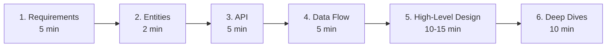
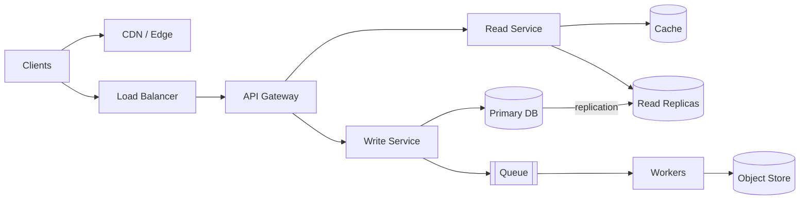
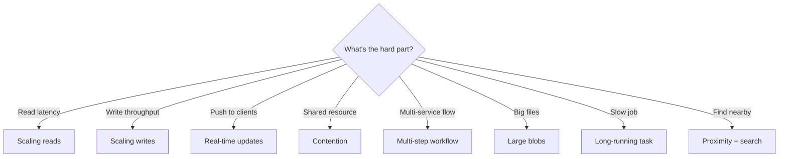
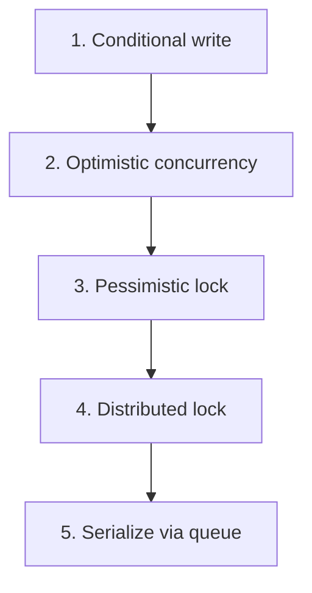
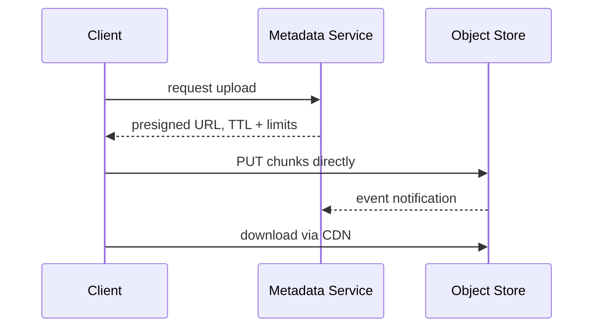
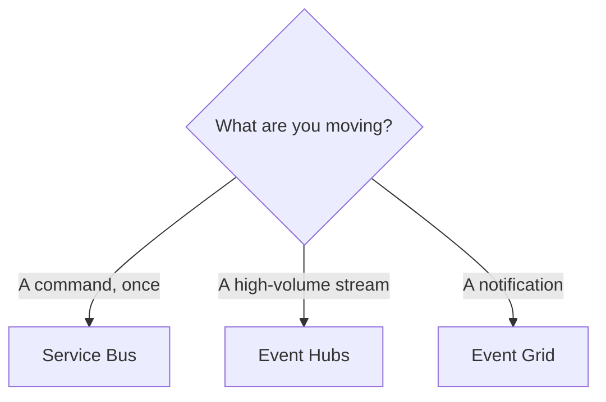

This is a single-sheet revision document, not a tutorial — every topic below has its own full explanation elsewhere on this site, and the point here is density: the framework script, the pattern catalogue, the toolbox tables, and the problem playbooks you want available in your head with nothing left to derive live. There is no single right answer in a system design interview; you're graded on problem navigation, solution design, technical excellence, and communication, not on matching a reference diagram.

> [!KEY]
> Say the generic concept first, then the product name: *"I need a partitioned, durable, ordered log — Kafka, or Event Hubs on Azure."* This reads as understanding the concept independent of any one vendor's API.

## The 60-minute script

| Interview type | Flow |
|---|---|
| **Product design** (Uber, WhatsApp, Twitter, Netflix) | Requirements → Entities → API → HLD → Deep dives |
| **Infra design** (rate limiter, message queue, LB) | Requirements → **system interface** (in/out) → **data flow** → HLD → Deep dives |

## Requirements and non-functional trade-offs

Functional requirements are verbs — ask targeted questions as if talking to a product owner, pick the top three, and explicitly park the rest as out of scope. Non-functional requirements must be **quantified**; walk the mnemonic **SCALE For Cloud DesignS** to make sure you covered the ground:

| Letter | Dimension | Ask yourself |
|---|---|---|
| **S** | Scalability | Read or write heavy? Bursty? DAU? |
| **C** | Consistency | CAP — pick C or A (P is a given) |
| **A** | Availability | Uptime target? Degraded mode acceptable? |
| **L** | Latency | p99 budget? (<100ms = "low latency") |
| **E** | Environment | Mobile, low bandwidth, region |
| **F** | Fault tolerance | What can die? Any SPOF? |
| **C** | Compliance | GDPR, PCI-DSS, HIPAA, residency |
| **D** | Durability | Can we ever lose a write? RPO/RTO? |
| **S** | Security | AuthN/AuthZ, encryption, abuse |

> [!NOTE]
> CAP forces consistency-or-availability only during a network partition; day to day, PACELC's latency-vs-consistency trade-off is the one you're actually making. The consistency spectrum, quorum reads/writes, and the nines table all have their own full page in this curriculum — here they're one line each: **strong** (linearizable) → **bounded staleness** → **session/read-your-writes** → **eventual**. The same system can mix levels per field.

## Numbers to know

| Storage | Latency | Throughput |
|---|---|---|
| RAM / in-process | ~100 ns | millions reads/s |
| SSD | ~0.1 ms | ~100,000 IOPS |
| HDD | ~10 ms | 100-200 IOPS |
| Network, same DC | ~0.5 ms | — |
| Network, cross-region | ~80-150 ms | — |

| Component | Single-instance capacity | Scale when… |
|---|---|---|
| **Cache** (Redis) | ~1ms, 100k+ ops/s, up to 1TB | hit rate <80%, latency >1ms, memory >80% |
| **Database** | up to 50k TPS, 10-20k writes/s, <5ms cached read | writes >10k TPS, uncached read >5ms |
| **App server** | 100k+ conns, 8-64 cores, 64-512GB RAM | CPU >70%, latency > SLA |
| **Message broker** | ~1M msgs/s/broker, <5ms, 50TB | ~800k msgs/s, growing consumer lag |

**Back-of-envelope recipe** — do this *during* the design, not before:

| Step | Formula |
|---|---|
| RPS | `DAU × actions/day ÷ 86,400` |
| Peak | `avg × 2 (steady) to 10 (bursty)` |
| Storage | `rows × bytes/row × replication factor` |
| Bandwidth | `RPS × payload size` |

> [!TIP]
> `2¹⁰ ≈ 10³` makes every unit conversion fast. And: **1B rows × 500B = 500GB → fits on one machine with replicas.** Don't shard because the problem sounds big — do the math and let the number decide.

## Core entities and API design

Entities are the nouns pulled straight from the functional requirements (`User`, `Tweet`, `Follow`). API design turns each requirement into an endpoint:

| Paradigm | Use when | Cost |
|---|---|---|
| **REST** *(default)* | CRUD over resources | over/under-fetching |
| **GraphQL** | diverse clients, data-rich UIs | POST-only, N+1, hard to cache |
| **gRPC** | internal service-to-service, streaming | needs HTTP/2, not human-readable |
| **WebSocket / SSE** | real-time features | stateful, needs infra support |

**Design rules:** resources are plural nouns, no verbs (`POST /users/{id}/activate` for actions); path = identity, query = filter/sort/page, body = payload; never put `userId` in the path or body — take it from the auth token; paginate offset by default, cursor for real-time/high-volume feeds; version in the URL; return structured, actionable errors.

| Method | Idempotent | Safe | Body |
|---|---|---|---|
| GET | ✅ | ✅ | ❌ |
| POST | ❌ | ❌ | ✅ |
| PUT | ✅ | ❌ | ✅ |
| PATCH | ❌* | ❌ | ✅ |
| DELETE | ✅ | ❌ | ❌ |

Status codes worth naming: `200/201/202/204 · 301/304 · 400/401/403/404/409/412/422/429 · 500/502/503/504`. Caching headers: `Cache-Control`, `ETag` + `If-None-Match` → `304`, and **`If-Match` + ETag = optimistic concurrency over HTTP**.

| Need | Use |
|---|---|
| User-facing web/mobile | **JWT** (stateless) or session + Redis (revocable) |
| Service-to-service | mTLS, API key + request signing, or managed identity |
| Delegated login | **OAuth 2.0** (+ OIDC for identity) |
| Permissions | **RBAC** (default) · ABAC (flexible) · ACL (doesn't scale) |

Pattern: short-lived access token (~15 min) + long-lived rotating refresh token. JWT is `header.payload.signature` — Base64, not encryption, so never put secrets in the payload.

## High-level design and building-block vocabulary

Start simple, satisfy one API at a time, and add a component only when a requirement forces it.

One database can serve several microservices — simpler, still fault tolerant via replication. Split read and write services only when their scaling profiles genuinely differ. Add an API gateway once you have more than one service.

| Block | What it does |
|---|---|
| **Load balancer** | Distributes traffic + health checks — round-robin, least-connections, IP hash, weighted, consistent hashing, geo |
| **L4 vs L7** | L4 = TCP/UDP, fast, WebSockets; L7 = HTTP-aware routing on URL/header/cookie |
| **API gateway** | Routing, authN, rate limiting, aggregation, versioning |
| **Service mesh** | Sidecar proxies: mTLS, retries, circuit breaking, tracing |
| **Object storage** | Blob/S3/GCS — flat namespace, immutable, durable. Never store files in the DB |
| **Scheduler** | Cron/delayed work — Quartz, K8s CronJob, Durable Functions timers |

## The eight core patterns

Pick the pattern that matches the bottleneck, then walk its escalation ladder — cheapest fix first, and stop at the rung the requirements actually demand.

### Pattern 1 — Scaling reads

`Index/denormalize/vertical → read replicas/sharding → cache`. Skewed access → cache; uniform access → replicas. Cache stampede → request coalescing + jittered TTL. Hot key → shard the key + in-process fallback. Stale cache → delete-on-write + cache versioning.

| Strategy | Write path | Best for |
|---|---|---|
| **Cache-aside** *(default)* | write DB, invalidate cache | general |
| Write-through | cache + DB together | read-heavy, frequently updated |
| Write-back | cache now, DB async | write-heavy (risk: loss) |

### Pattern 2 — Scaling writes

`Vertical + right DB → shard/partition → queue + shed load → batch/aggregate`. Write-heavy → Cassandra-style LSM (append-only, reads suffer); Postgres rewrites a B-tree per insert.

| Strategy | Idea | Watch out |
|---|---|---|
| **Consistent hashing** *(default)* | ring + virtual nodes | needs a good hash fn |
| Range | key ranges per shard | hot shards (timestamps) |
| Directory | lookup service → shard | extra hop, SPOF |

Good shard keys: high cardinality, evenly distributed, matches the query (`userId`, `orderId`). Bad: timestamp, low-cardinality status.

### Pattern 3 — Real-time updates

Two independent decisions: **client transport** and **server-to-server propagation**.

| Transport | Use when |
|---|---|
| Polling *(default)* | seconds of latency acceptable |
| SSE | server → client only: dashboards, notifications, token streaming |
| WebSocket | full duplex: chat, collab editing — needs L4 LB, heartbeats |
| WebRTC | peer-to-peer: video/audio, gaming |

| Propagation | Use when |
|---|---|
| Consistent hashing + coordinator | persistent connections that must scale |
| **Pub/Sub** *(default)* | many clients want the same update |

Redis Pub/Sub = simple, no durability. Kafka = complex, durable, replayable. Celebrity fan-out → batching + hierarchical distribution. Ordering across servers → funnel through one stamping point, or vector clocks.

### Pattern 4 — Contention and race conditions

Conditional write: put the check in the `WHERE` clause so compare-and-set is one statement. Optimistic: version/ETag + retry — beware the **ABA problem**, use a monotonic version. Pessimistic: `SELECT ... FOR UPDATE` — beware deadlocks, grab locks in deterministic order. Distributed lock (Redis `SET NX` / Blob lease / Zookeeper) once the lock must outlive a transaction — beware TTL expiring mid-work, fix with **fencing tokens**. Write skew (reads/writes on different rows conflicting) → `SERIALIZABLE` isolation, or better, collapse to one row.

### Pattern 5 — Multi-step workflows

| Approach | How | Cost |
|---|---|---|
| **Saga + compensation** | sequential local txns, compensate in reverse on failure | compensations can fail too |
| **Choreography** | durable log (Kafka), workers react | hard to see the whole flow |
| **Orchestration** | Temporal/Step Functions — workflow + idempotent activities | extra infra |
| **2PC** | coordinator prepares then commits all | blocking, coordinator SPOF |

Exactly-once step → idempotency key + state check before replay. Unbounded history → keep payloads small, continue-as-new. Dual write to DB + queue → **outbox pattern**, never write to two systems without it.

### Pattern 6 — Large blobs

Never proxy big files through app servers.

Presigned URL/SAS = temporary, scoped direct upload/download. Resumable uploads = client chunking + session id, track via checksum, stitch on complete. State-sync problem (file in blob, metadata in DB) → storage event notifications + periodic reconciliation. Skip this pattern under ~10MB or when synchronous inspection is required.

### Pattern 7 — Long-running tasks

Split the request: return a job id (`202 Accepted`), process async.

| Queue | Notes |
|---|---|
| **Kafka** *(default at scale)* | append-only log, replay, fan-out |
| RabbitMQ | smart broker, routing, DLQ |
| SQS | managed, 1MB msgs, visibility timeout |

Worker crash → redelivery via heartbeat/visibility timeout. Repeated failure → **DLQ**. Duplicate work → idempotency keys. Mixed workloads → separate queues/pools by task size.

### Pattern 8 — Proximity and search

| Need | Index |
|---|---|
| Nearby places | Geohash (prefix-matched string), Quadtree, **R-tree** *(production default)* |
| Real-time location | Redis GEO |
| Full-text search | Inverted index (Elasticsearch/AI Search) |

Plain lat/long B-tree indexes fail — one dimension returns a thin strip across the globe. At modest scale, Postgres + PostGIS + pg_trgm beats standing up a search cluster.

## Data modeling and indexes

| Model | Use when |
|---|---|
| **Relational** *(default)* | structured, ACID, joins |
| **Document** | nested/evolving schema |
| **Key-value** | cache, sessions, flags |
| **Wide-column** | massive writes, time series |
| **Search** | full text, facets, geo |

Enforce constraints as close to the persistence layer as possible (`UNIQUE(user_id, business_id)`), not in application code. Normalize by default, denormalize in the cache.

| Index | Good at |
|---|---|
| **B-tree** *(default)* | equality + range + sort |
| Hash | exact match only |
| LSM tree | write-heavy, time series |
| Composite | multi-column filter+sort — column order matters (leftmost prefix) |
| Covering | query served entirely from the index |

Indexes speed reads, slow writes, cost storage — check the query plan before adding one.

## Rate limiting

| Algorithm | Trade-off |
|---|---|
| Fixed window | simplest, 2x burst at the boundary |
| Sliding window counter | good accuracy, cheap — great default |
| **Token bucket** *(most common)* | allows controlled bursts (Stripe/AWS) |
| Leaky bucket | smooths to constant outflow, adds latency |

Enforce at the gateway/middleware. Respond `429` + `Retry-After`. Distributed: one central Redis is exact but a hotspot; per-node local limits are fast but approximate.

## Unique ID generation

| Method | Sortable | Notes |
|---|---|---|
| UUID v4 | ❌ | random, poor B-tree locality |
| **UUID v7 / ULID** | ✅ | timestamp prefix + random — modern default |
| **Snowflake** | ✅ | `timestamp + node + sequence`; needs clock sync |
| Ticket/range server | ✅ | each node reserves a block, hands out locally |

Don't leak sequential business IDs publicly — expose an opaque id.

## Probabilistic data structures

| Structure | Answers | Use case |
|---|---|---|
| **Bloom filter** | "definitely not in the set?" (no false negatives) | crawler dedupe, cache-miss avoidance |
| **HyperLogLog** | unique count, ~0.8% error in ~12KB | unique visitors |
| **Count-Min Sketch** | approximate frequency | trending topics, heavy hitters |
| Redis ZSET | exact top-N, ranges | leaderboards |

## Distributed coordination

| Concept | Meaning |
|---|---|
| **Quorum** | `W + R > N` ⇒ strong consistency |
| **Consensus** | Raft/Paxos — leader + replicated log, needs a majority |
| **Coordination service** | Zookeeper (ZAB), etcd (Raft) — config, registry, locks |
| **Split brain** | two leaders at once → fencing tokens + quorum promotion |
| **Clocks** | Lamport timestamps (causal order) or vector clocks (detect concurrency) |

> [!WARNING]
> Avoid rolling your own consensus. Lean on etcd/ZooKeeper or a managed service, and keep the coordination surface as small as possible.

## Event-driven patterns

| Pattern | Solves |
|---|---|
| **Outbox** | dual-write problem — write business row + outbox row in one txn, relay publishes |
| **Inbox/dedupe** | duplicate consumption — record processed message ids |
| **CDC** | keep search/cache in sync without dual writes |
| **CQRS** | reads and writes need different models/scale |
| **Event sourcing** | audit/time-travel — event log is the source of truth, add snapshots |

## Networking essentials

| Topic | Know |
|---|---|
| DNS | name → IP, TTL controls caching, GeoDNS/anycast for routing |
| TCP vs UDP | TCP reliable/ordered; UDP fire-and-forget (video, WebRTC, QUIC) |
| HTTP/2 vs HTTP/3 | HTTP/2 multiplexes over TCP; HTTP/3 runs over QUIC/UDP, no head-of-line blocking |
| TLS | terminate at the edge; mTLS for service identity |

## Reliability and operations

| Concern | Answer |
|---|---|
| Network failures | timeouts + exponential backoff **with jitter**, idempotent APIs, circuit breakers |
| Circuit breaker | Closed → Open (threshold) → Half-open (test) → Closed |
| Bulkhead | isolate resource pools per dependency so one hot path can't starve the rest |
| SPOF | redundancy, replication, health checks + failover, multi-AZ |
| Observability | Logs + Metrics (RED/USE) + Traces, correlated by a request id |
| Deployment | rolling · **blue-green** (instant rollback) · **canary** (staged, metric-gated) |
| Regionalization/DR | active-active (conflict handling) vs active-passive; define RPO and RTO |

## Azure technology map

Say the generic concept first, then the product.

| Need | Azure | OSS |
|---|---|---|
| Global L7 LB + CDN | **Front Door** | Nginx + Varnish |
| API gateway | **API Management** | Kong, Envoy |
| Relational DB | **Azure SQL DB** | PostgreSQL |
| NoSQL / multi-model | **Cosmos DB** | MongoDB, Cassandra |
| Cache | **Azure Cache for Redis** | Redis |
| Object storage | **Blob Storage** | MinIO |
| Search | **Azure AI Search** | Elasticsearch |
| **Message broker (queue/topic)** | **Service Bus** | RabbitMQ |
| **Event stream (log)** | **Event Hubs** | Kafka |
| **Event routing** | **Event Grid** | CloudEvents |
| Workflow orchestration | **Durable Functions** | Temporal, Airflow |
| Real-time push | **SignalR Service** | Socket.IO |
| Distributed lock | **Blob lease**, Redis `SET NX` | ZooKeeper, etcd |

**Service Bus** = RabbitMQ/SQS analogue: sessions, DLQ, duplicate detection, scheduled messages. **Event Hubs** = Kafka analogue: partitions, consumer groups, offsets, replay, Capture-to-Blob. **Event Grid** = EventBridge analogue: filters, push routing, retry up to 24h, dead-letter to Blob.

**Cosmos DB in one box:** globally distributed, multi-model, partitioned NoSQL. Throughput in **RU/s** (a 1KB point read ≈ 1 RU). Partition key must be high-cardinality, evenly distributed, and present in the hot query. Consistency is a tunable 5-level dial (Strong → Bounded Staleness → **Session***(default)* → Consistent Prefix → Eventual). **Change feed** drives materialized views and the outbox pattern. `ETag` + `If-Match` gives optimistic concurrency built in. `429` means RU throttling — back off and retry.

## Problem playbooks

| Problem | Core pattern | Key moves |
|---|---|---|
| **URL shortener** | Scaling reads | Base62 global counter (not a hash), 302 redirect, cache + CDN, 1B×500B = 500GB fits one DB + replicas |
| **File sync (Dropbox)** | Large blobs | Presigned URL, client chunking, resume via saved state, sync via `GET /changes?since=` |
| **Video platform** | Blobs + long tasks | Upload → queue → transcoding workers → adaptive bitrate + manifest, CDN, view counts in Redis |
| **Ticketing** | Contention | Redis distributed lock + TTL to reserve seats, virtual queue over SSE, heavy read caching for event pages |
| **Auction** | Contention + real-time | Optimistic locking on the bid row, Kafka for durability/ordering, SSE for the live high bid |
| **News feed** | Scaling reads/writes | Fan-out on write, hybrid skip for celebrities, sharded + replicated post cache |
| **Chat (WhatsApp)** | Real-time | WebSocket + Redis Pub/Sub, inbox DB for offline messages, sequence numbers to detect gaps |
| **Live comments** | Real-time | SSE, consistent hashing to co-locate viewers, CDN snapshots for mega-streams |
| **Ride sharing (Uber)** | Proximity + contention | Redis geospatial for driver locations, distributed lock per ride request, geo-sharding |
| **Local search (Yelp)** | Proximity + search | Elasticsearch (inverted + geo) synced via CDC, or Postgres + PostGIS at modest scale |
| **Ad click aggregator** | Scaling writes / streaming | Kafka → stream processor windowed aggregation → OLAP, signed impression id against fraud |
| **Metrics monitoring** | Scaling writes / time series | Agent buffering + batching → stream → time-series DB, rollups + cache for dashboards |
| **Web crawler** | Long-running tasks | Frontier queue → fetcher → separate parser stage, visibility timeout + DLQ, dedupe via bloom filter |
| **Notification system** | Multi-step + isolation | Fan out bulk campaigns into single notifications, bulkhead isolates OTPs from bulk traffic |
| **Payment system** | Multi-step + integrity | PaymentIntent + transactions, request signing, event sourcing for audit, reconciliation worker |

## Communication rules and closing checklist

**Do:** drive the conversation, always justify a choice ("stateless reads, so horizontal scaling is trivial"), frame every choice as **BAD → GOOD → GREAT**, do the math before calling something a bottleneck, name the generic concept then the product, surface edge cases proactively.

**Don't:** make vague claims ("we'll just add a cache"), quote scale numbers with no context, jump to Kafka/microservices/sharding before the simple design is shown to break, silently redesign without narrating.

| Dimension | Did I cover it? |
|---|---|
| Availability | replicas, multi-AZ/region, health checks, no SPOF |
| Latency | cache, CDN, index, connection reuse, right region |
| Consistency | which parts are strong, which are eventual, and why |
| Durability | replication, WAL, backups, RPO/RTO |
| Scalability | stateless services, shard key, autoscale triggers |
| Failure modes | retries + backoff + jitter, circuit breaker, DLQ, idempotency |
| Security | authN/authZ, encryption, rate limiting, secrets |
| Observability | logs, metrics, traces, alerts on SLO burn |

## Cheat sheet

- No single right answer — you're graded on problem navigation, solution design, technical excellence, communication.
- SCALE For Cloud DesignS covers the non-functional ground; quantify every one you name.
- `2¹⁰ ≈ 10³`, 86,400 seconds/day, RAM ~100ns, SSD ~0.1ms, cross-region ~100ms — the numbers that justify every other decision.
- Never put `userId` in the path or body; take it from the auth token.
- Pick the pattern that matches the bottleneck, then walk its ladder — stop at the rung the requirements demand.
- Outbox pattern any time you write to a database and a queue in the same operation.
- Idempotency keys make retries safe; fencing tokens make expiring locks safe.
- Say the generic concept, then the specific product — on Azure, Service Bus is commands, Event Hubs is streams, Event Grid is notifications.
- Close every answer with a trade-off named out loud, not a silent diagram.

## Common mistakes

| Mistake | Fix |
|---|---|
| Naming every building block before a requirement forces it | Start simple, add components only when justified |
| Treating CAP as a permanent global choice | It only forces a decision during a partition; day-to-day it's PACELC's latency/consistency trade-off |
| Reaching for a distributed lock by default | Try a conditional write first |
| Choosing choreography for a long branching workflow | Switch to orchestration once you can't see the whole flow |
| Writing to a DB and a queue without an outbox | Always wrap both in one transaction plus a relay |
| Indexing lat/long with a plain B-tree | Use a geohash/S2/H3 key or a 2D-aware tree |
| Quoting scale numbers with no comparison point | Always compare against the capacity table |

## Summary

This sheet compresses the whole interview into five layers: the 60-minute script that sequences the interview itself, the requirements checklist that quantifies what "good" means, the eight-pattern catalogue that covers almost every deep dive, the toolbox of indexes/rate-limiting/IDs/coordination/events/networking/reliability primitives that the patterns are built from, and the problem playbooks that show how real prompts combine them. Use it to jog memory mid-interview and to sanity-check that you're reaching for the tool the requirements actually justify, not the first one that comes to mind.

## Top Interview Questions

### Q1. How do you decide between REST, GraphQL, and gRPC for a new API?

REST is the default for straightforward CRUD over resources with a single client shape. GraphQL earns its complexity when multiple diverse clients need different shapes of the same underlying data and over/under-fetching with REST would be genuinely painful — at the cost of cache-ability and a harder N+1 problem. gRPC is for internal service-to-service calls where performance and strong typing matter more than human readability, and where you control both ends of the call so the lack of native browser support isn't a blocker.

### Q2. What's the difference between optimistic and pessimistic locking, and how do you choose?

Pessimistic locking holds a row lock for the duration of the transaction, blocking anyone else from touching it — the right choice when collisions are frequent, because failing fast on a lock wait is cheaper than repeatedly retrying a doomed write. Optimistic concurrency reads a version, writes conditionally on that version being unchanged, and retries on conflict — the right choice when conflicts are rare, since it avoids holding a lock at all in the common case. The trap with optimistic concurrency is the ABA problem — a value that changed and changed back — fixed by using a strictly monotonic version rather than any reusable value.

### Q3. Explain the outbox pattern and why a service can't just write to its database and publish to a queue directly.

Writing to a database and publishing to a queue are two separate systems with no shared transaction — if the database commit succeeds and the publish fails (or the reverse), the two systems disagree about what happened, and there's no way to roll one back without the other. The outbox pattern writes the business row and an outbox row describing the event in one local database transaction, then a separate relay process (or CDC reading the database log) publishes the outbox row and marks it sent — this is atomic because both writes are guaranteed by the same transaction, at the cost of the relay delivering at-least-once, so consumers must be idempotent.

### Q4. When would you reach for Kafka/Event Hubs instead of a traditional message broker like RabbitMQ/Service Bus?

Kafka-style logs are the right choice when you need very high throughput, replay capability, or many independent consumer groups reading the same stream at their own pace — think clickstream ingestion, IoT telemetry, or an event source multiple downstream systems each need to consume independently. A traditional broker like RabbitMQ or Service Bus is the better fit for task-queue-shaped work — commands that should be processed once, need per-message dead-lettering, or benefit from smart routing — because the broker actively tracks delivery and retry state per message rather than leaving that to the consumer.

### Q5. What's a fencing token and what specific problem does it solve that a plain TTL-based lock doesn't?

A TTL-based distributed lock can expire while the holder is still working — a long garbage-collection pause or network hiccup can make the holder believe it still owns the lock after another process has already acquired it, leading to two processes both thinking they safely own the critical section. A fencing token is a monotonically increasing number issued alongside the lock; the protected resource itself checks that incoming writes carry a token at least as large as the last one it accepted, rejecting a "zombie" write from a process that lost the lock without knowing it, even if that process is still convinced it holds it.

### Q6. How would you estimate whether a design needs sharding, using the back-of-envelope recipe?

I'd multiply rows by average bytes per row by replication factor — a billion rows at 500 bytes each is 500GB, times three replicas is 1.5TB, which comfortably fits on one modern managed database instance with room to spare. I'd only consider sharding once a specific number in the capacity table is actually being approached — write throughput past roughly 10k TPS for a single instance, for example — rather than sharding because the raw data size sounds large. The estimate's whole job is to turn "this feels big" into a number I can compare against a known ceiling.

### Q7. What's the practical difference between the Service Bus, Event Hubs, and Event Grid triad on Azure, mapped to their open-source equivalents?

Service Bus is the RabbitMQ/SQS-shaped option: a smart broker handling a discrete command that should be processed once, with sessions, dead-lettering, and duplicate detection built in. Event Hubs is the Kafka-shaped option: a partitioned, durable, replayable log for high-volume streams where the consumer tracks its own offset. Event Grid is the EventBridge-shaped option: lightweight, filtered routing of discrete notification events out to handlers, with retry and dead-lettering but no replay. Picking between them is really picking between "a command," "a stream," and "a notification."

### Q8. A candidate reaches for a circuit breaker to fix a slow downstream dependency. Is that the right tool, and what else might be needed?

A circuit breaker is the right tool for preventing cascading failure — once a dependency is failing past a threshold, it stops sending requests immediately rather than letting them queue up and time out slowly, giving the dependency room to recover. But it doesn't fix the slowness itself, and it doesn't protect your own system's resources from being exhausted by requests to *other* dependencies while this one is degraded — that's what a bulkhead does, by isolating resource pools per dependency so one bad dependency can't starve calls to a healthy one. The two are usually paired, not substitutes for each other.

### Q9. Why does the cheat sheet recommend geohash, S2, or H3 over a plain database index for proximity search, and how do you choose among the three?

A plain B-tree index handles one dimension well, but latitude and longitude together are two-dimensional — indexing them naively returns thin, physically meaningless slices rather than a genuine radius. Geohash, S2, and H3 all solve this by encoding two dimensions into one sortable key, but they differ in shape assumptions: geohash is simplest and works well for general point lookups (used inside Redis), S2 specifically corrects for the earth's curvature near the poles (used by MongoDB), and H3's hexagonal cells give uniform neighbour distance, which matters for ride-sharing-style "nearest N drivers" queries (used by Uber).

### Q10. How do RPO and RTO differ, and how do they drive a disaster recovery design?

RPO (recovery point objective) is how much data you can afford to lose, measured in time — an RPO of five minutes means you must replicate or back up frequently enough that at most five minutes of writes are ever at risk. RTO (recovery time objective) is how long you can afford to be down before service is restored. A low RPO drives synchronous or near-synchronous replication despite the latency cost; a low RTO drives active-active or hot-standby architectures over cold backups, since restoring from a cold backup is measured in hours, not seconds. Naming both numbers, not just "we have backups," is what makes a DR answer credible.

### Q11. What's the danger of applying every reliability pattern — retries, circuit breakers, bulkheads, timeouts — to every single call in a system?

Layering every pattern everywhere adds real operational and cognitive cost without proportional benefit: a retry on a non-idempotent call risks duplicate side effects, a circuit breaker on a call that's never actually the bottleneck adds complexity for no gain, and stacking all four patterns on every dependency makes failure behaviour hard to reason about and debug when something does go wrong. The stronger answer is to apply each pattern deliberately to the specific dependency and failure mode it addresses — retries for idempotent, transient-failure-prone calls, circuit breakers for dependencies that can cascade, bulkheads for resource pools genuinely at risk of being starved by one bad neighbour.

### Q12. If you could only remember five things from this entire cheat sheet walking into an interview, what would they be?

The 60-minute script's five phases, so you always have a next move. SCALE For Cloud DesignS, so you never state a non-functional requirement without a number attached. The eight-pattern selector — read scaling, write scaling, real-time, contention, workflows, blobs, long-running tasks, proximity — so any deep dive maps to a known escalation ladder. The back-of-envelope recipe, so "is this actually a bottleneck" is always a calculation, not a guess. And the outbox pattern, because "write to a database and a queue" shows up constantly and getting it wrong is one of the most common silent correctness bugs in a design.
