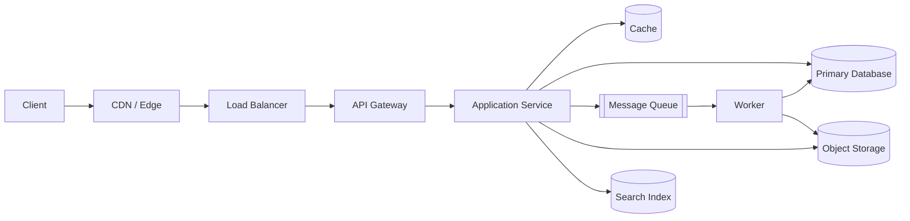

Almost every system design interview, however different the prompt sounds, gets assembled from the same small parts bin: something to route traffic, something to hold state, something to absorb load, something to make reads fast. This page is the tour of that parts bin — what each component solves, when it earns its place in a design, and what trade-off it adds. Treat it as a fast map before a design, not as a reason to add every component by default.

> [!KEY]
> A component belongs in your design the moment a stated requirement forces it, not because the problem "sounds like" it needs one. Naming a load balancer, a cache, and a queue before you've established why is the single most common way to lose the "problem navigation" score.

## Proxies: the traffic layer underneath everything

Every network-facing building block in this layer is, structurally, a proxy — something that sits between a client and the real destination and does useful work in the middle.

- **Forward proxy** — sits in front of the *client*, forwarding the client's own requests out to the internet. Used for caching outbound traffic, anonymising a client's origin, and region-shifting (the "Instagram proxy" pattern of appearing to browse from another country).
- **Reverse proxy** — sits in front of the *server*, accepting inbound requests from the internet and forwarding them to the correct backend. Load balancers, CDNs, API gateways, and firewalls are all specialised reverse proxies; Nginx is the canonical example of software that can be configured as one.

> [!TIP]
> When an interviewer asks "what does a reverse proxy actually buy you here?", the honest answer is almost always one of: load distribution, TLS termination, request routing by path/header, or hiding the internal topology from the outside world. Naming which one you need is worth more than naming the component.

## The component map

Read this table top to bottom as the rough order components get added to a design as it scales — start with nothing, add the next row only when a requirement or a bottleneck forces it.

| Component | What it solves | Reach for it when | Trade-off to name |
|---|---|---|---|
| **Load balancer** | One server falling over takes the whole service down | You have more than one backend instance and need traffic spread evenly | The balancer itself must be redundant |
| **API gateway / reverse proxy** | Every microservice re-implementing auth, rate limiting, routing | You have more than one service and need a single front door | Extra hop, bottleneck and policy-sprawl risk |
| **CDN / edge cache** | Every request round-tripping to one origin, regardless of user location | Content is read far more than it's written and users are geographically spread | Cache-key, TTL and invalidation complexity |
| **Cache (Redis/Memcached)** | Repeating expensive reads against the database | A read is hot or skewed, and tolerant of a little staleness | Invalidation, stampede and outage fallback |
| **Object storage** | Large files bloating a relational database | You're storing images, video, backups, or any blob measured in megabytes+ | Metadata sync and orphan cleanup |
| **Search / inverted index** | `LIKE '%term%'` scanning entire tables | Users need full-text, fuzzy, or faceted search over unstructured text | Index lag, reindexing and derived-data drift |
| **Message queue / pub-sub** | A slow or bursty operation blocking the request that triggered it | Work can be done asynchronously, or many consumers need the same event | At-least-once delivery, idempotency and lag |
| **Distributed lock** | Two processes on two machines racing for the same resource | A single database row-lock can't reach across services or outlive one transaction | TTL expiry, fencing tokens and contention |
| **Job scheduler / workflow engine** | Cron jobs that don't survive a crash, or multi-step processes with no single owner | Work is recurring, delayed, or spans multiple steps that must all eventually complete | Duplicate runs, idempotency and stuck workflows |

> [!NOTE]
> Notice what is *not* on this list by default: microservices, Kafka, and sharding. Those are escalations you justify with a number, not defaults you reach for because the prompt sounds big.

## Inside a single service: the request lifecycle

Zooming into a single backend service, the same small set of layers shows up repeatedly. The important interview point is where each responsibility belongs so HTTP, business logic, and persistence do not blur together.

| Layer | Job | Notes |
|---|---|---|
| **Controller / handler** | Bind the incoming request, validate and transform it, call the service layer, shape the response | Binding failures return `400`; this is the only layer that should know HTTP exists |
| **Middleware pipeline** | Cross-cutting concerns that wrap every request: CORS, rate limiting, security headers, auth, logging, compression, global error handling | Runs before and after the controller; each middleware can short-circuit and return early |
| **Service layer** | The actual business logic, deliberately isolated from HTTP concepts | Should be testable without spinning up a web server |
| **Repository** | Single-purpose database access, one method per query intent | Keeps the service layer ignorant of SQL/ORM details |
| **Request context** | Ambient, request-scoped state — user id from the auth token, a trace/correlation id, a cancellation signal — readable by every middleware and handler in the chain | The mechanism that lets a downstream layer know *whose* request it's serving without threading a parameter through every call |

> [!WARNING]
> A repository method that does more than one thing, or a controller that contains business logic, is the most common structural smell reviewers flag — the fix is always to push the misplaced logic down into the service layer.

## Object storage, briefly

Object storage (Amazon S3, Azure Blob Storage, Google Cloud Storage) deserves a specific callout here because "why not just put the file in the database?" comes up in nearly every design that touches media. The database is optimised for structured, indexed, row-sized data; blobs bloat table storage, make replication far more expensive, and gain nothing from a query engine that was never built to serve bytes. Object storage instead gives you a flat namespace of immutable, durable objects, addressed by key, that a client can often read or write **directly** — bypassing your application servers entirely via a presigned URL.

## Cheat sheet

- Forward proxy protects the client's outbound traffic; reverse proxy protects the server's inbound traffic — load balancers, CDNs, and gateways are all reverse proxies.
- Add a component because a stated requirement or a measured bottleneck forces it, not because the prompt sounds large.
- Load balancer and API gateway usually arrive together once you have more than one backend instance or more than one service.
- Cache and CDN both trade a little staleness for a lot of latency — cache for dynamic hot reads, CDN for static or geographically distributed content.
- Object storage is for anything blob-sized; keep only the metadata (key, size, owner, status) in the database.
- A message queue decouples "accept the request" from "do the slow work" — reach for it the moment a request would otherwise block on something slow or bursty.
- Distributed locks matter only when a database transaction can't hold the lock's full lifetime, or the lock must be visible across services.
- Inside a service, controller → middleware → service → repository is the layering that keeps HTTP concerns out of business logic.

## Common mistakes

| Mistake | Fix |
|---|---|
| Naming every building block in the first two minutes | Start with the simplest design that satisfies the functional requirements, add components as they're justified |
| Treating a reverse proxy, load balancer, and API gateway as three unrelated things | Recognise they're the same underlying pattern with different responsibilities layered on |
| Storing uploaded files as database blobs | Move them to object storage and keep only metadata in the database |
| Reaching for a distributed lock when a single conditional `UPDATE ... WHERE` would do | Try a conditional write first; escalate to a lock only when the critical section can't be a single statement |
| Putting business logic in a controller or a repository | Keep it in the service layer; controllers bind and respond, repositories only fetch and persist |
| Adding a message queue "for scale" with no stated slow or bursty operation | Point at the specific requirement — an operation that's slow, or a fan-out to many consumers — that justifies it |

## Summary

A high-level design is built from a recurring, small set of parts: proxies that route traffic, load balancers and gateways that spread and gate it, caches and CDNs that make reads fast, object storage that keeps large files out of the database, search indexes that make unstructured text queryable, queues that decouple slow work from the request path, and locks or workflow engines that coordinate work across machines. Inside any one service, the same controller → middleware → service → repository layering recurs. The skill this page maps to is recognising *which* component a requirement actually calls for, and naming the cost and failure mode it brings once you add it.

## Top Interview Questions

### Q1. What's the actual difference between a forward proxy and a reverse proxy?

A forward proxy sits in front of the client and forwards the client's own outbound requests — the server on the other end sees the proxy, not the original client, which is why it's used for caching, anonymity, or bypassing regional restrictions. A reverse proxy sits in front of the server and forwards inbound requests from the internet to the correct backend — the client sees the proxy, not the real server behind it. Load balancers, API gateways, and CDNs are all reverse proxies with a specific job layered on top of that basic forwarding behaviour.

### Q2. How do you decide which building blocks to introduce first when starting a design from a blank page?

I start with nothing but a client, a stateless application service, and a single database, and I only add a component when a specific functional or non-functional requirement forces it. A load balancer arrives the moment I have more than one instance of that service. A cache arrives when a read is both hot and tolerant of slight staleness. A queue arrives when an operation is slow enough, or bursty enough, that the caller shouldn't wait for it synchronously. Naming components before I can point at the requirement that needs them is exactly the "cargo-culting" behaviour that reads poorly to an interviewer.

### Q3. Why shouldn't large files be stored directly in a relational database?

Databases are optimised for structured, indexed, comparatively small rows — storing megabyte- or gigabyte-sized blobs bloats table storage, makes every backup and replication operation dramatically more expensive, and gains nothing from a query engine that was never designed to serve raw bytes efficiently. Object storage instead gives a flat, durable, immutable namespace purpose-built for this, and critically lets a client upload or download directly via a presigned URL — bypassing the application tier entirely for the expensive part of the operation, while the database keeps only the lightweight metadata (key, owner, size, status).

### Q4. What's the difference between a CDN and an application cache like Redis, and when would you use each?

A CDN caches content at edge locations physically close to users, and is the right tool when the win you're chasing is network latency for geographically distributed clients requesting largely static or infrequently-changing content — images, video, static assets, sometimes cacheable API GETs. An application cache like Redis sits close to your database, and is the right tool when the win is avoiding a repeated expensive computation or database round trip for a specific hot key, regardless of where the requesting client is located. Many designs use both — CDN for the edge, Redis for the origin.

### Q5. When does a design actually need a distributed lock instead of a plain database transaction?

A plain database transaction is enough whenever the entire critical section can be expressed as one conditional statement or one multi-statement transaction against a single database. A distributed lock becomes necessary when the critical section has to span multiple services, multiple databases, or a lifetime longer than a single transaction can reasonably hold open — for example, "hold this seat reserved for ten minutes while the user enters payment details" is a lock whose lifetime a database transaction was never designed to cover.

### Q6. What problem does a message queue actually solve, stated precisely?

A message queue decouples the acceptance of work from the execution of that work. Without one, a request that triggers a slow operation — resizing a video, sending a batch of emails — has to hold the client connection open until the slow part finishes, coupling the caller's latency to the worker's processing time and giving the caller no way to retry just the failed part. With a queue, the API can return immediately with a job id, the slow work happens asynchronously on a separate worker pool that can scale and fail independently, and the queue itself provides durability so work isn't lost if a worker crashes mid-processing.

### Q7. Why do controllers, services, and repositories get split into separate layers instead of one class doing everything?

Splitting them isolates concerns that change for different reasons and at different rates. The controller is the only layer that should know an HTTP request even exists — it binds, validates, and shapes the response. The service layer holds the actual business logic and should be testable without any web framework in scope at all. The repository isolates database access so a single query intent lives in one place, and swapping the underlying data store or ORM doesn't ripple through business logic. Mixing these together makes a class that's hard to unit test and hard to change safely, because a change to persistence details can silently break business rules that happen to live in the same method.

### Q8. What is request context used for, and why can't you just pass the data as normal method parameters?

Request context holds ambient, request-scoped state — the authenticated user id, a correlation/trace id, a cancellation token — that needs to be readable by every layer in the call chain, including middleware that runs before the controller even knows what handler will process the request. Threading that data explicitly through every method signature in a deep call chain is both noisy and error-prone; request context instead gives any layer a consistent way to read "who is making this request, and what request is this" without every function in between needing to know or forward that detail.

### Q9. An interviewer asks why you added an API gateway. What's a strong answer?

I'd say it's the point where cross-cutting concerns — authentication, rate limiting, request routing to the right backend service, response aggregation — get centralised once there's more than one service behind it, instead of every service re-implementing the same auth and rate-limiting logic independently. I'd also name the cost: it's an extra network hop and, if misconfigured, a new single point of failure and bottleneck, so I'd expect it to be deployed redundantly and to do as little heavy computation as possible, delegating actual business logic to the services behind it.

### Q10. How do you prevent any single building block — the load balancer, the gateway, the cache — from becoming the new single point of failure?

The pattern repeats across every layer: run more than one instance, health-check them, and have a failover mechanism above that layer that can route around a dead instance — a floating IP for a load balancer pair, multiple gateway instances behind their own load balancer, a cache cluster with replicas instead of a single node. The general principle is that adding a component to remove a single point of failure elsewhere in the system is only a net win if that new component is itself deployed with redundancy — otherwise you've just moved the single point of failure one layer over.
