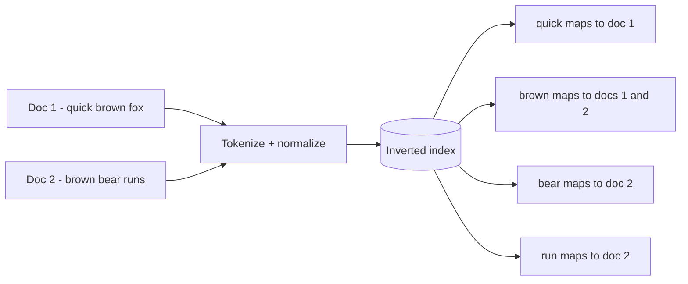
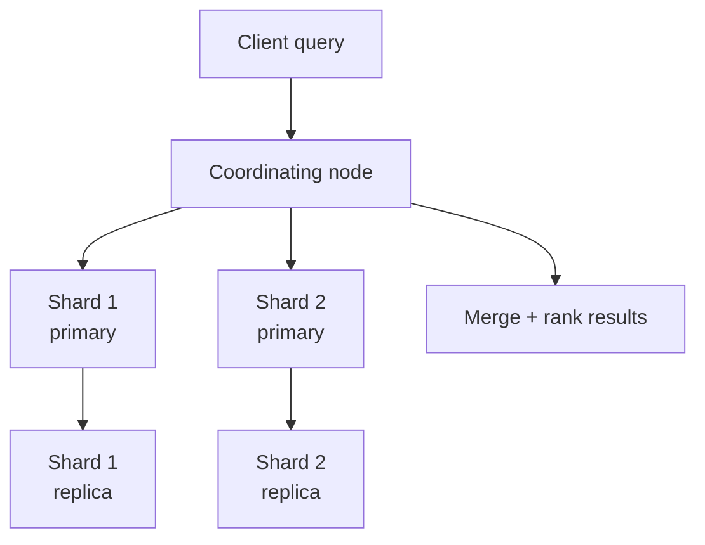
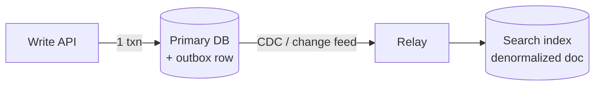

"Add search" is one of the most common feature requests in a system design interview, and it is also where candidates default to `WHERE title LIKE '%query%'` and get stuck the moment the interviewer asks about scale. Full-text search needs a fundamentally different data structure — the inverted index — built and served by a dedicated system.

## Why LIKE doesn't scale

A `LIKE '%term%'` query with a leading wildcard cannot use a B-tree index at all: the database has no choice but to scan every row and check the string. On a 10-million-row table that means tens of gigabytes read for a single query, every time, with no relevance ranking and no tolerance for typos or word variations.

| Need | SQL `LIKE` | Dedicated search engine |
|---|---|---|
| Exact prefix match | ✅ (`LIKE 'term%'` can use an index) | ✅ |
| Substring/contains match | ❌ full table scan | ✅ inverted index |
| Relevance ranking | ❌ none | ✅ BM25/TF-IDF scoring |
| Typo tolerance, stemming, synonyms | ❌ | ✅ analyzers |
| Faceting (counts per category) | Expensive `GROUP BY` | ✅ native aggregations |
| Scale | Degrades past ~10⁵–10⁶ rows | Built for 10⁹+ documents |

> [!KEY]
> A relational database is optimized for exact lookups and range scans on indexed columns. Full-text relevance search is a different problem with a different data structure — reach for a search engine, don't fight the database.

## The inverted index

An inverted index maps **terms back to the documents that contain them** — the inverse of a document listing its words, hence the name.

Each term points to a **postings list** of document IDs (plus positions and term frequency for ranking). A query for `brown` is now a term-dictionary lookup followed by work over the matching postings list, not a scan of every document; the cost is proportional to matched postings and intersections, not total corpus size.

### Building the index: the analysis pipeline

Raw text is never indexed as-is. It passes through an **analyzer**:

1. **Tokenization** — split text into terms: `"The Quick-Brown Fox!"` → `[the, quick, brown, fox]`.
2. **Lowercasing / normalization** — case-insensitive matching.
3. **Stop word removal** — drop high-frequency, low-signal words (`the`, `is`, `a`) to shrink the index and reduce noise.
4. **Stemming / lemmatization** — reduce words to a root so `running`, `runs`, `ran` all match `run`. Stemming is fast and crude (Porter stemmer); lemmatization is slower but grammatically correct.

> [!TIP]
> Say "analyzer" out loud, not just "tokenizer" — it signals you know indexing and query-time text both pass through the *same* pipeline, which is why a search for `"Running"` matches a document containing `"runs"`.

## Ranking: TF-IDF and BM25

Once many documents contain the query terms, you need to rank them. Two ideas do almost all of the work:

- **Term Frequency (TF)** — how often the term appears in *this* document. More occurrences suggest more relevance.
- **Inverse Document Frequency (IDF)** — how rare the term is *across all documents*. A term in every document (like "the") carries no signal; a rare term is a strong signal.

**TF-IDF** multiplies these. **BM25** (used by Elasticsearch/Lucene by default) improves on it with two tunable ideas: term frequency saturates (the 10th occurrence of a word matters much less than the 2nd), and it normalizes for document length (a match in a short doc counts for more than the same match in a huge one).

| Model | Idea | Note |
|---|---|---|
| TF-IDF | frequency × rarity | Simple, classic, still fine conceptually |
| **BM25** *(modern default)* | TF-IDF + saturation + length normalization | What Elasticsearch/Lucene actually compute |

You do not need the formulas in an interview — you need to say *"relevance combines how often a term appears in the document with how rare it is across the corpus, with BM25 adding saturation so keyword-stuffing doesn't dominate."*

## Search engine architecture: shards, replicas, near-real-time

Elasticsearch and Azure AI Search both scale using the same core ideas: split the index into **shards** for horizontal scale, and replicate each shard for availability and read throughput.

- A **shard** is an independent Lucene index; a query fans out to every shard and results are merged and re-ranked.
- A **replica** is a copy of a shard for failover and to spread read load; writes go to the primary shard and replicate out.
- **Near-real-time (NRT)**: a write is not instantly searchable. It lands in an in-memory buffer, and a periodic **refresh** (roughly every 1 second by default) makes it visible to search — this is a deliberate trade-off for indexing throughput.

> [!WARNING]
> "Near-real-time" means a document you just wrote may not appear in search results for up to a second (configurable). If an interviewer asks "the user just posted, why can't they find it in search yet", this refresh interval is the answer.

## Indexing pipeline: keeping search in sync with the source of truth

The database, not the search engine, is the source of truth. You need a pipeline to keep the search index current without risking a **dual write** (writing to the DB succeeding while the search write silently fails).

| Approach | How | Trade-off |
|---|---|---|
| Dual write from the app | App writes to DB and search engine in the same request | Simple but **not atomic** — one can fail while the other succeeds |
| **CDC / change feed** *(default at scale)* | A relay reads the database's change log (Debezium, Cosmos DB change feed) and pushes to the index | Decoupled, reliable, adds a few seconds of lag |
| Outbox pattern | Business write + outbox row in one DB transaction; a relay publishes from the outbox | Guarantees at-least-once delivery to the indexer |
| Batch reindex | Nightly/hourly full rebuild | Simple, but stale between runs; used for catch-up, not primary sync |

Documents sent to the index are usually **denormalized**: a product search document embeds the category name, brand name, and current price directly, rather than storing foreign keys, because the search engine cannot do a relational join at query time.

## Faceting and filters

Faceted search — "Brand (Nike 120, Adidas 80), Size (M 60, L 40)" — is a native aggregation the search engine computes alongside the query, counting documents per field value across the *entire* matching result set, not just the returned page. This is exactly the kind of `GROUP BY` that would be painfully slow in a relational database at scale, but is a first-class, optimized operation in a search engine because the index already has the field values in a columnar-friendly structure.

## Autocomplete approaches

| Approach | How | Pros | Cons |
|---|---|---|---|
| **Trie** | Prefix tree of terms, walk down as the user types | Fast prefix match, simple | Only prefix matches, no typo tolerance, no ranking by popularity built in |
| **N-gram indexing** | Index substrings (`"che"`, `"hea"`, `"eat"` for "cheat") | Matches mid-word, some typo tolerance | Larger index, more storage |
| **Completion suggester** *(default in Elasticsearch)* | Purpose-built in-memory FST (finite state transducer) structure for prefix completion, ranked by weight | Very fast, supports fuzzy matching and popularity weighting | Engine-specific feature, needs its own field type |

For most product search bars, the completion suggester is the answer to give — it is built exactly for this, ranks by a weight you control (e.g. popularity or recency), and supports fuzzy matching for typos out of the box.

## Cheat sheet

- `LIKE '%term%'` cannot use a B-tree index — it is a full scan; reach for a search engine past ~10⁵–10⁶ rows.
- **Inverted index**: term → list of documents (postings list), the core data structure of all full-text search.
- Analyzer pipeline: **tokenize → lowercase → remove stop words → stem/lemmatize**, applied at both index and query time.
- **BM25** (TF-IDF + saturation + length normalization) is the modern default relevance scorer.
- **Shards** scale write/query throughput horizontally; **replicas** give availability and read scale.
- Search is **near-real-time**, not real-time — a refresh interval (~1s) delays visibility.
- Sync the index via **CDC/change feed or the outbox pattern**, not a naive dual write.
- Search documents are **denormalized** — no joins at query time.
- Use a **completion suggester** (or trie/n-gram) for autocomplete, not a live `LIKE` query per keystroke.

## Common mistakes

| Mistake | Fix |
|---|---|
| Using `LIKE '%term%'` for product/content search at scale | Use a dedicated search engine with an inverted index |
| Dual-writing to DB and search index with no failure handling | CDC/change feed or outbox pattern for reliable propagation |
| Expecting search results instantly after a write | Understand and communicate the near-real-time refresh interval |
| Storing normalized, joined data in the search index | Denormalize documents so queries need no joins |
| Building autocomplete with a `LIKE` query per keystroke | Use a completion suggester, trie, or n-gram index |
| Treating the search index as the source of truth | Database remains source of truth; index is a derived, rebuildable projection |

## Summary

Full-text search is powered by the inverted index, built by an analyzer pipeline that tokenizes, normalizes, removes stop words, and stems terms so queries match variations, not just exact strings. Relevance ranking (BM25) combines term frequency with corpus-wide rarity so common words don't drown out meaningful matches. At scale, search engines like Elasticsearch or Azure AI Search shard and replicate the index, trading strict real-time visibility for near-real-time refresh and massive throughput, and the index itself is kept in sync with the source-of-truth database through CDC or the outbox pattern rather than a fragile dual write. Treat the search index as a derived, denormalized, rebuildable projection — never the system of record.

## Top Interview Questions

### Q1. Why doesn't a `LIKE '%term%'` query scale for search, and what's the alternative?

A leading-wildcard `LIKE` cannot use a standard B-tree index because the index is sorted by prefix, not substring, so the database falls back to scanning every row and testing the string — an `O(n)` operation per query that gets worse as the table grows, with no relevance ranking, typo tolerance, or stemming. The alternative is a dedicated search engine (Elasticsearch, Azure AI Search) backed by an inverted index, which maps terms directly to the documents containing them, so query cost is driven mainly by term lookup, postings-list intersections and the number of matches rather than by scanning the whole corpus.

### Q2. What is an inverted index and why is it the core data structure of search?

An inverted index maps each unique term to a postings list of the document IDs (and often positions) where it appears — the inverse of the natural document-to-words mapping. A query for a term becomes a direct lookup into this structure rather than scanning documents, and combining multiple terms (AND/OR queries) becomes an intersection or union of postings lists, which is fast even across millions of documents. This is the foundational structure underneath every major search engine, including database implementations of full-text indexes.

### Q3. Explain the analyzer pipeline: what happens to text before it's indexed?

Text passes through tokenization (splitting into words, handling punctuation), lowercasing (case-insensitive matching), stop word removal (dropping high-frequency, low-signal words like "the" or "is" to shrink the index and cut noise), and stemming or lemmatization (reducing words to a root form, so "running", "runs" and "ran" all index as "run"). Critically, the **same analyzer** runs on the query at search time, which is why searching "Running" matches a document that only contains "runs" — both get reduced to the same root term before comparison.

### Q4. What's the difference between TF-IDF and BM25?

TF-IDF scores a term's relevance as term frequency (how often it appears in this document) multiplied by inverse document frequency (how rare it is across the whole corpus) — frequent, common words score low, rare distinguishing words score high. BM25, the default in Elasticsearch/Lucene, refines this with two improvements: term frequency **saturates** (the 20th occurrence of a word barely adds more signal than the 10th, preventing keyword-stuffing from dominating), and it **normalizes for document length**, so a match in a short document isn't unfairly penalized compared to the same match buried in a huge one. In an interview, the concept matters more than the formula — you should be able to explain why both frequency and rarity matter, and why saturation is needed.

### Q5. How do shards and replicas work in a search cluster like Elasticsearch?

An index is split into shards — independent Lucene indexes — so both indexing and query load can be distributed across many nodes; a search request fans out to every relevant shard in parallel and the coordinating node merges and re-ranks results. Each shard has one or more replicas, copies used for failover and to serve additional read traffic, while writes always go to the primary shard first and then replicate to its replicas. The number of primary shards is typically fixed at index creation (resharding means reindexing), so shard count needs to be planned around expected data volume, which is a classic "what would go wrong" follow-up.

### Q6. What does "near-real-time" search mean, and why might a user not find something they just posted?

Writes to a search engine don't become searchable the instant they're written — they land in an in-memory buffer, and a periodic refresh operation (roughly once per second by default in Elasticsearch) flushes that buffer into a searchable segment. This is a deliberate trade-off: refreshing on every single write would tank indexing throughput. So a user who posts content and immediately searches for it may not see it for up to that refresh interval. If a product requires stronger guarantees (e.g. "show my own post immediately"), the fix is usually to read the freshly written item from the primary datastore or an application cache for that user, not from the search index, until the refresh has happened.

### Q7. How do you keep a search index in sync with your primary database without a fragile dual write?

Writing to the database and the search engine as two separate calls in the same request risks partial failure — the DB commits but the search write fails, or vice versa, silently drifting the two out of sync. The reliable pattern is to make the database the single source of truth and propagate changes asynchronously: either via CDC (reading the database's replication/change log with something like Debezium or a native change feed) or the outbox pattern (writing a business row and an outbox row in one transaction, then a relay process publishes from the outbox to the indexer). Both give at-least-once delivery to the index, so the indexing consumer must be idempotent, and a periodic full reindex acts as a safety net to catch any drift.

### Q8. Why are documents in a search index usually denormalized?

A search engine cannot perform relational joins at query time the way a database can, so a query like "find products where category = Electronics and brand = Sony" needs the category name and brand name embedded directly in the product's search document, not just foreign keys pointing elsewhere. This trades storage and update complexity (a brand name change requires reindexing every product referencing it) for query simplicity and speed — the same trade-off you'd make denormalizing into a cache, just applied to search documents built by the indexing pipeline.

### Q9. Design autocomplete for a product search bar with 50 million products. What approach do you pick?

For per-keystroke suggestions you want sub-50ms responses ranked by relevance/popularity, not a live `LIKE` scan. The standard answer is a completion suggester (Elasticsearch's dedicated FST-based structure, or Azure AI Search's equivalent) built on a separate lightweight field containing product titles weighted by popularity or recency, which supports prefix matching and configurable fuzzy tolerance for typos out of the box. A trie gives fast prefix matching but no typo tolerance and no popularity weighting without extra work; n-gram indexing supports mid-word matches but bloats the index. For 50 million products, the completion suggester is purpose-built for exactly this and is the production-grade default.

### Q10. A customer complains that searching for "run shoes" doesn't return a product titled "Running Shoe". What's likely wrong and how do you fix it?

This points to a stemming/analyzer mismatch — either the index wasn't built with a stemmer so "Running" and "run" are stored as distinct terms, or the query-time analyzer differs from the index-time analyzer, so the reduction isn't consistent on both sides. The fix is to ensure the same analyzer (tokenize, lowercase, stem) is applied at both indexing and query time, so "Running Shoe" indexes to the root terms "run" and "shoe", and a query for "run shoes" reduces to the same roots and matches. This is also a good moment to mention synonym filters (e.g. mapping "sneaker" to "shoe") as a related, commonly-requested enhancement.

### Q11. How would you implement faceted search (filter counts by brand, size, price range) and why not do it in SQL?

Faceting requires counting how many documents in the *entire matching result set* fall into each value of a field (brand, size, etc.), which in SQL means a `GROUP BY` over a potentially huge filtered set — expensive and slow at scale, especially combined with full-text relevance filtering. Search engines compute facets as a native aggregation alongside the query in one pass over the same inverted index structure, because field values are already stored in a columnar, aggregation-friendly form. In an interview, name this explicitly as a reason to route "search + filter" experiences (e-commerce, job boards) through the search engine rather than the primary database.

### Q12. What would you do if a single search index became too large or too slow for one search cluster to handle?

First check whether shard count and cluster node count are appropriately sized for the data volume — most degradation at this scale is a shard-sizing or hardware problem, not an architectural one. If genuine scale limits are hit, you can split by tenant or time range into separate indices (e.g. one index per month for time-series-heavy data, querying across a smaller relevant set), add more nodes to spread shards further, or introduce a caching layer in front of common queries. The key point to make out loud: unlike a single-shard relational table, search clusters are designed to scale by adding nodes and rebalancing shards, so the fix is almost always "add capacity and reshape the index," not "redesign the query."
