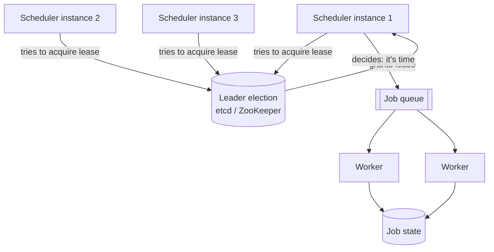
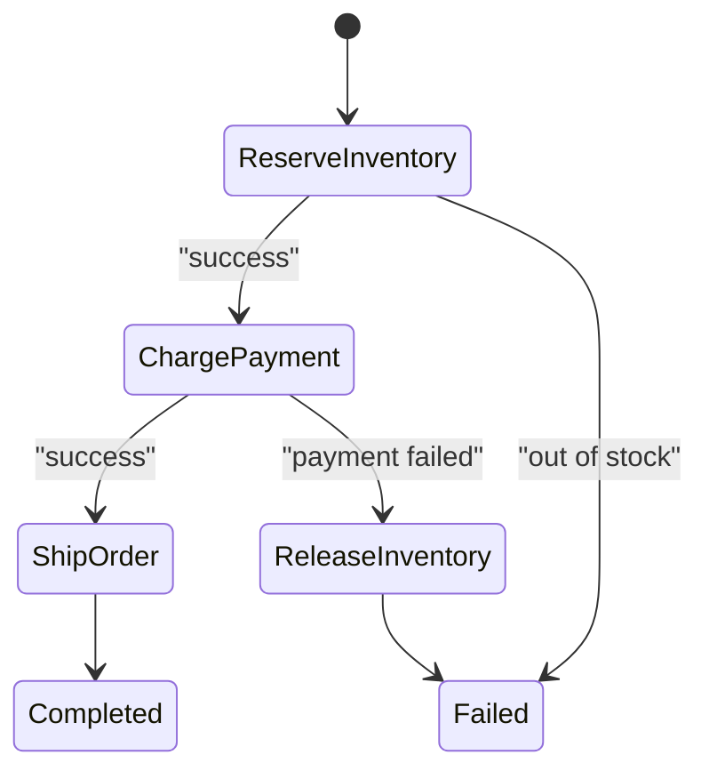

Every non-trivial system eventually needs something to run later, run repeatedly, or run as a sequence of steps that outlives any single process — sending a reminder email, generating a nightly report, or orchestrating a multi-day order fulfillment. The moment "run this on one server" becomes "run this exactly once across a fleet", the design gets genuinely hard.

## Cron vs a distributed scheduler

A single `cron` entry works until you have more than one instance of your service — then every instance fires the job simultaneously, or a server restart silently drops a run.

| | Cron (single box) | Distributed scheduler |
|---|---|---|
| Runs on | One machine | A cluster, coordinated |
| Failure mode | Job silently doesn't run if the box is down | Another node picks it up |
| Duplicate runs | Impossible (only one box) | Must actively prevent (leader election / locking) |
| Scale | One process's worth of jobs | Millions of jobs, sharded across workers |
| Examples | Linux `cron`, Windows Task Scheduler | Quartz, Kubernetes CronJob + leader election, Temporal, Airflow, cloud schedulers |

> [!KEY]
> The whole problem of distributed scheduling is: **exactly one node should decide "it's time", but any node should be able to do the work.** Those are two separate concerns — don't conflate the *trigger* with the *execution*.

## At-least-once vs at-most-once execution

Distributed systems cannot cheaply guarantee **exactly-once** execution — a scheduler that crashes right after triggering a job but before recording that it did can't tell whether the job actually ran.

| Guarantee | Behavior | Risk |
|---|---|---|
| **At-most-once** | Trigger, don't retry on ambiguous failure | Job might silently never run |
| **At-least-once** *(default, practical choice)* | Retry whenever success isn't confirmed | Job might run twice — **must be idempotent** |
| "Exactly-once" | Marketed by some systems | Really at-least-once delivery + application-level idempotency/deduplication |

> [!TIP]
> Say this line in an interview: *"I'll design for at-least-once delivery and make the job idempotent, because true exactly-once execution across a network isn't achievable without an idempotency key doing the real work anyway."*

## Leader election for the scheduler

To avoid every replica of your service firing the same cron-style job, exactly one instance must be elected **leader** for scheduling decisions, using the same primitives as distributed locks: a ZooKeeper ephemeral znode, an etcd lease, or a database row with a TTL that only one instance can hold.



Only the leader decides *when* to enqueue a job; any worker in the fleet can then pick it up and execute it, decoupling the "who triggers" problem from the "who runs" problem entirely. If the leader crashes, its lease expires and a standby takes over within seconds.

## Sharding jobs by key

At scale — millions of scheduled jobs (per-user reminders, per-tenant reports) — a single leader deciding "what's due" against one table becomes a bottleneck. Shard the job table by a key (user ID, tenant ID) so different scheduler workers own different shards and scan them independently, similar to how you'd shard any other high-volume table. A common pattern: partition jobs by `next_run_time` bucketed into minute-granularity buckets, so each scheduler tick only scans "due in this bucket" rather than the whole table.

## Delayed messages and time wheels

"Run this in 30 minutes" is a surprisingly common primitive — retry backoff, reservation timeouts, drip campaigns. Two common implementations:

| Mechanism | How | Used by |
|---|---|---|
| **Delayed queue message** | Message carries a visible-after timestamp; broker hides it until then | Service Bus scheduled messages, SQS delay queues |
| **Timing wheel** | A circular buffer of time buckets (like a clock face); a job is placed in the bucket for its due time, and a pointer sweeps forward each tick, firing whatever's in the current bucket | Kafka's internal delay queue, Netty, many custom schedulers |

A timing wheel gives `O(1)` insertion and firing (versus `O(log n)` for a heap-based priority queue), which matters when you have millions of pending timers — it is the standard answer to "how do you efficiently schedule millions of delayed timeouts" (e.g. connection timeouts, TTL expiry).

## Long-running workflows and durable execution

A workflow that spans minutes, hours or days — "reserve inventory, charge payment, ship, send confirmation, handle returns for 30 days" — cannot live in one process's memory; the process **will** be redeployed, crash, or be moved to another machine partway through.

**Durable execution** frameworks (Temporal, AWS Step Functions, Azure Durable Functions) solve this by persisting the workflow's **state machine** — which step it's on, and the results of completed steps — to durable storage after every step, so execution can resume on any worker exactly where it left off.



The key idea candidates often miss: the workflow **code looks like a normal sequential function**, but the framework replays its history (deterministically) on every resume, skipping steps whose results are already recorded, rather than re-executing everything from scratch.

> [!WARNING]
> Workflow code inside a durable execution framework must be **deterministic** — no direct calls to `Instant.now()`, no raw random numbers, no direct HTTP calls inside the workflow function itself. Side effects belong in separate "activities" that the framework calls and records the result of; the workflow function only orchestrates them.

Deployed, that splits into three tiers: your API server, the framework's own cluster holding the event history, and pools of workers. Workflow workers run the orchestration code; activity workers perform the side effects against external services.


## Retries and idempotent jobs

Every job in an at-least-once system will, eventually, run more than once — a retry after a timeout, a redelivery after a crash, a leader failover replaying an ambiguous trigger. The job itself must tolerate this:

```java
// Idempotency key derived from the business operation, not a random UUID per attempt
public void processRefund(String orderId, String idempotencyKey) {
    String existing = store.getResult(idempotencyKey);
    if (existing != null) return; // already processed, safe no-op

    paymentGateway.refund(orderId);
    store.recordResult(idempotencyKey, "done");
}
```

Retries should use **exponential backoff with jitter** to avoid a thundering herd of retries all landing at once, and a job that keeps failing after N attempts should move to a **dead-letter queue** for manual inspection rather than retrying forever.

## Backfill

When a scheduler was down, a bug skipped a run, or a new job is introduced that needs historical data reprocessed, you need a **backfill** — deliberately re-running a job for a range of past periods. Good scheduler design treats "run for date X" as a parameterized, idempotent operation from day one, so backfill is just "enqueue the same job for the missed dates" rather than a special code path. This is also why job execution should be idempotent per logical run (e.g. keyed by `job_name + scheduled_date`), not just per attempt.

## Monitoring jobs

| Signal | Why it matters |
|---|---|
| **Missed runs** | A job that should have fired but didn't — usually a scheduler/leader problem |
| **Duplicate runs** | Two executions for the same logical period — usually a locking/idempotency gap |
| **Job duration drift** | A job creeping slower over time signals a growing dataset or a regression |
| **Queue depth / consumer lag** | Jobs are being produced faster than consumed |
| **Dead-letter queue size** | Jobs failing repeatedly and needing attention |

> [!NOTE]
> Alert on the **absence** of an expected event (a job that should run daily and hasn't logged success in 26 hours), not only on explicit failures — silent scheduler outages are the most common real-world incident in this space.

## Cheat sheet

- Separate the **trigger decision** (leader-elected, exactly one) from **execution** (any worker in the fleet).
- Design for **at-least-once** execution and make jobs **idempotent** — true exactly-once isn't achievable across a network.
- **Leader election** (ZooKeeper/etcd/DB lease) prevents every replica from firing the same cron job.
- **Timing wheels** give `O(1)` scheduling for millions of delayed timers; a heap gives `O(log n)`.
- **Durable execution** frameworks persist workflow state after every step so execution resumes across crashes/redeploys.
- Workflow orchestration code must be **deterministic** — side effects live in separate activities.
- Retries need **exponential backoff + jitter**, and a **dead-letter queue** for jobs that keep failing.
- Design job runs to be **idempotent per logical period** (`job + date`) from day one — it makes backfill trivial.
- **Alert on missing runs**, not just explicit failures — silent scheduler outages are the most common real incident.

## Common mistakes

| Mistake | Fix |
|---|---|
| A cron job on every replica of a scaled-out service | Elect a single leader to make the "it's time" decision |
| Assuming exactly-once execution is achievable | Design for at-least-once + idempotency |
| Storing workflow state only in process memory | Persist state after every step (durable execution) |
| Non-deterministic code (random, `Instant.now()`, direct I/O) inside workflow orchestration logic | Move side effects into separately-recorded activities |
| Retrying forever with no backoff | Exponential backoff + jitter, then dead-letter after N attempts |
| Alerting only on explicit job failure | Also alert on an expected job that never reported success |
| Ad hoc scripts for backfill | Treat "run for date X" as a normal parameterized, idempotent job from the start |

## Summary

Distributed job scheduling splits into two separate problems: deciding *when* to trigger (which needs exactly one decision-maker via leader election) and actually *doing* the work (which any worker in the fleet can pick up, provided the job is idempotent for the inevitable at-least-once retries). Long-running, multi-step workflows add a further requirement — durable execution — because no single process can be trusted to stay alive for the full duration; frameworks like Temporal or Durable Functions solve this by persisting the workflow's state machine after every step and replaying deterministic history to resume. Get retries, idempotency, backfill and "alert on silence" right, and job scheduling stops being the fragile, forgotten corner of a system design.

## Top Interview Questions

### Q1. Why doesn't a simple cron job work once you scale a service to multiple instances?

A cron entry lives on one machine and fires locally; the moment you run three replicas of that service for redundancy, each replica's cron fires the same job at the same time, producing duplicate work (three emails sent, three reports generated) unless something prevents it. It also has the opposite failure mode: if the one box running cron goes down at the scheduled time, the job silently never runs, with nothing else positioned to notice or take over. A distributed scheduler solves both by separating "decide it's time" (done by exactly one elected leader) from "do the work" (done by any available worker), so triggering survives node failure without duplicating work.

### Q2. How would you design leader election for a distributed job scheduler?

Use a coordination primitive built for exactly this — an etcd lease or ZooKeeper ephemeral znode that only one scheduler instance can hold at a time, refreshed with a heartbeat while that instance remains alive and healthy. That instance is the only one allowed to evaluate "which jobs are due" and enqueue them onto a shared job queue; every other instance stays in standby, watching for the lease/znode to disappear. If the leader crashes or its heartbeat stops, the lease expires within seconds and a standby instance is elected, resuming scheduling decisions with minimal gap. Execution itself is decoupled — any worker pulling from the queue can run the job, regardless of which instance was leader when it was enqueued.

### Q3. Why is "exactly-once" job execution effectively a myth, and what do you design for instead?

Guaranteeing a job runs exactly once requires the trigger, the execution, and the confirmation of success to be atomic across a network, but any of the three can fail independently — the scheduler can crash after triggering but before recording it, a worker can finish the job but die before acknowledging, or a network partition can make a successful call look like a failure and trigger a retry. Systems that market "exactly-once" are really doing at-least-once delivery plus deduplication using an idempotency key at the application layer. The practical design is: assume at-least-once delivery, and make every job idempotent (safe to run twice) using an idempotency key tied to the logical operation, not the delivery attempt.

### Q4. What is a timing wheel, and why would you use one over a priority queue for scheduling delayed jobs?

A timing wheel is a circular buffer of time buckets, like a clock face, where a job due at time T is placed into the bucket corresponding to T, and a pointer advances one bucket per tick, firing whatever has accumulated in the current bucket. Insertion and firing are both `O(1)`, compared to `O(log n)` for a heap-based priority queue, which matters when you have millions of pending timers — connection timeouts, retry backoffs, reservation expiries. It's the standard answer when asked to efficiently schedule a very large number of short-to-medium delayed events, and it's what powers Kafka's internal delay queue and Netty's timeout handling.

### Q5. What problem does "durable execution" (Temporal, Step Functions, Durable Functions) solve that a normal service can't?

A long-running, multi-step workflow — reserve inventory, charge payment, ship, handle a 30-day return window — cannot safely live in one process's memory, because that process will eventually be redeployed, crash, or be rescheduled onto different hardware partway through. Durable execution frameworks persist the workflow's state — which step completed, with what result — to durable storage after every step, so if the process dies, any worker can pick up the workflow and resume exactly where it left off by replaying the recorded history rather than starting over or losing progress. This turns a fragile, in-memory, multi-step process into a resumable state machine backed by storage.

### Q6. Why must workflow orchestration code in a durable execution framework be deterministic?

These frameworks work by replaying a workflow's execution history to resume it after a crash — re-running the same function from the top, but skipping any step whose result was already recorded, to reconstruct current state. If the workflow function calls `Instant.now()`, generates a random number, or makes a direct network call inline, a replay could produce a different value or a different code path than the original run, corrupting the resumed state or causing a duplicate side effect. The fix is to isolate all non-deterministic operations and side effects into separate "activities" that the framework invokes and durably records the result of, keeping the orchestration function itself a pure, deterministic sequence of activity calls.

### Q7. A nightly report job has been silently not running for three days — nobody noticed until a stakeholder asked for it. How do you prevent this in the future?

The gap is that monitoring was set up to alert only on explicit job failure, but a job that never triggers at all produces no failure event to alert on — it just silently doesn't happen, often due to a scheduler leader-election bug or a downstream dependency change. The fix is to alert on the *absence* of an expected success signal: if the job is supposed to report success once every 24 hours and hasn't in, say, 26 hours, that itself should page someone, independent of whether any error was logged. This "heartbeat/dead man's switch" style of monitoring is the standard answer for catching silent scheduler outages, which are more common in practice than loud failures.

### Q8. How would you implement a backfill for a job that was recently found to have a bug affecting the last two weeks of runs?

If job execution was designed from the start to be idempotent per logical run — keyed by something like `job_name + scheduled_date`, not just per delivery attempt — then backfill is simply re-enqueuing the same job for each of the past 14 dates, and the existing idempotent processing logic safely overwrites or recomputes the correct result. The main risk is doing this without care for load: a backfill that enqueues 14 days of work all at once can overwhelm downstream systems that normally only see one day's worth of traffic, so it should be throttled or run with the same rate limits as normal operation. This is also why job execution should never assume "today" implicitly — it should always take the target date/period as an explicit, parameterized input.

### Q9. How do you make a payment-processing job idempotent when the message queue guarantees only at-least-once delivery?

Attach an idempotency key to the job that's derived from the business operation itself — for example, the order ID plus a fixed operation name like `charge` — rather than a random ID generated fresh on each delivery attempt, so redeliveries of the "same" logical job carry the same key. Before executing the charge, check a store (a database table or a fast key-value store) for whether that key has already been recorded as processed; if so, return the previously recorded result as a no-op instead of charging again. This turns "the queue might deliver this twice" from a correctness risk into a harmless, cheap lookup, and it's the same idempotency-key pattern used for HTTP retries and outbox-pattern consumers.

### Q10. How would you shard a scheduler that manages tens of millions of per-user reminder jobs?

A single leader scanning one "what's due now" table across tens of millions of rows becomes a bottleneck regardless of how efficient the query is, so you'd partition the job table by a key like user ID or a hash of it, similar to sharding any high-volume table, and have separate scheduler workers own and scan different shards independently. Within each shard, bucket jobs by `next_run_time` at a coarse granularity (e.g. per-minute buckets) so each scheduling tick only needs to inspect the current bucket rather than scan the whole shard. Leader election still applies per shard (or per shard-owner assignment) to avoid duplicate triggering within that shard, while the shards themselves scale out independently as job volume grows.

### Q11. What's the difference between choreography and orchestration when designing a multi-step workflow, and which would you pick for order fulfillment?

Choreography has each service react independently to events on a shared log (a payment service listens for "order placed," a shipping service listens for "payment charged"), with no central coordinator — this scales services independently but makes the overall flow hard to see or change, since understanding "what happens when an order is placed" means tracing event handlers across many services. Orchestration uses a central workflow definition (Temporal, Step Functions, Durable Functions) that explicitly calls each step, handles retries and timeouts, and gives you one place to see and version the entire flow, at the cost of a bit more coupling to the orchestrator. For order fulfillment specifically — with compensating actions like refunds and inventory release on failure — orchestration is usually the better fit because the explicit, resumable, retryable step sequence is exactly what durable execution frameworks are built for.

### Q12. Your job queue depth is steadily growing and consumer lag keeps increasing. What do you check and what are your options?

First check whether this is a genuine throughput mismatch (producers are outpacing consumers) versus a stuck consumer (a poison-pill job repeatedly failing and blocking a partition, or a downstream dependency that's slow/down) — the fix differs completely between the two. If it's a real throughput mismatch, options include autoscaling the consumer/worker pool, increasing partition/shard count so more consumers can work in parallel, and shedding or deprioritizing lower-value jobs under sustained backpressure. If it's a stuck or repeatedly-failing job, that job should move to a dead-letter queue after a bounded number of retries with exponential backoff, so a single bad job can't stall an entire partition indefinitely while healthy jobs pile up behind it.
