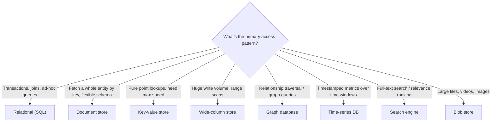

"Which database?" is one of the few system design questions with a genuinely defensible default answer — and yet candidates lose points either by picking something exotic to sound impressive, or by picking one database for the whole system without asking what each part of the data actually needs.

## The decision framework

Before naming a database, answer five questions about the data itself. The answers, not familiarity or hype, should drive the pick.

| Question | Why it matters |
|---|---|
| **Access pattern** | Is data fetched by primary key, by range, by relationship traversal, by full-text search, or by time window? |
| **Consistency needs** | Does this data need strong consistency (inventory, payments) or is eventual fine (a like count, a feed)? |
| **Scale** | What's the read/write volume, and does it fit on one well-provisioned instance or genuinely need horizontal partitioning? |
| **Query flexibility** | Do you need ad-hoc joins and filters, or a small, fixed set of known access patterns? |
| **Operational cost** | Who runs this in production — is there a managed offering, and does the team already know it? |

> [!KEY]
> The senior answer is never "use X because it's popular." It's "given this access pattern and this consistency requirement, X is the closest fit, and here's what I give up by not using Y."

## The big comparison table

| Type | Data shape | Best access pattern | Consistency | Scale model | Examples |
|---|---|---|---|---|---|
| **Relational (SQL)** | Rows in tables, fixed schema, relationships via foreign keys | Joins, transactions, ad-hoc queries | Strong (ACID) by default | Vertical first, then read replicas / sharding | PostgreSQL, MySQL, Azure SQL |
| **Document** | Semi-structured JSON/BSON documents | Fetch/update a whole entity by key, flexible schema per document | Tunable (often eventual by default, strong optional) | Horizontal by design (partition key) | MongoDB, Cosmos DB (NoSQL API), Couchbase |
| **Key-value** | Opaque value behind a key, no query language | Point lookups by key only | Eventual or tunable, very fast | Horizontal, near-linear scale | Redis, DynamoDB, Memcached |
| **Wide-column** | Rows with dynamic, sparse columns grouped into column families | Range scans over a partition key + sort key | Tunable, usually eventual | Built for massive horizontal scale | Cassandra, HBase, Bigtable |
| **Graph** | Nodes and edges with properties | Traversals, "friends of friends", shortest path | Varies by engine | Harder to shard (traversals cross partitions) | Neo4j, Amazon Neptune, Cosmos DB (Gremlin API) |
| **Time-series** | Timestamped points, often per metric/tag | Range queries over time, aggregations/rollups | Usually eventual, write-optimized | Time-partitioned, horizontal | InfluxDB, Prometheus, Azure Data Explorer |
| **Search** | Inverted index over text and structured fields | Full-text search, fuzzy match, relevance ranking, faceting | Eventual (indexing lag) | Horizontal via shards | Elasticsearch, Azure AI Search |
| **Blob / object store** | Opaque files, flat namespace | Fetch/store a whole file by key | Eventual (usually) | Effectively unlimited, horizontal | S3, Azure Blob Storage, GCS |



## Access patterns drive the choice

The single most useful interview habit is to describe the query **before** naming the database: *"I need to fetch a user's full profile by ID, update it atomically, and rarely query across users — that's a document or key-value shape, not a join-heavy relational one."* A few concrete examples:

- **"Show me all orders for this customer, joined with product details"** → relational, because it needs a join and consistent multi-table reads.
- **"Store and fetch a user's session by session ID, expire it automatically"** → key-value, because access is purely by key and TTL is a first-class feature.
- **"Ingest a million sensor readings per second, query the last hour's average"** → time-series, because writes are append-only and queries are time-windowed aggregations.
- **"Find products matching 'wireless noise cancelling' ranked by relevance"** → search engine, because relational LIKE queries can't rank by relevance at scale.
- **"Who are this user's mutual connections three hops out?"** → graph, because a relational join three levels deep is expensive and awkward to write.

## Consistency and scale as filters

| If you need... | Lean toward |
|---|---|
| Multi-row transactions (money must never be double-spent) | Relational, or a document store with multi-document transaction support |
| Massive write throughput with simple per-key access | Wide-column or key-value |
| Global low-latency reads/writes across regions | A globally distributed document store with tunable consistency |
| Ad-hoc analytical queries across many dimensions | A column-oriented warehouse (OLAP), not your transactional OLTP database |
| Flexible schema that changes often per record | Document store |

> [!WARNING]
> "NoSQL scales better" is a myth stated without qualification. A well-indexed relational database on modern hardware handles tens of thousands of transactions per second on a single instance — plenty for the overwhelming majority of systems. Reach for a purpose-built NoSQL store because the **access pattern** demands it, not because the word "SQL" sounds slow.

## Polyglot persistence

Most real systems at scale use more than one database type, each for the part of the data it fits best — this is called **polyglot persistence**. A typical e-commerce system might use: a relational database for orders and inventory (needs transactions), a document store for the product catalog (flexible, varying attributes per category), a key-value cache for sessions, a search engine for product search, and a blob store for product images.

> [!TIP]
> Naming polyglot persistence unprompted is a strong signal: *"I'd keep orders and payments in a relational database for transactional integrity, but product search needs a dedicated search engine — a relational LIKE query won't give relevance ranking at this scale."*

The cost of polyglot persistence is real, though: more operational surfaces, more places data can drift out of sync, and a need for a mechanism (often change data capture) to keep denormalized copies updated when the source of truth changes.

## When to keep it boring

> [!KEY]
> The single strongest thing you can say in a database deep dive is: *"I'd start with Postgres for almost everything, and only introduce a specialized store once a specific access pattern or scale number proves it's needed."*

Modern relational databases are extremely capable defaults: they support JSON columns for semi-structured data, full-text search extensions, geospatial queries (PostGIS), and read replicas for scale — covering a surprising fraction of what teams reach for a specialized NoSQL store for. Choosing Postgres first and only reaching for something else when a concrete number (write throughput, query shape, global distribution requirement) proves it's insufficient reads as engineering judgement, not lack of NoSQL knowledge.

## How to justify the choice out loud

A strong answer names the generic need, states the trade-off, and only then names a product:

```text
"This data needs strong consistency and relational integrity between orders
and inventory, so I'd use a relational database — Postgres. If write volume
later exceeds a single instance's capacity, I'd add read replicas first,
and only consider sharding by customer ID if writes themselves become the
bottleneck, which I'd confirm with the actual throughput numbers before
committing to that complexity."
```

## Cheat sheet

- Ask access pattern, consistency, scale, query flexibility, and operational cost — in that order — before naming a database.
- Relational = joins + transactions + ad-hoc queries. Document = whole-entity fetch + flexible schema. Key-value = pure point lookups.
- Wide-column = massive write scale with range scans. Graph = relationship traversal. Time-series = timestamped, windowed aggregation.
- Search engine = relevance-ranked full-text queries a relational LIKE cannot do well.
- Blob store = large opaque files; never put files in a relational database.
- "NoSQL scales better" is not automatically true — a well-indexed relational instance handles tens of thousands of TPS.
- Polyglot persistence is normal at scale — name it, and name the sync cost (usually CDC) that comes with it.
- Default to Postgres; justify anything more exotic with a specific access pattern or a specific scale number.

## Common mistakes

| Mistake | Fix |
|---|---|
| Naming a database before describing the access pattern | Describe the query shape first, then pick the store that fits it |
| Assuming NoSQL is always more scalable | State the actual bottleneck (writes/sec, joins, global distribution) that justifies the choice |
| Picking one database for the whole system by default | Consider polyglot persistence once different data has genuinely different needs |
| Choosing a graph database "because it sounds advanced" | Only use it when the query is genuinely a multi-hop traversal |
| Storing files inside a relational database | Use a blob store; keep only a reference/URL in the database |
| Ignoring operational cost | A team with zero Cassandra experience adopting it under deadline pressure is a real risk, not a footnote |
| Jumping to sharding before proving a single instance can't handle it | Show read replicas and vertical scaling as the first, cheaper steps |

## Summary

Picking a database is really picking a match between the shape of your queries and the shape of the storage engine — relational for transactional integrity and joins, document or key-value for simple entity access at scale, wide-column and time-series for massive append-heavy ingestion, graph for relationship traversal, search engines for relevance ranking, and blob storage for large files. Real systems commonly mix several of these (polyglot persistence) once different parts of the data genuinely have different needs, but the safest starting point in almost any interview is a boring, well-understood relational database, escalating to something specialized only once a concrete access pattern or scale number proves it's necessary.

## Top Interview Questions

### Q1. How do you decide between a relational and a document database for a new service?

I start from the access pattern rather than a general preference: if the data has strong relationships that need to be queried together with joins, and correctness requires multi-row transactions (like an order referencing a customer and several line items that must all update atomically), a relational database is the better fit. If instead the natural unit of access is "fetch and update one whole entity by its ID" and different records legitimately have different shapes — like a product catalog where a electronics item and a clothing item have very different attribute sets — a document database avoids the awkward sparse-columns or excessive-joins problems a rigid relational schema would create for that same data.

### Q2. Why might "NoSQL scales better than SQL" be a misleading statement to make in an interview?

It's misleading because modern relational databases, properly indexed and running on capable hardware, can sustain tens of thousands of transactions per second on a single instance, plus read replicas for further read scaling — which is more than enough for the vast majority of real systems. What NoSQL stores like wide-column or key-value databases actually offer isn't inherently "more scale," but a different scaling model built around simpler access patterns (point lookups, partition-key range scans) that partitions more predictably across many nodes for very specific, very high-volume workloads. The honest framing is "this specific access pattern scales more predictably on this specific storage model," not a blanket claim that one category is faster or bigger than the other.

### Q3. When would you reach for a wide-column store like Cassandra instead of a relational database?

When the access pattern is dominated by very high write throughput with simple, well-known query shapes — typically "give me all records for this partition key, optionally within this sort-key range" — and the data volume genuinely exceeds what a single relational instance (even with read replicas) can sustain. A concrete example is time-stamped event or telemetry ingestion at massive scale, where writes vastly outnumber reads and the queries are almost always "recent events for this device/user" rather than ad-hoc joins across unrelated entities. I'd be explicit that this comes at the cost of query flexibility — Cassandra doesn't support arbitrary joins or ad-hoc filtering the way a relational database does, so the query patterns need to be known largely up front.

### Q4. What is polyglot persistence, and what's the operational cost of adopting it?

Polyglot persistence means using multiple types of databases within the same system, each chosen for the part of the data it fits best — for example, a relational database for orders and payments, a document store for a flexible product catalog, a search engine for product search, and a blob store for images, all within one e-commerce platform. The benefit is that each data type is served by a storage engine well suited to its access pattern rather than forcing everything into one compromise. The cost is real: more infrastructure to operate and monitor, more places for data to drift out of sync between stores, and usually the need for a synchronization mechanism like change data capture to keep denormalized copies consistent with the source of truth.

### Q5. A search feature built with `LIKE '%keyword%'` queries against a relational database is getting slow and doesn't rank results well. What would you recommend?

I'd recommend moving full-text search to a dedicated search engine like Elasticsearch or a managed equivalent, because relational `LIKE` queries can't use a standard B-tree index efficiently for substring matches, forcing table scans that get slower as the dataset grows, and they have no concept of relevance ranking, fuzzy matching, or faceted filtering — all of which a search engine's inverted index is purpose-built for. I'd keep the relational database as the source of truth for the underlying records and use change data capture or an application-level sync process to keep the search index updated whenever the underlying data changes, rather than trying to make the relational database itself do a job it wasn't designed for.

### Q6. Why is a graph database a good fit for "friends of friends" queries but a poor fit for a typical CRUD application?

A graph database stores relationships (edges) as first-class citizens with direct pointers between connected nodes, so traversing multiple hops — finding a user's connections, then their connections' connections — is a fast, local traversal operation regardless of how many total nodes exist in the graph. In a relational database, the same query requires multiple self-joins, and performance degrades sharply as the number of hops increases because each additional hop multiplies the join cost. For a typical CRUD application, though, most access is simple entity lookups and updates without deep relationship traversal, where a graph database offers no advantage and adds unnecessary operational complexity and a less familiar query language for the team.

### Q7. How would you store and query time-series sensor data efficiently, and why not just use a regular relational table with a timestamp column?

I'd use a purpose-built time-series database, which is optimized for the actual access pattern of this workload: extremely high append-only write volume, and queries that are almost always range scans over a time window with an aggregation (average, max, downsampling) rather than arbitrary lookups. A time-series database handles this with time-based partitioning, built-in downsampling/rollup support, and storage engines tuned for sequential writes, which a general-purpose relational table with a timestamp index would handle far less efficiently at high ingestion rates — indexes on a huge, ever-growing table become expensive to maintain, and the database isn't optimized for the rollup queries this workload typically needs.

### Q8. Your team wants to store uploaded video files directly as BLOBs in a relational database column. What would you say?

I'd recommend against it and suggest a dedicated blob/object store like S3 or Azure Blob Storage instead, storing only a reference URL or key in the relational database. Storing large binary files in a relational database bloats the database's storage footprint disproportionately, makes backups and replication far more expensive since every video byte gets replicated along with your actual transactional data, and relational databases simply aren't optimized for large sequential blob reads and writes the way object stores are. Object stores are also typically far cheaper per gigabyte and offer built-in features like CDN integration and lifecycle-based tiering to cold storage that a relational database column doesn't provide.

### Q9. How would you decide whether a new feature needs a specialized database or can just use the existing Postgres instance the rest of the system already uses?

I'd start by assuming Postgres can handle it, since it supports JSON columns for semi-structured data, full-text search extensions, and geospatial queries via PostGIS, covering a large share of what teams reach for specialized stores for. I'd only introduce a new database type once I can point to a specific, measured limitation — a concrete write throughput ceiling being approached, a query shape (like multi-hop graph traversal or time-windowed aggregation at high ingestion rates) that's genuinely awkward or slow to express relationally, or a global distribution requirement Postgres alone can't meet. Introducing a new database "just in case" adds operational cost without a proven need, which is a worse trade-off than migrating later once the need is concrete.

### Q10. What consistency trade-offs would you consider when choosing a globally distributed document database over a single-region relational database?

A globally distributed document database (like Cosmos DB) typically offers a tunable consistency dial, and choosing anything weaker than strong consistency (session, bounded staleness, or eventual) usually means writes in one region aren't immediately visible to reads in another region, which is often an acceptable trade for much lower latency and higher availability across regions. A single-region relational database gives strong consistency by default but concentrates all writes in one place, adding cross-region latency for distant users and creating a single regional point of failure. I'd choose based on whether the specific data actually needs global low-latency access — a social feed benefits from the distributed model's latency win and can tolerate eventual consistency, while a financial ledger usually cannot.

### Q11. How would you justify choosing Redis (key-value) purely for session storage rather than storing sessions in the primary relational database?

Session data access is almost always a simple point lookup by session ID with no need for joins, relationships, or complex queries, and it benefits from a built-in TTL to automatically expire old sessions — both of which map directly onto what a key-value store is optimized for, at in-memory latency far faster than a disk-backed relational query. Using the primary relational database for this instead would add unnecessary read/write load to a system that's better reserved for data actually needing transactional guarantees and relational structure, and would require building expiry logic manually rather than getting it as a first-class feature. The trade-off to name honestly is durability — Redis by default trades some durability guarantees for speed, so session loss on a rare failure needs to be an acceptable outcome (usually it is, since a user can simply log in again).

### Q12. If asked "design the database layer for a new system" with no further detail, what's your first move?

I would not name a database at all yet — I'd first ask what the core entities are and how they're actually going to be queried: what needs transactions, what needs to scale independently, whether there's a search or analytics requirement, and what consistency guarantees matter for which pieces of data. Only after mapping out those access patterns per entity would I propose a data store per entity type, defaulting to a single relational database for anything without a specific reason to diverge, and calling out polyglot persistence explicitly for any entity whose access pattern clearly doesn't fit that default — with the reasoning stated for each divergence, not just the final list of technologies.
