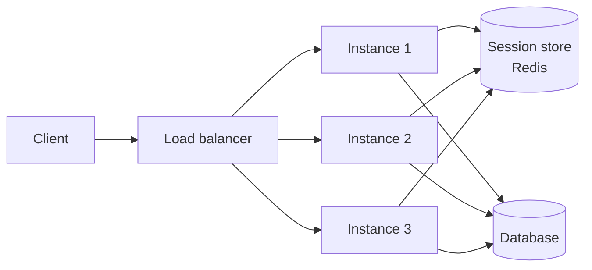
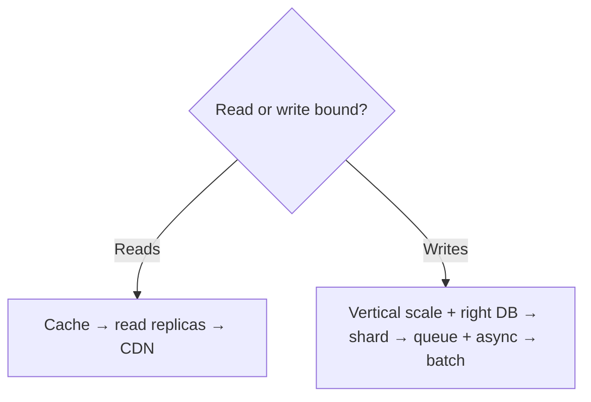

"How would you scale this?" is asked in nearly every system design interview, and the honest answer is almost always "make the service stateless and add more of it — until the database can't keep up, which happens first." This page is about what statelessness really means, where state actually has to live, and why scaling reads and writes are different problems.

## Vertical vs horizontal scaling

| | Vertical scaling | Horizontal scaling |
|---|---|---|
| **How** | Bigger machine (more CPU/RAM) | More machines |
| **Complexity** | Trivial — no code changes | Needs load balancing, statelessness, coordination |
| **Ceiling** | Hard physical/cost limit on one box | Effectively unlimited, if the service is stateless |
| **Downtime to scale** | Often requires a restart/resize | Rolling — add nodes with zero downtime |
| **Cost curve** | Non-linear — the biggest instances are disproportionately expensive | Roughly linear, closer to pay-for-what-you-use |
| **Good first move** | Yes — cheapest way to buy time | Do this once vertical scaling hits diminishing returns |

> [!KEY]
> Vertical scaling is the right *first* answer in an interview — "before I add complexity, I'd check whether a bigger box buys enough headroom" — but the real conversation is about horizontal scaling, because that's where statelessness, load balancing and database limits come in.

## What makes a service stateless, and where the state actually goes

A stateless service keeps **no request-specific data in process memory or on local disk** between requests — any instance can handle any request, which is what makes horizontal scaling (and simple round-robin load balancing) possible at all.

State doesn't disappear — it moves to somewhere shared and durable:

| Where state used to live | Where it goes in a stateless design |
|---|---|
| In-memory session on the server | **External session store** (Redis) keyed by session ID |
| Server-side "logged in" flag | **JWT / stateless token** the client holds, verified per request |
| Local file uploads | **Object storage**, not local disk |
| In-memory cache per instance | **Shared cache** (Redis) or accept cache misses after routing changes |
| WebSocket connection state | Either **sticky sessions** to one instance, or state externalized to a shared store with a pub/sub fan-out |

> [!TIP]
> If asked "how do you scale a service with WebSocket connections", the answer is nuanced: the *connection* itself is inherently stateful (it's a live socket to one machine), but you can still avoid stateful *business logic* by keeping the connection's server-side state in Redis and using sticky sessions only for connection routing, not for correctness.

### Sticky sessions — a deliberate compromise, not statelessness

**Sticky sessions** (a load balancer routing the same client to the same instance, usually via a cookie or client IP hash) let you keep local in-memory state without an external store, at the cost of uneven load and losing that state if the instance restarts. It's a valid trade-off for WebSocket routing or short-lived session data, but it is explicitly *not* the same as being stateless — say so if asked.

## Autoscaling signals

Autoscaling should react to a signal that actually predicts user-visible pain, not just a convenient metric.

| Signal | Good for | Watch out |
|---|---|---|
| **CPU utilization** | Compute-bound services | Can lag — by the time CPU is at 90%, latency may already be bad |
| **Request latency / P99** | User-facing services | Directly reflects experience, but reacts *after* the problem starts |
| **Queue depth / consumer lag** | Async workers, event-driven systems | Leading indicator — catches the problem *before* user impact |
| **Concurrent connections** | Connection-heavy services (WebSocket gateways) | Doesn't capture per-connection cost differences |
| **Memory** | Memory-bound workloads | Rarely the primary trigger unless you're leaking |

> [!WARNING]
> Scaling on CPU alone is a lagging strategy: a queue-based worker fleet can have low CPU while consumer lag balloons, because the bottleneck is a slow downstream call, not compute. For async systems, **queue depth and consumer lag are the leading signal** — scale on those first.

## Scaling reads vs scaling writes

These are different problems with different toolkits, and conflating them is a common interview mistake.

| | Scaling reads | Scaling writes |
|---|---|---|
| Cheapest lever | Cache (app cache, CDN) | Bigger box, or a write-optimized DB (LSM-based) |
| Next lever | Read replicas | Sharding by the primary access pattern |
| Trade-off introduced | Replication lag (stale reads) | Rebalancing complexity, cross-shard queries |
| Escalation | Denormalize, precompute | Queue + async processing, batch/aggregate |

Reads scale relatively easily because copies are cheap — cache a value, or add a read replica, and you've multiplied read capacity with only eventual-consistency risk. Writes are harder because there is exactly one place a given piece of data can be authoritative at a time (per the shard/partition it lives in); scaling writes ultimately means either writing less (batching, queueing, load shedding) or writing to more places in parallel (sharding).

## Connection pool exhaustion when you scale out

A classic trap: you scale a stateless service from 10 instances to 100 to handle more load, and the database falls over — not from query volume, but from **connection count**. Each instance holds its own connection pool (say, 20 connections), so 100 instances × 20 = 2,000 connections, and most databases have hard limits (Postgres defaults to 100, tuned deployments might reach a few thousand) well below what a large fleet can generate.

| Fix | How |
|---|---|
| **Connection pooler** (PgBouncer, RDS Proxy) | Sits between app and DB, multiplexes many app connections onto fewer real DB connections |
| **Smaller per-instance pool** | Reduce pool size as instance count grows so the product stays bounded |
| **Serverless-aware drivers** | Some databases offer HTTP-based or proxy-based access designed for bursty, high-instance-count serverless callers |

> [!DANGER]
> "We autoscaled and now the database refuses new connections" is one of the most common real production incidents caused by naive horizontal scaling. Always account for the multiplicative effect of (instance count × pool size per instance) against the database's actual connection ceiling.

## The database is the real bottleneck

Application servers are the easy part — they're stateless, cheap to replicate, and scale close to linearly. The database is where scaling gets hard, because it holds the one thing that can't simply be copied without a consistency trade-off: the authoritative state. This is why nearly every escalation path in system design interviews eventually points at the database — caching exists to protect it, read replicas exist to offload it, sharding exists to split it, and queues exist to smooth bursts before they hit it.

> [!KEY]
> When an interviewer asks "what's the bottleneck", the honest answer in the overwhelming majority of designs is "the database" — application tier scaling is a solved problem; database scaling is where the real trade-offs live.

## The scaling cube

A useful mental model (from *The Art of Scalability*) for the different axes you can pull:

| Axis | What it means | Example |
|---|---|---|
| **X-axis** | Clone identical copies behind a load balancer | Run 10 identical stateless app instances |
| **Y-axis** | Split by function/responsibility | Separate read service, write service, notification service |
| **Z-axis** | Split by data partition | Shard users A–M on one DB, N–Z on another |

Most real designs combine all three: cloned stateless services (X), split into purpose-specific services (Y), reading from sharded data stores (Z).

## Capacity headroom

Always design and provision with margin, not to exactly meet today's peak: a common rule of thumb is running at **60–70% utilization at peak**, so a traffic spike, a failed node, or a regional failover doesn't immediately cascade into an outage. Combine this with **autoscaling** for organic growth and **load shedding** (reject or degrade low-priority requests) as the last line of defense when even headroom runs out.

## Cheat sheet

- **Vertical scaling first** for a quick, simple win; **horizontal scaling** for the real ceiling — but it requires statelessness.
- Stateless means no request state in process memory/local disk — state moves to a **shared store, token, or object storage**.
- **Sticky sessions** are a deliberate compromise, not the same thing as being stateless.
- Scale on the signal that **predicts** pain: **queue depth/lag** for async workers, **P99 latency** for user-facing paths — not CPU alone.
- **Reads scale via copies** (cache, replicas); **writes scale via sharding, queueing, or writing less**.
- Watch **(instance count × connection pool size)** against your database's connection ceiling — a classic scale-out failure mode.
- The **database is almost always the real bottleneck** — application tiers are the easy part.
- Use the **scaling cube**: clone (X), split by function (Y), split by data (Z) — most designs use all three.
- Provision with **headroom** (60–70% target utilization) plus autoscaling and load shedding as a backstop.

## Common mistakes

| Mistake | Fix |
|---|---|
| Storing session data in server process memory | External session store (Redis) keyed by session ID |
| Treating sticky sessions as "stateless" | Recognize it as a routing compromise with its own trade-offs |
| Autoscaling purely on CPU for async/queue-based workers | Scale on queue depth / consumer lag, a leading indicator |
| Scaling out app instances without checking DB connection limits | Add a connection pooler; shrink per-instance pool size |
| Assuming horizontal scaling fixes a database bottleneck | Cache, replicate, or shard the data layer — more app servers don't help |
| Provisioning for exactly today's peak load | Leave headroom (60–70% target) for spikes and node failures |

## Summary

Horizontal scaling only works cleanly when a service is stateless, which means request state has to move somewhere shared — a session store, a token, object storage — rather than living in process memory. Reads and writes scale through different levers: reads through caching and replicas, writes through sharding, queueing, or reducing what you write. The database, not the application tier, is almost always the real ceiling, and the classic trap when scaling out application instances is forgetting that connection pools multiply with instance count until the database itself refuses new connections. Design with headroom, autoscale on a leading signal like queue depth rather than a lagging one like CPU, and always be ready to say which axis of the scaling cube — clone, split by function, or split by data — you're pulling next.

## Top Interview Questions

### Q1. What does it mean for a service to be stateless, and why does it matter for scaling?

A stateless service holds no request-specific data in its own process memory or local disk between requests — every instance is interchangeable, so a load balancer can route any request to any instance without needing to know what happened before. This matters for scaling because it lets you add or remove instances freely (horizontal scaling) with a simple round-robin or least-connections load balancer, with no coordination needed between instances and no data loss when an instance is replaced. If a service is stateful, scaling it requires either sticky routing (a compromise) or externalizing that state to a shared store, which is real design work, not a free lever.

### Q2. If a service is stateless, where does the state actually go?

It moves to whatever shared, durable location fits the type of state: session/login data goes to an external store like Redis (keyed by session ID) or becomes a self-contained token like a JWT that the client holds and the server verifies per request; uploaded files go to object storage instead of local disk; a cache that used to live in-process becomes a shared cache like Redis so any instance sees the same cached value. The unifying idea is that anything an instance needs to "remember" between requests must live somewhere every instance can reach, not in that instance's own memory.

### Q3. Why is scaling database writes fundamentally harder than scaling reads?

Reads scale cheaply because you can make copies — a cache, a read replica — and route traffic across them, accepting a manageable staleness trade-off. Writes are harder because, for any given piece of data, there is exactly one place that can be the authoritative, consistent source at a time; you cannot simply copy a write target the way you copy a read target without introducing conflict-resolution problems. Scaling writes therefore means either writing less (batching, queueing, load shedding low-value writes) or partitioning the data so different writes land on different, independently-scaled shards — which introduces its own complexity around cross-shard queries and rebalancing.

### Q4. You scaled a stateless service from 10 to 100 instances and the database started rejecting connections. What happened?

Each instance maintains its own connection pool to the database — say 20 connections per instance — so scaling from 10 to 100 instances took the total connection count from 200 to 2,000, and most databases have a hard connection ceiling (Postgres defaults to 100, tuned setups might support a few thousand) that this blew past. The service itself scaled fine because it's stateless, but the database, which is stateful and has a real physical limit on open connections, became the bottleneck. The fix is a connection pooler (PgBouncer, RDS Proxy) that multiplexes many application connections onto a smaller, bounded number of real database connections, and/or shrinking the per-instance pool size as instance count grows so the product stays within budget.

### Q5. What autoscaling signal would you use for a fleet of workers consuming from a message queue, and why not just CPU?

Queue depth or consumer lag is the right signal — it directly measures whether producers are outpacing consumers, and it's a leading indicator that catches the problem before user-visible impact grows. CPU utilization can be misleading here: a worker fleet can sit at low CPU while lag balloons if the bottleneck is a slow downstream dependency (an external API call, a slow database write) rather than compute, so CPU-based autoscaling would fail to react at all in that scenario. The senior answer names queue depth/lag as a leading indicator versus CPU as a lagging, and sometimes irrelevant, one for this workload shape.

### Q6. What's the trade-off with using sticky sessions instead of a shared session store?

Sticky sessions let a load balancer route the same client to the same instance (via a cookie or IP hash), so that instance can keep session state in local memory without needing an external store — simpler to build, no extra infrastructure, lower latency per request. The costs are uneven load distribution (some instances end up with disproportionately many "sticky" clients), loss of that session's state if the instance restarts or is replaced during a deploy, and complications for autoscaling since removing an instance mid-session disrupts its stuck-to clients. It's a legitimate, deliberate trade-off for cases like WebSocket connection routing, but it should never be described as "the service is stateless" — it explicitly is not.

### Q7. Explain the scaling cube (X, Y, Z axes) and give an example combining all three.

The X-axis is cloning — running many identical copies of the same service behind a load balancer, the simplest form of horizontal scaling. The Y-axis is functional decomposition — splitting a monolith into services by responsibility, like separating a read service from a write service or splitting out a notification service. The Z-axis is data partitioning — sharding a dataset so different partitions are handled independently, like splitting users A–M onto one database and N–Z onto another. A realistic large-scale design combines all three: multiple cloned instances (X) of a purpose-specific read service (Y) each querying a shard of the user database (Z).

### Q8. Why do interviewers keep steering the conversation back to "the database is the bottleneck" regardless of what service you're designing?

Application servers are stateless by design in most modern architectures, so they scale close to linearly by adding more identical instances — there's little inherent ceiling once you've solved load balancing. The database holds the one thing that genuinely cannot be freely copied without a consistency trade-off: the authoritative state, and every scaling technique in the toolbox — caching, read replicas, sharding, queueing — exists specifically to reduce load on it or absorb bursts before they arrive. Recognizing this early in a design conversation, and naming the database as the real constraint rather than continuing to add app-tier capacity, is a strong signal of practical scaling experience.

### Q9. When would vertical scaling actually be the correct answer instead of horizontal scaling?

Vertical scaling is the right first move when the system is genuinely not stateless-friendly yet (a legacy monolith holding in-memory state), when load is moderate and a bigger box buys meaningful headroom cheaply without any code changes, or when the workload doesn't parallelize well across machines (a single large in-memory computation, some legacy database configurations). It's also the pragmatic choice under time pressure — "let's resize the box today and revisit horizontal scaling with statelessness as a follow-up project" is a reasonable, honest engineering answer, not a cop-out, as long as you can also articulate the ceiling vertical scaling eventually hits.

### Q10. How would you decide what percentage utilization to target when provisioning capacity?

Running at close to 100% utilization at peak leaves no margin for a sudden traffic spike, a node failing (which shifts its load onto the survivors), or a regional failover concentrating traffic onto fewer remaining regions — any of these can cascade into an outage with zero headroom. A common target is 60–70% utilization at expected peak, which leaves enough slack to absorb these events while autoscaling catches up, combined with load shedding (deliberately rejecting or degrading low-priority requests) as a last line of defense if headroom is ever exhausted anyway. The number itself is less important than being able to explain *why* you're leaving margin and what backstop exists if that margin is exceeded.

### Q11. A read-heavy API is slow under load. Walk through your escalation path before reaching for more database replicas.

Start with the cheapest fix: confirm the right index exists for the query pattern, since a missing index can make even a lightly loaded database feel slow. Next add caching — if access is skewed toward popular items, an application or CDN cache absorbs most of the load with a small invalidation cost. Only once access is genuinely uniform across a large dataset (so caching doesn't help much) would you add read replicas, accepting replication lag as the trade-off, and route read-your-own-writes-sensitive requests back to the primary. This order — index, then cache, then replicas — avoids introducing replication lag and infrastructure cost before cheaper fixes have been tried.

### Q12. Your service's business logic is stateless, but it holds long-lived WebSocket connections. How do you think about scaling it?

The WebSocket connection itself is unavoidably stateful — it's a live TCP socket pinned to one specific machine — but that doesn't mean the business logic running on top of it has to be. Keep any state that logic needs (presence, current room, last-seen message) in a shared store like Redis rather than in that instance's memory, so if the connection has to be re-established on a different instance after a restart or a rebalance, the new instance can reconstruct the necessary context. Use sticky routing at the load balancer purely to keep an active connection pinned to its current instance for its lifetime, not as a substitute for externalizing the state that matters for correctness — and use a pub/sub layer (Redis Pub/Sub, or a message broker) so an event destined for a user can reach whichever instance currently holds their connection.
