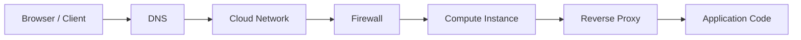

Every distributed systems conversation leans on a shared vocabulary — words like reliability, redundancy, and fault tolerance get used precisely, not interchangeably, and a design that mixes them up reads as imprecise even when the diagram is fine. This page is that vocabulary: a fast concept-to-definition table you can scan before an interview, followed by the backend request path, the storage-to-latency hierarchy, and vertical versus horizontal scaling ideas that tie the rest together.

> [!KEY]
> Precision with these words is itself a scoring signal. "The system should be reliable" says nothing; "the system should tolerate a single node failure without dropping a request" is a testable claim built from this vocabulary.

## Concept quick reference

| Term | One-line definition |
|---|---|
| **Scalability** | The ability to handle more load by adding resources, not by rewriting the system |
| **Maintainability** | How easily the system can be modified to fix bugs or add features without breaking unrelated parts |
| **Efficiency** | Doing the job with the least CPU, memory, and storage the job genuinely requires |
| **Reliability** | Performing correctly and consistently over time, including in the presence of failures |
| **Redundancy** | Duplicating a critical component so its failure doesn't take the system down with it |
| **Fault tolerance** | The system keeps working despite a component failure; **partition tolerance** is the network-failure special case |
| **SPOF (single point of failure)** | Any one component whose failure alone takes down the whole system |
| **CI/CD** | Continuous integration and continuous deployment — shipping small changes frequently and safely |
| **Staging environment** | A production-like environment used to validate a change before it reaches real users |
| **CAP theorem** | During a network partition, a distributed store must choose consistency or availability; partition tolerance is assumed |
| **Consistency models** | Rules that define how stale, ordered, or session-aware a read is allowed to be |
| **SLI / SLO / SLA** | The measurement, the internal target, and the contractual promise |
| **Throughput** | The amount of work a system processes per unit time — requests/second, queries/second, bytes/second |
| **Latency** | The time a single request takes to get a response |
| **Circuit breaker** | Stops calling a failing dependency for a cooldown period instead of retrying it into the ground |
| **Idempotency** | Performing an operation twice has the same effect as performing it once — what makes retries safe |
| **Graceful degradation** | Shedding non-critical functionality under load so the core function keeps working |
| **Regionalization** | Placing servers, data, and caches close to users across geographic regions |
| **Observability** | The combination of logs, metrics, and traces that lets you answer "why is this happening" from outside the process |

## What "backend" actually means

A backend is the system listening for client requests on an open port over the internet — it's called a "server" precisely because it serves data, content, and requests. Logic that could technically run in the browser often can't stay there: the client has less computing power, direct database connections from a browser are a security hole, CORS restricts cross-origin calls, and a browser tab is a fundamentally untrusted, sandboxed environment compared to a machine you control.

A request's real path is longer than "client calls server": browser, through DNS resolution, into the cloud provider's network, through a firewall, onto a compute instance, through a reverse proxy, and only then into your application code. Naming this full path — rather than treating "the backend" as one undifferentiated box — is what separates a system-design answer from a web-development answer.

## The storage hierarchy and when to scale each layer

Every tier of storage trades capacity for speed, and the gap between adjacent tiers is orders of magnitude, not a small percentage — which is exactly why caching in front of a database is worth the complexity.

| Storage type | Approximate latency | Approximate throughput | Typical role |
|---|---|---|---|
| CPU cache (L1–L3) | ~1 ns | — | Transparent to the application, but explains why in-process state is cheap |
| RAM | ~100 ns | Millions of reads/second | Running program state, Redis and other in-memory stores |
| SSD | ~0.1 ms | ~100,000 IOPS | Databases, application binaries, most modern "disk" |
| HDD | ~10 ms | ~100–200 IOPS | Cold storage, rarely on a hot path today |

Beyond raw storage speed, each architectural layer has its own realistic capacity ceiling and a signal that tells you it's time to scale that specific layer rather than the whole system:

| Component | Single-instance capacity | Scale this layer when |
|---|---|---|
| **Cache** (Redis) | ~1 ms latency, 100k+ ops/second, up to ~1 TB in memory | Hit rate drops below 80%, latency exceeds 1 ms, or memory exceeds 80% |
| **Database** | Up to ~50k transactions/second, 10–20k writes/second, sub-5ms cached reads, 64 TiB+ storage | Write throughput exceeds ~10k TPS, uncached reads exceed 5ms, or you need geographic distribution |
| **App server** | 100k+ concurrent connections, 8–64 cores, 64–512 GB RAM | CPU exceeds 70%, latency exceeds SLA, or connections approach the instance limit |
| **Message broker** | Up to ~1M messages/second per broker, sub-5ms latency, up to 50 TB storage | Throughput nears ~800k msgs/second or consumer lag is growing |

> [!TIP]
> Modern systems are far more often CPU-bound than disk-bound — say that out loud when justifying why you're scaling compute before you reach for a bigger disk.

## CAP, consistency, and availability in one paragraph

On a network partition — a failure mode you must assume can happen in any distributed system — a store either keeps serving and risks stale data (**availability**) or stops serving to guarantee every node agrees (**consistency**). Consistency itself is a spectrum, not a binary: linearizable consistency guarantees a single object follows real-time latest-write order, causal consistency preserves the order of related events, read-your-writes guarantees a user sees their own updates, and eventual consistency only guarantees convergence with no bound on when. The same system can mix these per field — inventory strongly consistent, a shopping cart read-your-writes, order history eventually consistent — which is a stronger interview answer than picking one model for the whole system.

{height=200px}

Availability itself is usually expressed in nines: 99.9% uptime allows 8.76 hours of downtime a year, while 99.999% allows only 5.26 minutes. An **SLO** is the internal target you engineer toward; an **SLA** is the external, often contractual, promise built on top of it.

## Scaling: vertical vs horizontal

| | Vertical scaling | Horizontal scaling |
|---|---|---|
| Meaning | A bigger single machine | More machines sharing the load |
| Complexity | Simple — no coordination needed | Complex — needs load balancing, statelessness, data partitioning |
| Ceiling | Hard limit — the biggest machine money can buy | No practical ceiling |
| Failure behaviour | One machine, one failure domain | Losing one node degrades capacity, doesn't take the system down |

Vertical scaling is where most designs should start — it's simple, and a single well-specified modern instance handles more traffic than most interview prompts actually need. Horizontal scaling earns its complexity once a single instance's ceiling is a real, arithmetic-backed constraint, not an assumption.

## Handling failure gracefully: the operational vocabulary

A production system needs a consistent answer to "what happens when this goes wrong," and that answer is built from a handful of recurring pieces:

| Concern | What it covers |
|---|---|
| **Input validation** | Syntactic (required fields, regex), semantic (a negative age, a past-dated future event), and type checks — enforced at the boundary, on both client and server |
| **Error handling** | Logic, database, validation, external-service, and configuration errors each need a path: retry, fallback, restart, or bubble up through a global error handler |
| **Config management** | App settings, feature flags, and secrets, stored in environment variables, config files, a key-value store, or a managed vault — never hardcoded |
| **Logging and monitoring** | Structured (JSON) logs at debug/info/warn/error/fatal levels, metrics on system health, and traces that follow one request across every service it touches |
| **Graceful shutdown** | On `SIGTERM`, stop accepting new connections, drain in-flight requests, then release resources — `SIGKILL` gives no such chance |
| **Alerting** | Notifying a human when a symptom crosses a threshold, ideally on user-visible impact rather than every internal metric |

> [!WARNING]
> None of these six concerns is optional in a real system, but naming all six in depth during an interview eats your clock. State the vocabulary, pick the one the interviewer is actually probing, and go deep only there.

Two of these concerns — timeouts/retries and circuit breakers — are common enough deep-dive targets that they're worth a dedicated image even though the fault tolerance and disaster recovery page covers them fully:

A circuit breaker moves through **closed** (requests flow, failures counted) → **open** (requests fail immediately once a failure threshold is hit) → **half-open** (a limited number of test requests check for recovery) → back to closed. Retries pair with **exponential backoff and jitter** — jitter specifically exists to stop many clients retrying in lockstep and re-creating the exact spike that caused the failure, known as the thundering herd problem.

## Regionalization, briefly

Serving users across the world means placing servers and data close to them: regional servers, regional data partitioning, replication and sharding so writes don't all cross an ocean, and CDNs and caches at the edge. The hard parts are active-active versus active-passive topology, split-brain prevention and conflict resolution; the summary is that "regionalization" always means both compute placement and data placement, not compute alone.

## Cheat sheet

- Reliability, availability, fault tolerance, and redundancy are related but distinct — use the precise one.
- SPOF is any single component whose failure alone takes the system down; the fix is always redundancy plus health checks and failover.
- RAM, SSD, and HDD differ by orders of magnitude in both latency and cost — that gap is the entire justification for caching.
- Each architectural layer (cache, database, app server, broker) has its own capacity ceiling and its own scale-trigger metric — quote the specific one, not "it's under load."
- CAP forces a choice only during a partition; day-to-day, PACELC's latency-vs-consistency trade-off is the one you're actually making.
- Vertical scaling first, horizontal scaling once a measured ceiling is actually being approached.
- Idempotency is what makes retries safe — design mutating operations to tolerate being called twice.
- A circuit breaker protects a *dependency* from cascading load; a queue and backpressure protect *your own* system from an upstream burst.

## Common mistakes

| Mistake | Fix |
|---|---|
| Using "reliable," "scalable," and "available" interchangeably | Use the precise term for the precise property being discussed |
| Saying "the system should be highly available" with no number | Quantify it — 99.9%, 99.99% — and say what degraded mode looks like |
| Reaching for horizontal scaling by default | Start vertical; scale horizontally once a ceiling is measured, not assumed |
| Retrying without idempotency | Design the operation to be safely repeatable before you add retry logic |
| Treating "add a circuit breaker" as a complete answer | Name the state machine and the specific dependency it protects |
| Skipping graceful shutdown in a design | Mention it explicitly — it's a common, easy, free point in a deep dive |
| Conflating SLO and SLA | SLO is the internal target; SLA is the external, often penalised, promise |

## Summary

This vocabulary — reliability, redundancy, fault tolerance, SPOF, the storage-to-latency hierarchy, vertical versus horizontal scaling, and the operational concerns of validation, error handling, config, logging, and graceful shutdown — is the shared language system design answers assume you already have. CAP, consistency models, availability math, and circuit breakers are deliberately kept brief here; the value is the connective vocabulary and the numbers that make deeper trade-off discussions precise.

## Top Interview Questions

### Q1. What's the difference between reliability, availability, and fault tolerance?

Reliability is about correctness over time — the system does the right thing consistently, including under unusual conditions. Availability is specifically about responsiveness — the system answers requests, even if what it returns is occasionally stale. Fault tolerance is the mechanism that makes both possible: the system keeps working despite an individual component failing. A system can be fault tolerant (it survives a node dying) without being perfectly available during the failover window, and a system can be available while briefly being less than fully reliable if it's serving slightly stale data to stay up.

### Q2. Why is a single point of failure dangerous even in an otherwise well-designed system?

A SPOF means the overall system's uptime is capped by that one component's uptime, no matter how redundant everything else is — three perfectly replicated application servers behind one un-replicated load balancer still go down the moment that load balancer fails. The fix is always the same shape: duplicate the component, add health checks so a failure is detected quickly, and add a failover mechanism so traffic moves to the healthy replica automatically. The subtlety is that fixing one SPOF can silently create a new one at the next layer up if you don't keep checking.

### Q3. Why does the difference between RAM, SSD, and HDD latency matter for system design, not just for hardware trivia?

The gap is roughly five orders of magnitude between RAM (~100 ns) and HDD (~10 ms), and about three orders of magnitude between RAM and SSD (~0.1 ms). That gap is the entire economic argument for caching: moving a hot read from a database's disk-backed storage into an in-memory cache isn't a marginal improvement, it's a thousand-times-or-more latency reduction, which is why "add a cache" is such a disproportionately effective fix for a slow read path compared to almost any other single change.

### Q4. How would you decide whether to scale a struggling service vertically or horizontally?

I'd start by identifying which specific resource is actually saturated — CPU, memory, connection count, or disk IOPS — and check whether a single bigger instance would resolve it, since vertical scaling is operationally simpler and avoids the coordination cost of a distributed fleet. I'd move to horizontal scaling once either the vertical ceiling is a real limit (there's a maximum instance size the cloud provider offers) or the failure-domain argument matters more than the operational simplicity — a single large vertically-scaled instance is still a single point of failure, however powerful it is.

### Q5. What's the practical difference between an SLO and an SLA?

An SLO is an internal engineering target — "99.95% availability measured over a rolling 30 days" — used to decide how much risk the team can take with releases and how urgently to respond to degradation. An SLA is the external, often contractual, version of that promise made to customers, frequently with financial penalties attached for breach. The SLO is normally set stricter than the SLA specifically to leave error-budget margin, so an SLO breach gives the team an early warning well before the SLA — the one customers actually notice — is at risk.

### Q6. Why is idempotency described as "what makes retries safe," and what happens without it?

A retry, by definition, means the same operation might execute more than once — over an unreliable network, the caller genuinely cannot tell whether the first attempt failed before or after it took effect. If the operation isn't idempotent, retrying a "charge $50" call risks charging the customer twice. Idempotency fixes this by making repeated execution produce the same end state as a single execution — typically via a client-generated idempotency key that the server records, checking it before doing the work again and returning the original result if the key was already processed.

### Q7. Explain the circuit breaker states and why the half-open state exists.

Closed is the normal state — requests pass through while failures are counted against a threshold. Once that threshold is crossed, the breaker moves to open, where requests fail immediately without even attempting the call, protecting the failing dependency from further load and protecting the caller from piling up slow, doomed requests. After a cooldown, the breaker moves to half-open and lets a small number of test requests through — if they succeed, it closes again; if they fail, it reopens. Half-open exists so recovery is detected automatically without either flooding a barely-recovered dependency or waiting indefinitely with no test at all.

### Q8. What's the purpose of jitter in a retry-with-backoff strategy?

Exponential backoff alone still lets many clients that failed at the same moment retry at the same delayed moment, in near-lockstep — recreating the exact traffic spike that caused the original failure, just delayed. Jitter adds a randomized component to each client's backoff delay so retries spread out over a window instead of arriving simultaneously, which is what actually protects the recovering dependency from an immediate second wave, known as the thundering herd problem.

### Q9. Why should graceful shutdown be part of a system design answer, and what does it actually involve?

Without it, deploying a new version or scaling down an instance means requests mid-flight get abruptly dropped, which shows up to users as failed requests during a routine, planned operation. Graceful shutdown means the process, on receiving `SIGTERM`, immediately stops accepting new connections, allows in-flight requests to finish within a bounded grace period, and only then releases its resources and exits — `SIGKILL` bypasses all of this and should only be a last resort after the grace period expires.

### Q10. What does "regionalization" mean beyond just running servers in multiple data centers?

It means both compute and data are placed close to users, not just compute. Running application servers in multiple regions but leaving a single central database means every write, and often every read, still crosses the ocean anyway — the latency win from regional servers is lost the moment they call home. Real regionalization pairs regional application servers with regionally replicated or partitioned data, plus a CDN and edge caching layer for anything that can be served without hitting the origin at all, and an explicit answer for how writes made in one region reach the others.

### Q11. A system reports "high availability" but users still complain about slow responses. What's the disconnect?

Availability measures whether requests get *a* response, not whether that response is fast — a system can be technically up and answering every request while serving them at a latency users experience as broken. This is exactly why latency needs its own SLO alongside an availability SLO; a design that only tracks uptime can hit 99.99% availability while silently degrading p99 latency to several seconds, and nothing in the availability number would catch it. I'd add a latency-specific SLO and alert on it independently.

### Q12. Why is "the system should be scalable" considered a weak requirement statement, and how would you improve it?

It doesn't say what kind of load growth is expected, along which dimension, or to what target — scalable for 2x traffic and scalable for 100x traffic imply very different architectures. A stronger version names the axis and the number: "the system should handle growth from 100k to 10M daily active users over the next year, primarily driven by read traffic on the feed endpoint." That version tells you whether you're solving a read-scaling problem, a write-scaling problem, or a storage-growth problem, which is the actual decision scalability as a bare word never communicates.
