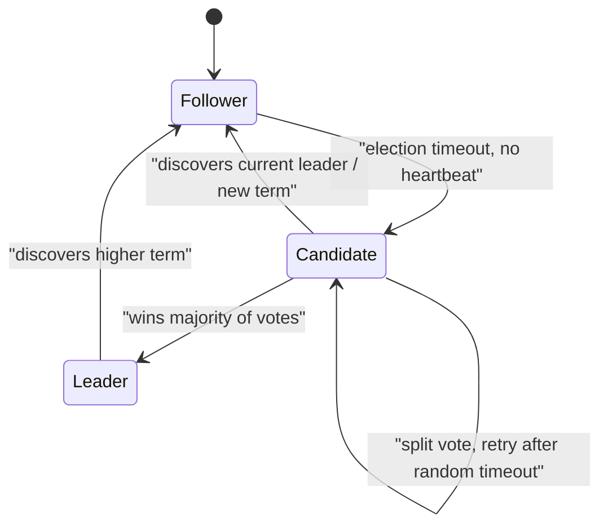
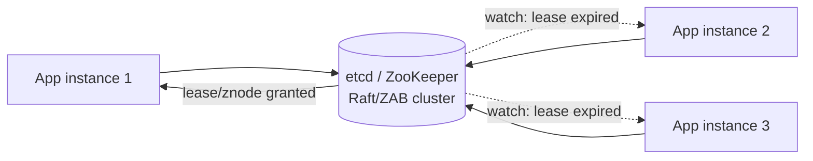

Consensus is the problem of getting a set of unreliable machines, connected by an unreliable network, to agree on a single value or a single leader — and it underlies leader election, distributed locks, configuration stores, and metadata services throughout distributed systems. It is also a topic where interviewers mostly want to hear that you know the shape of the problem and the names of the tools, not that you can derive Paxos from first principles.

## Why consensus is hard

The **FLP result** (Fischer, Lynch, Paterson, 1985) proves that in a fully asynchronous network — one with no bound on message delay — it is **impossible** for a consensus algorithm to guarantee both correctness and termination if even one node might fail. In plain English: you cannot build an algorithm that is guaranteed to always reach agreement in bounded time if the network might arbitrarily delay messages and you can't tell a slow node from a dead one.

> [!KEY]
> Real systems escape FLP not by disproving it, but by **relaxing its assumptions**: they use timeouts and heartbeats to treat "no response in time" as "probably failed" (accepting occasional wrong guesses), and they only need to make progress most of the time, not provably always. This is why Raft/Paxos systems can pause during a bad partition rather than violate correctness — they trade *liveness* for *safety*, never the reverse.

## Quorums

The core building block every consensus protocol uses is the **majority quorum**: with `2f + 1` nodes, the system tolerates `f` failures, because any two majorities out of `2f + 1` nodes must overlap by at least one node — this overlap is what prevents two conflicting decisions from both being accepted.

| Total nodes | Tolerates failures (`f`) | Majority needed |
|---|---|---|
| 3 | 1 | 2 |
| 5 | 2 | 3 |
| 7 | 3 | 4 |

> [!TIP]
> "Why 5 nodes, not 4?" is a classic follow-up. With 4 nodes, a majority is 3, but a 2-2 network split leaves *neither* side with a majority — no progress, but at least no split brain. Odd numbers avoid wasting a node: 5 tolerates the same 2 failures that 6 would, with one fewer machine.

## Paxos vs Raft

Both solve the same problem — get a majority of nodes to agree on a sequence of values (usually: entries in a replicated log) — but Raft was explicitly designed to be **understandable**, while Paxos is notoriously difficult to implement correctly from its original description.

| | Paxos | Raft |
|---|---|---|
| Goal | Prove consensus is achievable with quorums | Achieve the same result, optimized for engineers to implement correctly |
| Structure | Roles (proposer/acceptor/learner) per-value, hard to map to "one leader" intuitively | Explicit, single strong leader per term |
| Leader concept | Implicit / multi-Paxos adds one informally | **Central and explicit** |
| Log replication | Less directly specified | Explicit: leader appends, replicates, commits once majority ack |
| Real-world use | ZooKeeper (ZAB, Paxos-like), Google Chubby/Spanner | etcd, Consul, CockroachDB, most modern systems |

> [!NOTE]
> In an interview, naming Raft and describing its three pieces (leader election, log replication, safety/commit rule) is almost always sufficient — you are very unlikely to be asked to explain Paxos's proposer/acceptor mechanics in a system design round.

## Raft: leader election, log replication, commit

**Leader election**: every node starts as a **follower**. If a follower doesn't hear a heartbeat from a leader within a randomized timeout, it becomes a **candidate**, increments the current **term**, and requests votes from peers. A candidate that wins a majority becomes **leader** for that term; a split vote (no majority) causes candidates to retry after another random timeout, and randomization is what keeps split votes rare.

**Log replication**: once elected, the leader is the only node that accepts client writes. Each write is appended to the leader's log and sent to followers; once a **majority** have acknowledged it, the entry is **committed** and applied to the state machine. Followers that fall behind are simply brought up to date by the leader resending log entries — there's no separate reconciliation protocol.

**Terms and heartbeats**: a **term** is a monotonically increasing logical clock; every message carries the sender's term, and any node that sees a higher term than its own immediately steps down (if it was a leader/candidate) and updates its term. This is what prevents an old, isolated leader from being believed once it reconnects — its term is now stale.

> [!WARNING]
> The commit rule — "committed once a majority acknowledges" — is what makes Raft safe under partition: the leader cannot report success to the client for an entry that hasn't reached a majority, so a client-visible "success" is guaranteed to survive the failure of any minority of nodes, including the leader itself.

## Split brain and fencing

If a leader is partitioned away from the majority but keeps running, it can't get new writes committed (it can never reach a majority acknowledgment), but it might still believe it's the leader and could — without protection — keep serving stale reads or accepting writes it can't safely commit. Raft's term mechanism handles this cleanly: the majority partition elects a **new leader with a higher term**; when the old leader eventually reconnects and sees a higher term, it immediately steps down. Systems built on top of Raft/Paxos-based stores (like using etcd for leader election in an application) get **fencing tokens** derived from the term/lease version for free — any resource can reject an operation whose token is lower than one it has already seen, closing the same "paused leader wakes up and acts anyway" gap discussed in distributed locking.

## ZooKeeper and etcd as coordination services

You are extremely unlikely to be asked to implement Raft in an interview — you are very likely to be asked "what would you use for X", and the answer is almost always one of these.

| Service | Consensus protocol | Data model | Common uses |
|---|---|---|---|
| **ZooKeeper** | ZAB (Paxos-like, primary-backup) | Hierarchical znodes (like a filesystem) | Leader election, config, service discovery, distributed locks (ephemeral znodes) |
| **etcd** | Raft | Flat key-value store with leases and watches | Kubernetes' own metadata store, leader election, distributed locks, service discovery |
| **Consul** | Raft | Key-value + native service mesh/discovery | Service discovery, health checking, config, locks |

Both ZooKeeper and etcd expose the same practical primitives on top of consensus: **strongly consistent reads/writes**, **ephemeral/lease-based keys** that disappear if a client dies (the basis of leader election and locks), and a **watch** mechanism so clients are notified of changes instead of polling.

## Where consensus appears in real systems

| Use case | How consensus is used |
|---|---|
| **Leader election** | Exactly one node wins a lease/ephemeral node, agreed by a quorum |
| **Distributed locks** | A lock is a lease/znode; consensus guarantees only one holder is agreed upon |
| **Configuration management** | Config changes are committed to a replicated log, so all readers agree on the current value |
| **Cluster metadata** | Kubernetes stores all cluster state in etcd; Kafka controllers/metadata quorum use Raft-like consensus (KRaft) |
| **Distributed transactions** | Commit protocols (e.g. two-phase commit's coordinator decision) need agreement on the outcome |

## Why you should never build your own

Consensus algorithms are famous for having subtly broken "obvious" implementations — the original Paxos paper itself needed years of follow-up papers to clarify correct implementation, and Raft's own authors wrote an entire paper specifically about how hard it is to implement correctly despite being designed for understandability. Off-the-shelf, battle-tested implementations (etcd, ZooKeeper, Consul) have had years of production hardening, published TLA+ formal verification in some cases, and active communities finding and fixing edge cases you are unlikely to think of in a design review.

> [!DANGER]
> "I'll just have each node ping the others and the majority decides" is not consensus — it's a race condition wearing a consensus costume. Real implementations must handle: what happens during a network partition, what happens if two nodes think they won at the same time, what happens if a node crashes mid-decision and restarts with stale state. Always say "I'd use etcd/ZooKeeper" rather than attempt to design your own protocol live in an interview.

## Cheat sheet

- **FLP result**: no consensus algorithm can guarantee both correctness and termination in a fully asynchronous network with even one possible failure — real systems use timeouts to work around this in practice, trading liveness (not safety) during bad partitions.
- **Quorum = majority of `2f+1` nodes tolerates `f` failures** — any two majorities must overlap by at least one node.
- **Raft in three pieces**: leader election (randomized timeouts, terms), log replication (leader appends, majority acks), commit (only after majority acknowledgment).
- **Terms** are a monotonic clock that lets any node reject a stale leader — the basis of Raft's split-brain protection.
- **ZooKeeper (ZAB)** and **etcd (Raft)** are the practical, real-world answers — know their primitives (ephemeral nodes/leases, watches) not their internals.
- Consensus underlies **leader election, distributed locks, config management, and cluster metadata** — it's a building block, not a niche topic.
- **Never propose building your own consensus protocol** in an interview or in production — always defer to a battle-tested implementation.

## Common mistakes

| Mistake | Fix |
|---|---|
| Proposing a custom "majority ping" protocol as consensus | Defer to etcd/ZooKeeper; explain why rolling your own is risky |
| Thinking consensus guarantees progress no matter what | FLP says it can't, always, in an async network — real systems trade liveness for safety during bad partitions |
| Using an even number of nodes (e.g. 4) for a quorum cluster | Use an odd number — same fault tolerance with fewer machines |
| Assuming a partitioned old leader stops acting immediately | It keeps believing it's leader until it observes a higher term; protection comes from the term check, not instant awareness |
| Conflating a distributed lock with full consensus | A lock is often *built on* consensus (via a coordination service), but understand which one your design actually needs |
| Trying to explain Paxos's proposer/acceptor roles in depth unprompted | Raft's leader/term/log model is the expected depth for most interviews |

## Summary

Consensus is provably hard in a fully asynchronous network — the FLP result rules out an algorithm that always guarantees both agreement and termination — so real systems like Raft and Paxos work around it using timeouts, terms, and quorums, accepting that progress can stall during a bad partition as long as safety is never violated. Raft makes this tractable to reason about with three explicit pieces: randomized-timeout leader election, majority-acknowledged log replication, and a commit rule that only reports success once a majority has durably recorded an entry. ZooKeeper and etcd package this into practical coordination primitives — ephemeral leases, watches — that power leader election, distributed locks, and cluster metadata across the industry. The correct interview answer to "how would you implement this coordination" is almost always "on top of etcd or ZooKeeper," never "I'd design my own protocol."

## Top Interview Questions

### Q1. What is the FLP impossibility result, and how do real systems work around it?

FLP proves that in a fully asynchronous network — one with no guaranteed bound on message delay — no consensus algorithm can guarantee both correctness (never agreeing on a wrong value) and termination (always eventually deciding) if even a single node might fail, because a sufficiently slow message is indistinguishable from a dead node. Real systems like Raft and Paxos work around this not by disproving it but by relaxing the assumption: they use timeouts and heartbeats to treat "no response within X ms" as a practical (if occasionally wrong) signal of failure, accepting that the system might stall — not make wrong decisions, just make no decision — during a bad partition. The key insight to state out loud: these systems preserve safety unconditionally and sacrifice liveness only temporarily, never the other way around.

### Q2. Explain quorums and why consensus systems almost always use an odd number of nodes.

A quorum is a majority of the total nodes — with `2f + 1` total nodes, the system tolerates `f` failures, because any two majority subsets of `2f + 1` nodes are mathematically guaranteed to overlap in at least one node, and that guaranteed overlap is what prevents two conflicting decisions from both being independently accepted by different majorities. Odd numbers are preferred because they don't waste a node's fault tolerance: 5 nodes tolerate 2 failures with a majority of 3, and adding a 6th node still only tolerates 2 failures (majority becomes 4, but a 3-3 split has neither side with a majority) — so 6 nodes cost more without buying additional fault tolerance over 5.

### Q3. Walk through Raft's leader election process.

Every node starts as a follower, passively waiting for periodic heartbeats from a leader. If a follower doesn't receive a heartbeat within a randomized election timeout, it assumes the leader is gone, transitions to candidate, increments its current term (a monotonically increasing counter), votes for itself, and requests votes from every other node. If it receives votes from a majority of nodes for that term, it becomes leader and starts sending heartbeats; if two candidates split the vote and neither gets a majority, both time out (with a fresh random delay, which is what makes a second split unlikely) and retry. The randomized timeout is the key mechanism that keeps elections fast and split votes rare without any central coordinator.

### Q4. What is a "term" in Raft, and why does it matter for safety?

A term is a monotonically increasing integer that acts as a logical clock; every node tracks the highest term it has seen, and every message (heartbeat, vote request, log entry) carries the sender's term. If any node ever sees a message from a higher term than its own, it immediately updates to that term and, if it was acting as leader or candidate, steps down to follower — this is the mechanism that resolves stale leadership. It matters for safety because it's what lets a partitioned-away old leader be safely overridden: when it reconnects and observes a higher term (because the majority partition already elected a new leader), it recognizes its own leadership is stale and steps down, rather than continuing to act as if nothing happened.

### Q5. How does Raft guarantee that a committed log entry is never lost, even if the leader crashes right after committing it?

An entry is only considered committed once a *majority* of nodes have durably appended it to their logs, not just the leader — so by the time the leader can report success to the client, the entry already exists on enough nodes that any future leader (which must itself be elected by a majority, and that majority necessarily overlaps with the majority holding the entry) is guaranteed to have it in its log. If the leader crashes immediately after commit, the newly elected leader (elected via the same quorum-overlap guarantee) will already have that entry and will continue replicating it to any followers that are missing it, so nothing is lost — this overlap between "who committed it" and "who can become the next leader" is the core safety argument in Raft.

### Q6. Compare Paxos and Raft. Why did Raft become the more common choice in new systems?

Both solve the same fundamental problem — a majority of nodes agreeing on a sequence of values (typically a replicated log) — using the same underlying quorum-overlap idea, but Paxos's original formulation describes roles (proposer, acceptor, learner) per individual value being agreed on, which is notoriously difficult to map onto an intuitive "one leader replicating a log" mental model and has led to many subtly incorrect real-world implementations. Raft was explicitly designed for understandability: it has a single, explicit strong leader per term, a clear log replication mechanism, and a straightforward commit rule, making it dramatically easier for engineers to implement correctly and to reason about during an incident. This practical implementability, not a theoretical superiority, is why etcd, Consul, and most new systems built after ~2014 chose Raft over classic Paxos.

### Q7. What practical primitives do ZooKeeper and etcd expose that make them usable for leader election and locking, without an application implementing Raft itself?

Both expose lease- or session-bound keys (etcd leases, ZooKeeper ephemeral znodes) that automatically disappear if the owning client's connection or heartbeat stops, which is exactly the "release the lock/step down as leader if I die" behavior applications need without having to detect and handle that failure themselves. Both also expose a watch mechanism, letting other clients be notified immediately when a key changes or disappears, rather than polling — critical for fast leader failover and lock hand-off. Because reads and writes to these stores are themselves strongly consistent (backed by the underlying consensus protocol), an application can trust that "I successfully created this znode/lease" means it genuinely, uniquely holds it, without needing to reason about consensus itself.

### Q8. Why is it considered risky or naive to design your own leader election protocol from scratch (e.g. "nodes ping each other and the one with the lowest ID wins")?

A protocol like "lowest ID wins, decided by pinging" ignores nearly every hard case that real consensus protocols exist to handle: what happens if a network partition splits nodes into two groups that each elect their own "lowest ID" leader (split brain), what happens if a node crashes mid-decision and restarts believing stale state, and what happens if messages are delayed rather than lost, making a live node look dead temporarily. These aren't edge cases — they're the entire reason FLP is a hard theoretical result and why Paxos took years of follow-up papers to get right even among distributed systems researchers. The safe, expected answer in an interview or in production is to use an existing, formally reasoned-about implementation (etcd, ZooKeeper) rather than attempt a bespoke protocol, however intuitive it seems.

### Q9. Give three real-world examples of where consensus is used under the hood, beyond "electing a leader."

Kubernetes stores its entire cluster state — pods, deployments, config, secrets — in etcd, relying on Raft consensus so every API server replica sees a consistent view of cluster state even as nodes come and go. Kafka's newer KRaft mode replaces its old ZooKeeper-based controller quorum with an internal Raft-based metadata quorum, using consensus to agree on partition leadership and cluster metadata instead of a separate ZooKeeper cluster. Distributed configuration systems (feature flags, dynamic config) built on ZooKeeper or etcd rely on consensus so that a config change is durably committed and every reader across a fleet of services converges on the same value rather than some services seeing an old value indefinitely.

### Q10. During a network partition, a Raft cluster's leader ends up in the minority side. What happens on each side of the partition?

On the minority side, the old leader keeps trying to replicate new writes but can never get acknowledgment from a majority (since the majority partition doesn't include it), so those writes never commit and the leader effectively can't make progress — it will not incorrectly report success to clients for anything it can't get a majority to acknowledge. On the majority side, nodes stop hearing heartbeats from the old leader, their election timeouts fire, and they elect a new leader with a higher term, which can then commit new writes normally since it has access to a majority. When the partition heals, the old leader receives messages carrying the higher term, recognizes it's stale, and steps down to follower, re-synchronizing its log with the new leader's — this whole sequence is why Raft never violates safety during a partition, only availability on the minority side.

### Q11. What's the difference between a distributed lock and full consensus, and are they the same thing?

A distributed lock is a narrower, application-level primitive — "let exactly one process hold this token right now" — while consensus is the broader underlying capability of getting a set of nodes to agree on a value or sequence of values reliably despite failures. In practice, a robust distributed lock is often *built on top of* a consensus-backed coordination service — a ZooKeeper ephemeral znode or an etcd lease is a lock precisely because the underlying Raft/ZAB consensus guarantees only one client can hold that particular lease/znode at a time. So they're related but not identical: consensus is the general machinery, and a distributed lock is one common application built using it.

### Q12. If a candidate proposes replacing a distributed lock with a Raft-based coordination service purely for correctness reasons, what should they weigh against that decision?

Moving from something like a Redis `SET NX` lock to a Raft-backed coordination service like etcd or ZooKeeper trades simplicity and low latency for stronger correctness guarantees — Raft-based systems require a majority round trip to commit any change, which is inherently higher latency than a single-node Redis operation, and it adds a new piece of infrastructure to operate, monitor, and reason about failure modes for. The right framing in an interview is a trade-off, not a strict upgrade: use the coordination service when the cost of a correctness bug (double-processing a payment, two leaders both writing) is high enough to justify the added latency and operational overhead, and stick with a simpler Redis-based lock (accepting its known limitations, mitigated with fencing tokens) when the stakes are lower and speed matters more.
