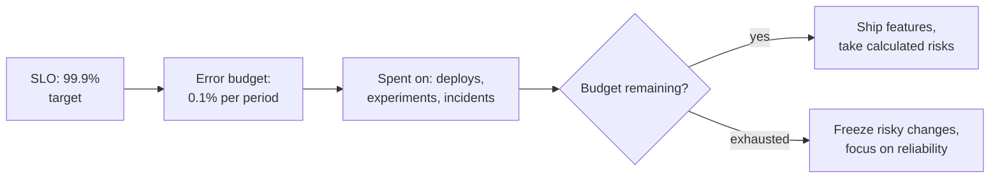
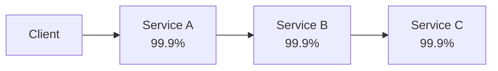

"Make it highly available" means nothing until it's a number. This page covers the vocabulary that turns reliability into something you can measure, alert on and negotiate — SLIs, SLOs, SLAs, the nines table, error budgets, and the maths of composing availability across dependencies.

## The nines table

Availability is usually expressed as a percentage of time a system is "up," and each additional nine is an order of magnitude less downtime.

| Availability | Downtime / year | Downtime / month | Downtime / week |
|---|---|---|---|
| 99% ("two nines") | 3.65 days | 7.2 hours | 1.68 hours |
| 99.9% ("three nines") | 8.76 hours | 43.2 minutes | 10.1 minutes |
| 99.95% | 4.38 hours | 21.6 minutes | 5.04 minutes |
| 99.99% ("four nines") | 52.6 minutes | 4.32 minutes | 1.01 minutes |
| 99.999% ("five nines") | 5.26 minutes | 25.9 seconds | 6.05 seconds |

> [!KEY]
> Going from 99.9% to 99.99% is not "a bit better" — it's **10x less tolerance for downtime**, and typically requires qualitatively different engineering (multi-region failover, no single points of failure, automated remediation) rather than just "trying harder."

## SLI, SLO and SLA — three different things

These three terms are often used interchangeably in casual conversation, but they answer different questions and mixing them up is an easy interview stumble.

| Term | Question it answers | Who it's for | Example |
|---|---|---|---|
| **SLI** (Service Level Indicator) | What are we actually measuring? | Engineering | "Percentage of requests completed in < 300 ms" |
| **SLO** (Service Level Objective) | What internal target do we hold ourselves to? | Engineering + product | "99.9% of requests < 300 ms over a rolling 28 days" |
| **SLA** (Service Level Agreement) | What have we contractually promised the customer, with what penalty? | Legal/business + customer | "99.5% monthly uptime or a service credit" |

> [!TIP]
> A senior answer volunteers the relationship: *"The SLA should always be looser than the SLO, which should be looser than what the SLI shows we actually achieve — that gap is the safety margin against noisy months."* Never set the SLA equal to your measured performance; you'll breach it on a bad day.

### Choosing good SLIs

Not every metric is worth turning into an SLI. Good SLIs are user-facing and map to what a user actually experiences:

| SLI category | What it measures | Example |
|---|---|---|
| **Availability** | Fraction of requests that succeed | `successful requests / total requests` |
| **Latency** | Fraction of requests fast enough | `requests under 300ms / total requests` |
| **Quality / correctness** | Fraction of responses that are correct/complete | `responses without degraded/fallback data / total` |
| **Freshness** | How stale served data is allowed to be | `% of reads served from data < 5 min old` |

> [!WARNING]
> CPU usage, queue depth, and GC pause time are useful **internal signals** for debugging, but they are poor SLIs — a user doesn't experience "CPU at 80%," they experience a slow or failed request. Pick SLIs that would make sense read aloud to a non-engineer.

## Error budgets

If your SLO is 99.9% availability, you have implicitly agreed to **0.1% unavailability** — an *error budget* you're allowed to spend. This reframes reliability from "never break anything" to "you have a budget, spend it deliberately."

The practical effect: when the error budget is healthy, teams can deploy freely, run experiments, and take calculated risks. When the budget is nearly exhausted, the team **stops shipping new risk** and prioritizes reliability work until the budget recovers. This turns a political argument ("can we deploy on Friday?") into a data-driven one ("we have 40% of this month's budget left, so yes").

> [!KEY]
> The error budget is what makes "100% availability" the **wrong target** to state out loud: at 100%, the budget is zero, which means no deploys, no experiments, no risk — ever. A little planned unreliability is what buys engineering velocity.

### Burn-rate alerting

Alerting directly on "we're below the SLO" is too slow — by the time the 28-day average dips, you've already blown the budget. Burn-rate alerting instead asks "at the *current rate* of errors, how fast are we consuming the budget?"

| Burn rate | Meaning | Typical alert |
|---|---|---|
| 1x | Burning budget exactly on schedule to exhaust it precisely at period end | Informational |
| 2x | Will exhaust the budget in half the period | Low-urgency ticket |
| 10x+ | Will exhaust the whole month's budget in a few hours | Page immediately |

A common pattern (used at Google) is a **multi-window, multi-burn-rate** alert: check both a short window (5 minutes, to catch fast-moving outages) and a long window (1 hour, to avoid paging on a brief blip), each with its own burn-rate threshold.

## Availability maths: series vs parallel

A request often depends on several services in sequence, and availability **multiplies** across a series — every dependency drags the composite number down.

Three services at 99.9% each, called in series: `0.999 × 0.999 × 0.999 ≈ 99.7%` — worse than any individual dependency. Add a fourth and it keeps dropping. This is why "each of our five microservices is 99.99% available" doesn't mean the user-facing flow is — it's `0.9999⁵ ≈ 99.95%`.

**Redundancy in parallel** is the fix: if a component is replicated and the request only needs *one* replica to succeed, availability improves instead. Two independent replicas each at 99% give a combined availability of `1 - (1 - 0.99)² = 99.99%` — the failures have to happen **simultaneously** to cause an outage, which is far less likely if the replicas are truly independent (different racks, zones, or regions).

| Composition | Formula | Example |
|---|---|---|
| Series (all must succeed) | `A₁ × A₂ × ... × Aₙ` | Chained microservice calls |
| Parallel (any one must succeed) | `1 - (1-A₁)(1-A₂)...(1-Aₙ)` | Redundant replicas, retries to a different instance |

> [!DANGER]
> Redundancy only helps if failures are **independent**. Two replicas in the same rack, same AZ, or behind the same power supply share a common failure mode — a single event can take both down at once, and the parallel-availability formula no longer applies.

## Composite service availability, worked

Say a checkout flow calls: API gateway (99.99%) → auth service (99.95%) → payment service, which has two redundant providers each at 99.9% → inventory service (99.9%).

1. Payment redundancy: `1 - (1-0.999)² = 1 - 0.000001 = 99.9999%`
2. Chain them all: `0.9999 × 0.9995 × 0.999999 × 0.999 ≈ 99.83%`

The composite (99.83%) is dragged down mostly by the weakest **series** link (inventory at 99.9%), not by payment — even though payment looks the scariest on paper, its redundancy already fixed it. This is the point of doing the maths explicitly in an interview: it tells you **where to invest** — improving inventory's availability (or adding redundancy there too) moves the composite number more than anything else.

## Cheat sheet

- **99.9% ≈ 8.76 h/yr down; 99.99% ≈ 52.6 min/yr; 99.999% ≈ 5.26 min/yr** — memorize these.
- **SLI** = the measurement, **SLO** = your internal target, **SLA** = the contractual promise (with penalty) — SLA should be looser than SLO.
- **Good SLIs are user-facing**: availability, latency, quality, freshness — not CPU or queue depth.
- **Error budget = 1 − SLO.** Healthy budget → ship and experiment freely; exhausted budget → freeze and stabilize.
- **100% availability is the wrong target** — it implies zero error budget, i.e., zero room to deploy or experiment.
- **Burn-rate alerting** catches "about to blow the budget," not just "already below SLO."
- **Series dependencies multiply availability down** — every added hop hurts.
- **Parallel/redundant dependencies multiply unavailability down** — but only if failures are independent.
- **Composite availability calculations reveal the true weakest link**, which isn't always the scariest-looking component.

## Common mistakes

| Mistake | Fix |
|---|---|
| Setting the SLA equal to measured performance | Leave a safety margin — SLA looser than SLO looser than actual |
| Picking internal metrics (CPU, queue depth) as SLIs | Use user-facing measurements: success rate, latency, correctness, freshness |
| Alerting only when the SLO is already breached | Add burn-rate alerts to catch fast budget consumption early |
| Assuming "highly available" components make redundancy unnecessary | Redundancy still needed — series composition drags availability down regardless |
| Treating two replicas in the same AZ as independent | Independence requires separate failure domains (zone/region/power) |
| Chasing 100% availability | Budget deliberate unreliability; it's what funds shipping velocity |

## Summary

Availability stops being a vague adjective once you separate SLI (what you measure), SLO (your internal target) and SLA (the contractual promise), and once you accept that a nonzero error budget is a feature, not a failure. Series dependencies multiply availability down, so composite systems are almost always less available than their weakest-looking link suggests, while genuinely independent redundancy multiplies unavailability down. Burn-rate alerting turns "we might breach our SLO this month" into an actionable, early signal, and the whole framework turns reliability from a moral argument into a numbers-driven engineering trade-off.

## Top Interview Questions

### Q1. What is the difference between an SLI, an SLO and an SLA?

An SLI (Service Level Indicator) is the actual measurement — a concrete, quantifiable metric like "percentage of requests completed successfully" or "percentage of requests under 300 ms." An SLO (Service Level Objective) is the internal target you hold that SLI to, e.g. "99.9% of requests succeed over a rolling 28-day window" — it's a goal for engineering and product, not a promise to a customer. An SLA (Service Level Agreement) is the external, often contractual, commitment to a customer, usually with a financial penalty for breach, e.g. "99.5% monthly uptime or a service credit." The SLA should always be set looser than the SLO, which in turn should be looser than what you actually measure day-to-day, so a single bad day doesn't trigger a contractual breach.

### Q2. Why is 100% availability the wrong target to aim for?

Because the gap between 100% and your actual SLO is your **error budget** — the amount of unreliability you're implicitly allowed to "spend" on deploys, experiments, and unavoidable incidents. At exactly 100%, the budget is zero, which in practice means no deployments (any deploy carries some risk of a brief failure), no canary releases, no chaos testing, and no tolerance for even a single transient blip. Beyond the operational absurdity, 100% is also economically wasteful — going from 99.99% to 99.999% often costs disproportionately more (multi-region active-active, extensive redundancy) for a use case where users likely can't perceive the difference. The right target balances user expectation against engineering cost and velocity.

### Q3. Explain what an error budget is and how it changes engineering decisions day to day.

An error budget is simply `1 − SLO` over a given period — if your SLO is 99.9% over 28 days, your budget is 0.1% of that period's requests (or time) allowed to fail. Practically, teams track how much of the budget has been consumed; if it's healthy, they can ship features, run A/B experiments, and take calculated risks, because there's room to absorb the occasional bad deploy. If the budget is nearly or fully exhausted, the team enters a "freeze" mode — halting risky releases, prioritizing bug fixes and reliability work — until the budget recovers. This converts "can we deploy on Friday" from an opinion-based argument into a data-driven decision based on remaining budget.

### Q4. Why does availability multiply across services in series, and what does that mean for a five-microservice call chain?

If a request must succeed at every one of several sequential dependencies to succeed overall, the probability all of them succeed is the product of each individual probability — a single 99.9% link failing fails the whole chain, so you multiply, not average. For five services each at 99.99%, the composite is `0.9999⁵ ≈ 99.95%` — worse than any individual service. This is a common interview gotcha: teams often report each microservice's own availability without realizing the user-facing flow that chains several of them together is meaningfully less available than any single one, especially as the number of hops grows.

### Q5. How does redundancy in parallel improve availability, and what condition must hold for the maths to work?

If a component is replicated such that only *one* of several replicas needs to succeed, the probability all of them fail simultaneously is the product of each one's failure probability — which shrinks fast. Two replicas each at 99% (1% failure) combined: `1 − (0.01 × 0.01) = 99.99%`. The critical condition is **independence**: this maths assumes the replicas fail for unrelated reasons. If both replicas share a failure domain — same rack, same availability zone, same power feed, same underlying cloud region — a single event can take both down together, and the real combined availability collapses back toward a single replica's number. True redundancy requires diversifying the failure domain, not just duplicating instances.

### Q6. What makes a metric a good SLI versus a poor one?

A good SLI directly reflects what a user experiences and can be explained to a non-engineer without translation — request success rate, request latency under a threshold, response correctness/completeness, or data freshness. A poor SLI is an internal implementation detail that correlates with user pain but isn't itself the thing users feel — CPU utilization, queue depth, GC pause count, disk IOPS. Those are valuable for **debugging** why an SLI is degrading, but shouldn't be the SLO target itself, because a system can have terrible CPU usage while every user request still succeeds quickly, or vice versa. The test: "if I read this metric out loud to a customer, would it describe their experience?"

### Q7. What is burn-rate alerting and why is it better than alerting directly on the SLO?

Burn-rate alerting looks at how *fast* the error budget is being consumed right now, rather than waiting for the rolling SLO window average to actually dip below target. A 1x burn rate means you're on pace to use exactly the full budget by the end of the period (expected); a 10x burn rate means you'd exhaust the entire month's budget in a few hours if it continued, which warrants an immediate page. Alerting only when the SLO itself is breached is too slow — by definition, the damage (the budget overspend) has already happened by the time a 28-day rolling average crosses the line. Multi-window burn-rate alerts (checking both a short window like 5 minutes and a longer window like 1 hour) catch fast incidents quickly while avoiding paging on brief, self-resolving blips.

### Q8. Scenario: your service reports 99.95% availability over the quarter but users keep complaining about reliability. What would you investigate?

First, check whether the SLI actually reflects the user's experience — a common gap is measuring server-side success (2xx responses) while ignoring client-side failures like timeouts, retries the client gave up on, or degraded/fallback responses that technically "succeeded" but frustrated the user. Second, check whether the aggregation window is hiding a burst: 99.95% over a quarter can still contain a single terrible day that violated the SLO badly, averaged out by many perfect days — look at the burn-rate history, not just the rolling average. Third, check if the SLI is measured at the wrong layer (e.g. at the load balancer, missing failures that occur further downstream, like a slow database causing timeouts the LB never sees as errors). The fix is usually to add or refine SLIs closer to the actual user-perceived experience.

### Q9. How would you calculate the composite availability of a checkout flow with four dependencies, one of which has two redundant providers?

Compute redundant components first, then multiply the chain. If payment has two independent providers each at 99.9%, their combined availability is `1 − (1 − 0.999)² ≈ 99.9999%`. Then multiply that result with the other services in series — say API gateway 99.99%, auth 99.95%, inventory 99.9%: `0.9999 × 0.9995 × 0.999999 × 0.999 ≈ 99.83%`. The useful insight from doing this explicitly is identifying the true bottleneck — here, inventory at 99.9% (a plain series link with no redundancy) drags the composite down more than payment does, even though payment "looks" like the riskier component on paper. That tells you where to invest next: add redundancy or improve inventory's own reliability, not payment.

### Q10. Your team's SLO is 99.9% but the last three months averaged 99.95%. Should you tighten the SLO?

Not automatically — a consistently better-than-target result doesn't necessarily mean the target is wrong; it might mean the current architecture happens to be reliable, or that the measurement period didn't include a rare-but-expected failure mode (a regional outage, a major dependency incident) that the SLO was set to tolerate. I'd look at whether the SLO was set based on user needs/contractual requirements (in which case, leave it — the extra headroom is a healthy buffer, not "wasted" reliability) versus set arbitrarily. If tightening it, be explicit about the cost: a tighter SLO shrinks the error budget, meaning less room for deploys and experiments, so it should be a deliberate trade against velocity, not an automatic ratchet every quarter the number looks good.

### Q11. How do SLOs interact with incident response and postmortems?

An SLO breach (or a fast burn rate approaching one) is usually the trigger for declaring an incident and the natural way to size its severity — "we burned 60% of this month's budget in one hour" is a much more actionable framing than "the error rate spiked." Postmortems should quantify impact in terms of budget consumed (e.g. "this incident used 3 days' worth of our monthly error budget") so that engineering leadership can weigh the cost of the incident against the cost of preventing it, on the same scale used for planning feature work. It also creates a natural forcing function: if an incident (or a string of smaller ones) consumes the whole budget, the team is expected to shift focus to reliability work until it recovers, rather than that decision being purely subjective.

### Q12. How would you choose the measurement window for an SLO (e.g. 7 days vs 28 days vs 90 days)?

Shorter windows (7 days) make the SLO more sensitive and responsive — useful for fast-moving, actively-developed services where you want quick feedback on whether recent changes hurt reliability — but they're noisier and can trigger budget-freeze behavior from a single bad day. Longer windows (28–90 days) smooth out noise and better match how customers actually perceive reliability over a billing cycle, which is why 28-30 day rolling windows are the most common default (aligning with monthly SLA reporting), but they're slower to reflect recent regressions and can let a team "coast" on a good month while masking a newly-introduced problem. A common compromise is to track multiple windows simultaneously — a short window for fast alerting via burn rate, and a longer rolling window as the actual reported SLO number.
