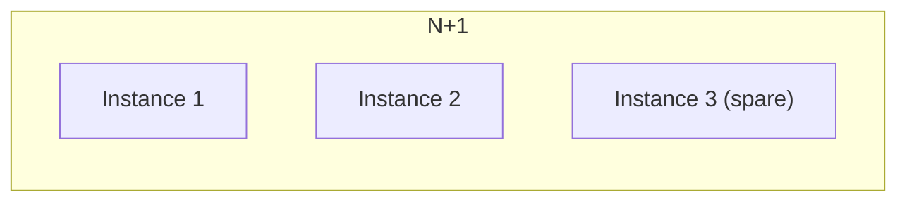
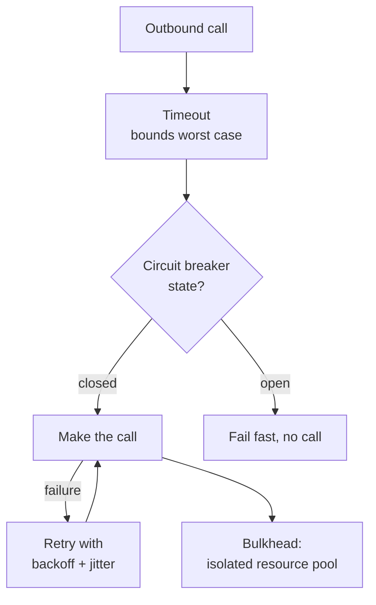
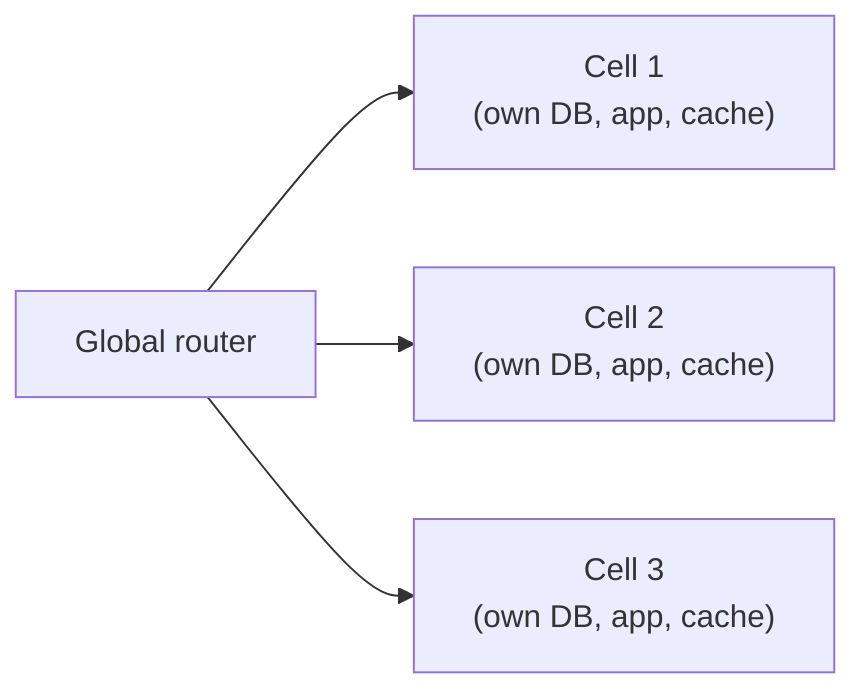

Systems fail constantly at scale — disks die, networks partition, processes get OOM-killed, entire regions go dark. Fault tolerance is not about preventing failure, it's about designing so that failure is contained, expected, and recoverable within a promised time and data-loss window. This page covers the failure taxonomy, the resilience patterns, and the disaster-recovery maths interviewers expect you to reason through.

## Failure modes taxonomy

Not all failures look alike, and how a component fails changes what defenses actually work.

| Failure mode | What happens | Defense |
|---|---|---|
| **Crash (fail-stop)** | Component stops entirely, cleanly | Health checks + restart/failover |
| **Omission** | Component silently drops a request/response without responding | Timeouts, retries |
| **Timing** | Component responds, but too slowly (violates SLA without being "wrong") | Timeouts, hedged requests, load shedding |
| **Byzantine** | Component responds with incorrect or malicious data, possibly convincingly | Checksums, consensus quorums, signature verification |
| **Grey failure** | Component appears healthy on standard health checks but a subset of real requests fail | Synthetic/canary probes, per-endpoint error tracking, not just liveness |

> [!WARNING]
> Grey failures are the ones that hurt most in practice: a node that answers `/health` fine but times out on 30% of real writes (a failing disk, a saturated connection pool) will happily keep receiving traffic from a load balancer that only checks liveness. Health checks need to exercise a real code path, not just "process is running."

## Redundancy strategies



| Strategy | Description | Failover time | Cost |
|---|---|---|---|
| **N+1** | One extra unit of capacity beyond what's needed, absorbs a single failure | Instant (already serving) | Low — one extra unit |
| **Active-passive** | Standby replica kept in sync, promoted on failure | Seconds to minutes (promotion + DNS/routing) | Medium — standby is idle |
| **Active-active** | Multiple replicas serve traffic simultaneously | None — traffic just shifts away from the failed one | High — full duplicate capacity, plus conflict handling |

Active-active gives the best failover time because there's no promotion step, but it requires handling concurrent writes to multiple active copies (see the multi-region page for conflict resolution) — that complexity is the real cost, not just the extra hardware.

## Graceful degradation and load shedding

When a dependency is unhealthy or overloaded, the choice isn't "up or down" — a well-designed system degrades a specific feature while keeping the core flow alive.

| Technique | What it does | Example |
|---|---|---|
| **Graceful degradation** | Serve a reduced/cached/default experience instead of failing | Recommendations service down → show generic "popular items" instead of personalized ones |
| **Load shedding** | Deliberately reject a fraction of requests before the system collapses entirely | Return `503` to low-priority traffic when queue depth exceeds a threshold |
| **Prioritization** | Serve critical traffic first when shedding | Checkout traffic protected; browsing traffic shed first |

> [!KEY]
> Load shedding sounds like giving up, but it's the opposite: rejecting the *marginal* request fast and cheaply is what keeps the system from collapsing under retry storms and queueing collapse, protecting the requests already in flight.

## Timeouts, retries with jitter, circuit breakers, bulkheads

These four patterns are the standard toolkit for surviving a flaky dependency, and they compose — a resilient call to a downstream service typically uses all four together.



- **Timeouts** bound how long you wait for a slow dependency — without one, a hung call ties up a thread/connection indefinitely.
- **Retries with jitter**: exponential backoff (`base × 2^attempt`) spreads retries out, but if every client backs off on the *same* schedule, they all retry in sync and cause a thundering herd. **Jitter** — adding randomness to the delay — desynchronizes retries across clients.
- **Circuit breaker**: Closed (normal) → after enough failures → Open (fail fast, no calls made) → after a cooldown → Half-open (a few test calls) → Closed or back to Open. Stops hammering an already-struggling dependency and lets it recover.
- **Bulkhead**: partition resources (thread pools, connection pools) per dependency so one slow/failing dependency can't exhaust the resources needed to serve requests to a healthy one — named after ship compartments that contain flooding to one section.

> [!DANGER]
> Retrying without jitter is a classic outage amplifier: a dependency blips, every client's retry timers fire at the same backoff intervals, and the resulting synchronized retry wave can be worse than the original blip. Always add jitter.

## Blast radius reduction and cell-based architecture

Rather than relying purely on redundancy, a **cell-based architecture** partitions the whole system — infrastructure, data, and traffic — into independent, isolated "cells," each serving a subset of customers/traffic end to end.



If cell 2 has a bad deploy, a noisy-neighbor problem, or a cascading failure, only the customers routed to cell 2 are affected — cells 1 and 3 keep operating normally. This trades some efficiency (you can't share a resource pool across all traffic) for a hard limit on blast radius, and it's how large platforms (AWS itself is built this way internally) avoid a single bug or failure taking down 100% of customers at once.

> [!TIP]
> "How do you limit blast radius" is a question that rewards naming cell-based architecture specifically, not just "we have multiple availability zones" — AZs protect against infrastructure failure, cells also protect against **software/config failures** (bad deploys, poison-pill data) that AZs don't help with at all.

## Backups vs replication

These are often confused, but they defend against different things.

| | Replication | Backup |
|---|---|---|
| Protects against | Hardware/node/AZ failure | Data corruption, bad deploys, accidental deletes, ransomware |
| Speed to recover | Fast (already running) | Slower (restore process) |
| Propagates bad writes? | Yes — instantly, to every replica | No — a backup taken before the bad write is unaffected |

> [!DANGER]
> Replication is not a backup. If someone runs `DELETE FROM orders` with no `WHERE` clause, every replica faithfully replicates the deletion within milliseconds. Only a point-in-time backup (or a delayed/immutable replica) can undo it.

## RTO, RPO and disaster recovery strategies

**RTO** (Recovery Time Objective) is how long you can be down. **RPO** (Recovery Point Objective) is how much data you can afford to lose, measured as time since the last recoverable point. Both are business decisions, translated into architecture.

| Strategy | RTO | RPO | Cost | How it works |
|---|---|---|---|---|
| **Backup and restore** | Hours to days | Hours (since last backup) | $ | Periodic backups, restore into fresh infra on disaster |
| **Pilot light** | Tens of minutes | Minutes | $$ | Minimal core (DB replica, config) always running; scale up compute on failover |
| **Warm standby** | Minutes | Seconds to minutes | $$$ | Scaled-down but fully functional copy running in the DR region, scaled up on failover |
| **Hot-hot (active-active)** | Near zero | Near zero | $$$$ | Full duplicate capacity serving live traffic in both regions simultaneously |

> [!KEY]
> RTO and RPO should come from the business, not from engineering preference — "how many minutes of downtime can we tolerate, and how many minutes of data can we afford to lose" are questions for product/finance, and the answer determines which (expensive) row of this table you need, not the other way around.

## Chaos testing

Chaos engineering deliberately injects failure into a system — killing instances, adding network latency, blocking a dependency — to verify that the resilience patterns you *believe* you have (timeouts, retries, circuit breakers, failover) actually work under real conditions, rather than only on paper.

```java
// Example: a chaos-injection filter that randomly fails a fraction of calls
@Override
protected void doFilterInternal(HttpServletRequest req, HttpServletResponse res, FilterChain chain)
        throws ServletException, IOException {
    if (chaosEnabled && random.nextDouble() < failureRate) {
        res.setStatus(503); // simulate dependency failure
        return;
    }
    chain.doFilter(req, res);
}
```

Well-known practice: start in staging, graduate to production during low-traffic windows with a kill switch, and always have a human "abort" button. The goal isn't to prove things are broken — it's to find out *before* a real outage whether your failover, alerting, and runbooks actually work.

## Cheat sheet

- **Classify the failure mode first**: crash, omission, timing, byzantine, grey — each needs a different defense.
- **Grey failures pass health checks** — probe real request paths, not just liveness.
- **N+1 < active-passive < active-active** in failover speed, and in cost/complexity.
- **Load shedding is a feature, not a failure** — reject the marginal request to protect the rest.
- **Timeout + retry-with-jitter + circuit breaker + bulkhead** compose together for every outbound call.
- **Replication ≠ backup** — replication propagates bad writes instantly; only backups (or delayed replicas) undo them.
- **RTO = how long you can be down. RPO = how much data you can lose.** Business decisions, not engineering ones.
- **Backup-restore → pilot light → warm standby → hot-hot**: RTO/RPO improve, cost climbs, in that order.
- **Cell-based architecture limits blast radius** even for software bugs, not just hardware failure.
- **Chaos testing verifies resilience claims empirically**, before a real incident does it for you.

## Common mistakes

| Mistake | Fix |
|---|---|
| Health check only pings `/health`, not a real dependency path | Add synthetic checks that exercise real request paths (grey failure detection) |
| Retrying without jitter | Add randomized jitter to backoff to avoid synchronized retry storms |
| Treating replication as a backup strategy | Keep separate, immutable/point-in-time backups for corruption/deletion scenarios |
| Setting RTO/RPO based on what's "easy to build" | Get the numbers from the business, then pick the DR strategy that satisfies them |
| One shared thread/connection pool for all dependencies | Bulkhead — isolate pools per dependency |
| Only testing failover in a tabletop exercise, never for real | Run actual chaos tests (in staging, then guarded production windows) |

## Summary

Fault tolerance starts with correctly naming how something is failing — crash, omission, timing, byzantine, or the sneaky grey failure that passes health checks — because each demands a different defense. Timeouts, jittered retries, circuit breakers and bulkheads are the composable building blocks for surviving a flaky dependency, while cell-based architecture and genuine backups (not just replicas) contain the blast radius of bugs, bad deploys, and data corruption. RTO and RPO translate "how much downtime and data loss can we tolerate" into a concrete choice among backup-restore, pilot light, warm standby, or hot-hot — and chaos testing is how you find out whether all of this actually works before a real disaster does.

## Top Interview Questions

### Q1. What are the main failure modes a distributed system needs to handle, and why does "grey failure" deserve special attention?

The taxonomy: crash (a component stops cleanly and entirely), omission (it silently drops requests/responses without answering), timing (it responds, just too slowly to meet the SLA), and byzantine (it responds with incorrect or even malicious data). Grey failure is the dangerous one because it doesn't fit cleanly into "up" or "down" — the component looks healthy on a standard liveness check (`/health` returns 200) while a meaningful fraction of real requests fail or time out, often due to a specific degraded dependency, a subset of bad data, or partial resource exhaustion. Because load balancers and orchestrators typically route based on liveness checks, a grey-failing node keeps receiving traffic it can't properly serve, which is why health checks need to exercise a real request path, not just process liveness.

### Q2. Compare N+1 redundancy, active-passive, and active-active in terms of failover time and cost.

N+1 keeps one extra unit of capacity beyond what's strictly needed, so if one instance fails, the spare absorbs the load with effectively instant failover and low added cost — but it only protects against losing that one unit, not a broader regional event. Active-passive keeps a full standby replica in sync but idle, promoted to active on failure; this costs a full duplicate of infrastructure sitting mostly unused, and failover takes seconds to minutes for promotion and traffic re-routing (DNS propagation, health-check detection). Active-active runs multiple replicas serving live traffic simultaneously, so failover is nearly instantaneous — traffic simply shifts away from the failed instance — but it's the most expensive option and requires solving concurrent-write conflict resolution, since more than one copy can be written to at once.

### Q3. Explain how timeouts, retries with jitter, circuit breakers and bulkheads work together for a single outbound call.

A timeout bounds the worst case for how long you'll wait on a slow dependency, preventing a hung call from tying up a thread or connection indefinitely. If the call fails, a retry with exponential backoff attempts it again after a growing delay, but pure exponential backoff synchronizes retries across many clients into a "thundering herd" — adding random jitter to the delay desynchronizes them. A circuit breaker tracks the failure rate over time and, once it crosses a threshold, stops making calls entirely for a cooldown period (failing fast instead of waiting out timeouts on every request), then allows a few test calls through in a half-open state to check recovery. A bulkhead ensures the resources (thread pool, connection pool) used for this dependency are isolated from other dependencies, so if this one gets slow or exhausted, it can't starve calls to unrelated, healthy dependencies.

### Q4. What's the difference between replication and backup, and why can't replication substitute for backups?

Replication keeps additional live copies of data in sync, in near real time, primarily to survive hardware or node failure — if one replica dies, another is already up to date and ready to serve. A backup is a point-in-time snapshot taken separately and stored (often in a different, immutable location) specifically to survive corruption, accidental deletion, bad deploys, or malicious action. The critical difference: replication faithfully propagates *every* write, including bad ones — if an accidental `DELETE` with no `WHERE` clause runs, every replica applies that delete within milliseconds. Only a backup taken before that bad write (or a deliberately delayed/immutable replica) lets you recover the prior state; a fully-synced replica gives you zero protection against logical/application-level data loss.

### Q5. Define RTO and RPO, and explain who should set these numbers.

RTO (Recovery Time Objective) is the maximum acceptable duration of downtime after a disaster before service is restored. RPO (Recovery Point Objective) is the maximum acceptable amount of data loss, measured as time — "we can lose up to 5 minutes of data" means backups/replication must be frequent enough that no more than 5 minutes of writes are ever at risk. These should be set by the business (product, legal, finance) based on customer impact and cost of downtime/data loss, not chosen by engineering based on what's convenient to build — a payments system might demand an RPO near zero and an RTO of minutes, while an internal analytics dashboard might tolerate hours of both. Engineering's job is to then pick (and cost out) the DR strategy — backup-restore, pilot light, warm standby, or hot-hot — that actually satisfies the numbers the business set.

### Q6. Walk through the four common DR strategies and where each fits.

Backup-restore is the cheapest: periodic backups sit in storage, and on disaster you provision fresh infrastructure and restore from the latest backup — RTO of hours to days, RPO of hours (since the last backup), fine for low-criticality systems. Pilot light keeps a minimal core always running in the DR region (e.g. a replicated database, core config) with compute scaled down to near zero, and on failover you scale up the application tier — RTO in the tens of minutes, RPO in minutes, moderate cost. Warm standby runs a fully functional but scaled-down copy of the whole stack in the DR region continuously, promoted and scaled up on failover — RTO in minutes, RPO seconds to minutes, higher cost since compute is always running somewhere. Hot-hot (active-active) runs full capacity in both regions simultaneously serving live traffic, giving near-zero RTO and RPO at the highest cost and complexity (conflict resolution for concurrent writes across regions).

### Q7. What is a cell-based architecture and what does it protect against that availability zones don't?

A cell-based architecture partitions the entire system — application, database, cache, everything — into independent, isolated units ("cells"), each self-sufficient and serving a subset of customers or traffic, fronted by a thin global router that assigns customers to cells. Availability zones protect against infrastructure failure — a rack, a power supply, a whole datacenter going down — by giving you physically separate copies of infrastructure. Cells additionally protect against **software and configuration failures**: a bad deploy, a poison-pill message, a runaway query, or a bug triggered by specific data — because these failures happen inside the software itself and would otherwise replicate across every AZ. With cells, such a failure is contained to the customers on that one cell, capping blast radius even for failures that redundancy alone can't stop.

### Q8. What is chaos testing and what is its actual goal?

Chaos testing (or chaos engineering) is the practice of deliberately injecting failure into a running system — killing an instance, adding artificial network latency, blocking access to a dependency, filling a disk — to observe how the system actually behaves under that failure. The goal is not to "prove things are broken"; it's to validate that the resilience mechanisms you've built (timeouts, retries, circuit breakers, failover, alerting, runbooks) genuinely work under real conditions, because a mechanism that's never been tested under real failure is a mechanism you're merely hoping works. It also surfaces the unknown unknowns — dependencies you didn't realize existed, timeouts that were never actually configured, alerts that never fire — well before a real, uncontrolled incident does, and it turns "we think we can survive a region loss" into a tested, empirical claim.

### Q9. Why is load shedding considered a resilience technique rather than a failure to handle load?

Without load shedding, a system approaching its capacity limit doesn't fail cleanly — it enters a vicious cycle where queueing delay balloons (per the non-linear latency-vs-utilization curve), clients time out and retry, the retries add even more load on top of the already-overloaded system, and eventually the whole system collapses under a pile of retries and half-finished work, serving nobody well. Load shedding breaks that cycle by deliberately rejecting a controlled fraction of the *marginal* incoming requests early and cheaply (a fast `503` before doing any real work), which keeps the system's actual throughput near its real capacity and protects the requests already being processed. It's a deliberate trade of "some users get an explicit, fast failure" for "avoid all users getting a slow, cascading failure" — a strictly better outcome at the margin.

### Q10. Scenario: your service passes all health checks, but customers report intermittent 500s on checkout specifically. How do you investigate and what would you change?

This is a textbook grey failure — the health check (likely a simple liveness ping) doesn't exercise the checkout code path, so a node that's failing checkout specifically (a bad connection to the payment gateway, a poisoned cache entry, a specific downstream dependency issue) still looks perfectly healthy to the load balancer and keeps receiving checkout traffic. I'd start by correlating the 500s with specific instances/pods (are they concentrated, suggesting one bad node, or spread evenly, suggesting a shared dependency issue), then add a synthetic/canary check that actually exercises a checkout-like path (not just liveness) so the orchestrator can detect and remove a grey-failing instance automatically. Longer-term, I'd add bulkheading so the checkout path's connection pool to its dependency is isolated from other traffic, and per-endpoint error-rate monitoring so this class of failure surfaces immediately instead of via customer complaints.

### Q11. How would you design and roll out a chaos testing program for a production system, and what precautions would you take?

I'd start in a staging environment that mirrors production topology, injecting controlled failures — killing an instance, adding artificial latency to a dependency, blocking a downstream call — and verifying the expected defenses (failover, circuit breakers, alerting) actually trigger and recover within the expected time. Once staging experiments are boring (i.e., the system behaves as designed every time), I'd graduate to production, but only during low-traffic windows, with a small defined blast radius (a single cell or a small percentage of traffic), a monitoring dashboard watched live during the experiment, and an immediate kill switch to abort if user impact exceeds a threshold. I'd also insist on a hypothesis before each experiment ("we expect the circuit breaker to open within 10 seconds and error rate to recover within 30") so results are objectively pass/fail, not just "nothing obviously broke."

### Q12. Why is retrying without jitter dangerous, and how much jitter is enough?

Plain exponential backoff (`base × 2^attempt`) is deterministic — every client that started failing at roughly the same time (because the dependency itself blipped) computes the same sequence of retry delays, so they all retry at the same moments. This synchronizes what should be a spread-out recovery load into sharp spikes that hit the recovering dependency at the exact same instants, which can re-trigger the very failure the backoff was trying to avoid, or extend an outage that would otherwise have been brief. Adding jitter — typically "full jitter" (a random delay uniformly chosen between 0 and the computed backoff ceiling) — spreads retries out over the backoff window instead of clustering them, smoothing the retry load into something the recovering dependency can actually absorb; AWS's own architecture blog on backoff strategies found full jitter outperforms both no-jitter and partial-jitter approaches in reducing total completion time under contention.
