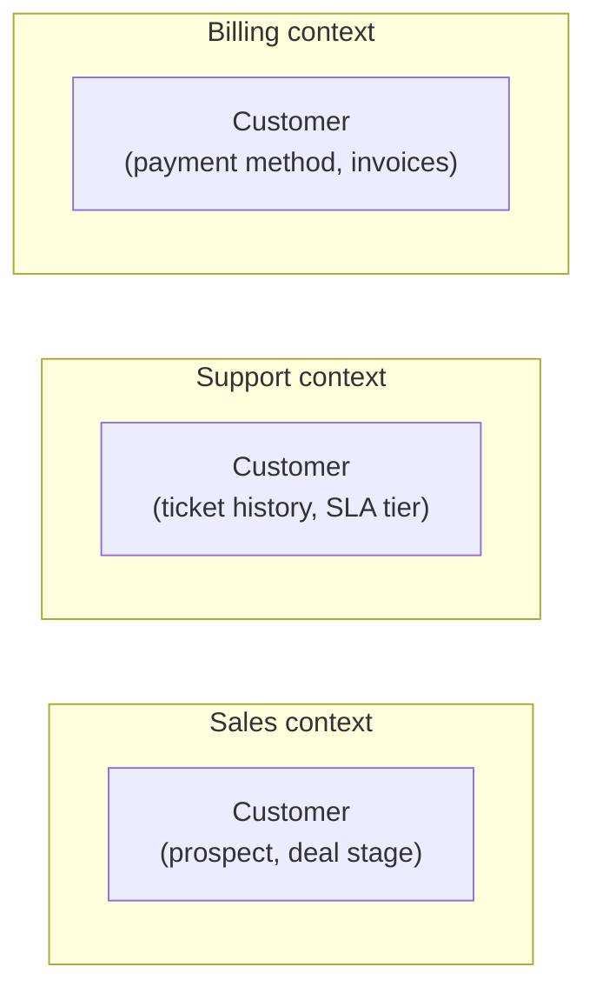
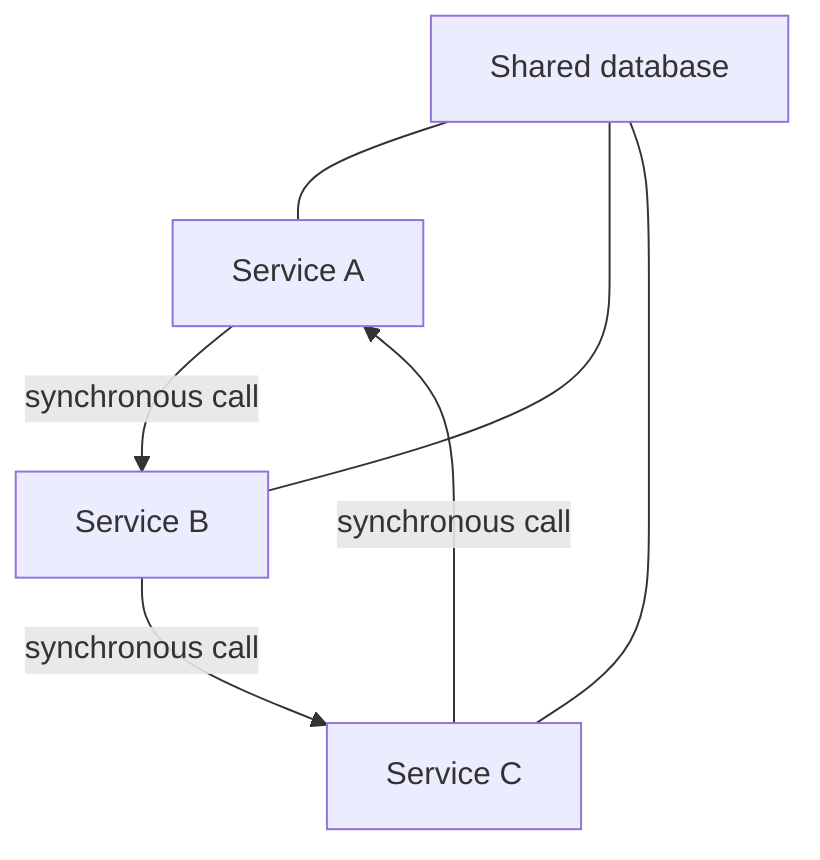
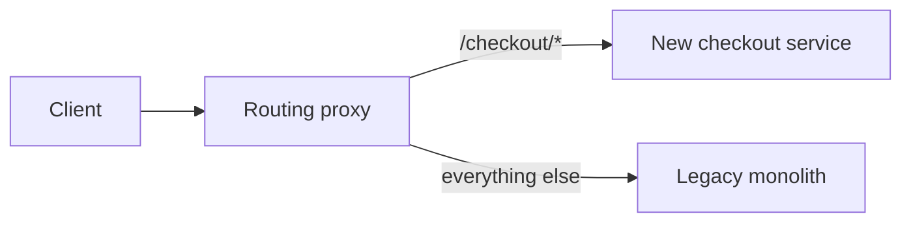

Microservices are a way to trade complexity in the code for complexity in the network and organization — and that trade is only worth making when a specific organizational or scaling problem demands it. This page covers when to make that trade, how to find real boundaries using domain-driven design, and the anti-patterns that turn "microservices" into a distributed monolith with all the downsides of both worlds.

## Monolith vs modular monolith vs microservices

| | Monolith | Modular monolith | Microservices |
|---|---|---|---|
| Deployment | One unit | One unit | Independent per service |
| Codebase | Single, often tangled over time | Single, with enforced internal module boundaries | Separate repos/codebases |
| Data | One shared database | One database, modules own their own tables/schemas | Each service owns its own database |
| Scaling | Scale the whole app together | Scale the whole app together | Scale each service independently |
| Team model | Works for one team, strains past a few teams | Works well for several teams sharing a runtime | Built for many independent teams |
| Failure isolation | A bug can take down everything | A bug can still take down everything (shared process) | A failure is contained to one service (if done right) |
| Operational cost | Low — one thing to deploy/monitor | Low — one thing to deploy/monitor | High — many things to deploy, monitor, version |
| Cross-cutting changes | Trivial — one PR, one deploy | Trivial — one PR, one deploy | Hard — coordinated changes across services |

> [!KEY]
> A modular monolith is the underrated middle option: enforce module boundaries (via internal APIs, not shared mutable state) inside a single deployable, and you get most of microservices' organizational clarity without the network, without independent deployability, and without the operational tax. Many systems that "need microservices" actually need this.

## When microservices are worth the cost — and when they aren't

> [!TIP]
> The strongest interview answer to "would you use microservices here" is never a flat yes or no — it's naming the specific pressure that justifies the split: team scaling, independent scaling needs, or genuinely different technology requirements per component.

| Worth it when... | Not worth it when... |
|---|---|
| Multiple teams need to deploy independently without blocking each other | You have one team, or a handful of engineers |
| Components have wildly different scaling needs (a video transcoder vs a user-profile API) | The whole system's load profile is roughly uniform |
| Components have genuinely different technology requirements (ML inference in Python, hot path in Go) | You're picking different languages for novelty, not necessity |
| Failure isolation is a hard requirement (one feature failing shouldn't take down checkout) | The system is small enough that a monolith's blast radius is acceptable |
| The domain has natural, stable seams (billing, catalog, fulfillment are genuinely separate concerns) | You don't yet know where the real boundaries are — premature splitting bakes in the wrong ones |

## Finding boundaries with DDD bounded contexts

Domain-Driven Design's core tool for this is the **bounded context**: a boundary within which a particular domain model, its terminology, and its rules are consistent and unambiguous — the same word can mean different things in different bounded contexts, and that's fine as long as each context is internally consistent.

"Customer" means something different to sales (a prospect with a deal stage), support (someone with a ticket history and SLA tier), and billing (a payment method and invoice history) — trying to force one shared "Customer" model across all three is exactly how systems end up with a 200-column table nobody fully understands. Practical technique for finding these seams: **event storming** — get domain experts in a room, map out the business events ("Order Placed," "Payment Captured," "Shipment Dispatched") on a timeline, and watch where vocabulary and ownership naturally shift. Those shifts are your service boundaries.

> [!WARNING]
> Splitting services along **technical** layers (a "database service," a "validation service") instead of **business capability** boundaries is one of the most common mistakes — it guarantees that almost every real feature requires changes across multiple services, which is the opposite of the isolation microservices are supposed to buy you.

## The distributed monolith anti-pattern

A distributed monolith has all the network latency, operational overhead, and partial-failure complexity of microservices, with none of the independent-deployability benefit — because the services are still tightly coupled underneath.

Telltale signs: services share a database (so schema changes in one break others silently), a deploy of service A requires simultaneously deploying B and C because of tightly coupled contracts, and a single request chains through five synchronous calls where a failure anywhere breaks the whole chain. You end up paying microservices' cost (network hops, deployment complexity, distributed debugging) while still being forced to deploy everything together — strictly worse than either a real monolith or real microservices.

## Service-per-team and Conway's Law

Conway's Law: *"organizations design systems that mirror their own communication structure."* If two teams must coordinate closely to ship a feature, your architecture already reflects (or fights) that reality whether you planned it or not. The practical takeaway used at scale (Amazon's "two-pizza teams," Spotify's "squads"): **design the team structure and the service structure together** — a service owned end-to-end by one team, deployed independently, is what actually delivers the "independent teams" benefit; a service split that doesn't match team ownership just creates cross-team coordination overhead disguised as an architecture diagram.

## Data ownership: no shared database

The single non-negotiable rule of microservices: **each service owns its data exclusively**, and no other service touches that data directly — not via a shared database, not via a direct SQL query into another service's schema.

| Wrong | Right |
|---|---|
| Service B queries Service A's tables directly | Service B calls Service A's API, or consumes events A publishes |
| Two services share one database instance for "convenience" | Each service has its own schema/database, even if hosted on shared infrastructure |
| A "reporting" job joins across five services' tables directly | Build a read-side aggregate (CQRS-style projection, or a data warehouse fed by CDC) instead |

Breaking this rule silently turns every service back into a monolith at the data layer — any service's schema change can break another service that reaches in directly, and you've lost the ability to change a service's internal storage without a cross-team migration.

## Synchronous vs asynchronous communication

| | Synchronous (REST/gRPC) | Asynchronous (events/queue) |
|---|---|---|
| Coupling | Caller blocked on callee's availability | Decoupled — publisher doesn't need consumer to be up |
| Failure mode | Caller fails/times out if callee is down | Message waits in the queue until consumer recovers |
| Use for | Request needs an immediate answer (read a price, validate a card) | Fire-and-forget side effects, workflows, notifying other services of a change |
| Latency | Adds directly to the caller's response time | Decoupled from the caller's response time |
| Complexity | Simpler to reason about, easier debugging | Needs idempotency, eventual consistency handling, more moving parts |

> [!KEY]
> A good rule: use synchronous calls only where the caller genuinely cannot proceed without the answer right now; use events for everything else — most inter-service "notify X that Y happened" traffic should be asynchronous, not a synchronous call chain.

## Service mesh, versioning and contracts

As the number of services grows, cross-cutting concerns (mTLS between services, retries, timeouts, observability, traffic shaping) get duplicated in every service's code unless factored out. A **service mesh** (Istio, Linkerd) runs a sidecar proxy next to each service instance, handling these concerns transparently at the network layer — services get mTLS, retry policies, and distributed tracing without each team reimplementing it.

Contracts between services need explicit versioning discipline: **consumer-driven contract testing** (e.g. Pact) lets a consumer specify the exact shape of the response it depends on, and the provider's CI verifies it hasn't broken that contract — catching breaking changes before deployment instead of in production. Combine this with **backward-compatible API evolution** (additive changes only within a version, a real major-version bump with a deprecation window for breaking changes) so services can deploy independently without a "big bang" coordinated release.

## Testing across services

| Test type | What it covers | Trade-off |
|---|---|---|
| Unit tests | Logic within one service | Fast, but proves nothing about integration |
| Contract tests | The shape of the API between two services matches expectations | Catches breaking changes cheaply, without a full integration environment |
| Integration tests | Real calls between a small set of services | Slower, more realistic, harder to keep stable |
| End-to-end tests | The full user journey across many services | Slowest, most brittle, but the closest to what a user experiences |

> [!TIP]
> Push the majority of coverage toward unit and contract tests, and keep end-to-end tests to a small number of critical user journeys — a common trap is over-investing in end-to-end suites that become slow, flaky, and eventually ignored.

## Migration via strangler fig

Rewriting a monolith wholesale is high-risk; the **strangler fig pattern** (named after the vine that grows around a host tree and gradually replaces it) instead routes traffic for one capability at a time to a new service, leaving the rest untouched, until the old monolith has nothing left to do.

A routing layer (API gateway, reverse proxy) sends traffic for the migrated capability to the new service and everything else to the monolith. This lets you migrate incrementally, validate each slice in production with real traffic, and roll back a single slice without risking the whole system — vastly safer than a big-bang rewrite, at the cost of running both systems (and the routing complexity) during the transition.

## Cheat sheet

- **Modular monolith is a real, underrated middle option** — enforce boundaries without paying the network/ops tax.
- **Justify microservices with a specific pressure**: team scaling, differential scaling needs, differential tech needs, or hard failure-isolation requirements.
- **Use DDD bounded contexts / event storming** to find real seams — split along business capability, not technical layers.
- **Distributed monolith = microservices' costs without microservices' benefits** — usually caused by a shared database or tightly-coupled synchronous chains.
- **Design team structure and service structure together** — Conway's Law will win either way.
- **No shared database, ever** — a service's data is only reachable through its API or its published events.
- **Sync calls only when the caller can't proceed without the answer now; async for everything else.**
- **Service mesh for cross-cutting network concerns; consumer-driven contract tests for API safety.**
- **Strangler fig** for migration — incremental, routable, reversible, instead of a big-bang rewrite.

## Common mistakes

| Mistake | Fix |
|---|---|
| Adopting microservices without a specific driving pressure | Default to a (modular) monolith until team scale, differential scaling, or isolation needs force the split |
| Splitting services along technical layers (DB service, validation service) | Split along business capability / bounded context |
| Sharing a database across services "for convenience" | Each service owns its data exclusively; expose it via API or events |
| Chaining many synchronous calls across services | Use async events for anything that isn't "I need the answer right now" |
| Deploying multiple services together because their contracts are tightly coupled | That's a distributed monolith — decouple via versioned, backward-compatible contracts |
| Rewriting a monolith in one big migration | Use the strangler fig pattern — migrate one capability at a time behind a router |

## Summary

Microservices are a trade of in-process complexity for network and organizational complexity, and that trade only pays off when a specific pressure — independent team deployability, differential scaling needs, differential technology needs, or hard failure isolation — actually exists; otherwise a modular monolith gets most of the benefit for a fraction of the cost. Real boundaries come from domain-driven design's bounded contexts, found through techniques like event storming, and split along business capability rather than technical layers. The traps that turn microservices into a worse-of-both-worlds distributed monolith are a shared database, tightly-coupled synchronous call chains, and a service structure that doesn't match team ownership — avoiding those, plus disciplined contract testing and an incremental strangler-fig migration path, is what makes the architecture actually deliver on its promise.

## Top Interview Questions

### Q1. When would you recommend microservices over a monolith, and when would you push back on it?

I'd recommend microservices when there's a specific, named pressure: multiple teams need to deploy independently without blocking on each other's release cycles, different components have meaningfully different scaling profiles (a video transcoding pipeline vs a lightweight user-profile API), components genuinely need different technology stacks, or a hard failure-isolation requirement exists (one feature's bug must not take down checkout). I'd push back when none of those apply — a small team, a roughly uniform load profile, and a domain that isn't yet well understood are all signs that the cost (network latency, distributed debugging, operational overhead, eventual consistency) isn't justified, and a monolith (ideally a modular one with enforced internal boundaries) will move faster with less risk.

### Q2. What is a modular monolith, and why might it be a better starting point than microservices?

A modular monolith is a single deployable application internally organized into modules with enforced boundaries — each module owns its own tables/schema and only exposes a defined internal API, with no reaching into another module's internals or shared mutable state. It gives you most of what people actually want from microservices — clear ownership boundaries, the ability to reason about one module without understanding the whole system, an easier future split if needed — without paying for independent deployment, network calls between modules, or distributed operational complexity. It's a better starting point because the "right" service boundaries are usually not obvious until the domain is well understood; splitting into physical services too early bakes in boundaries you'll likely have to undo, whereas a modular monolith's boundaries are cheap to refactor since it's all still one codebase and one database.

### Q3. How do you use domain-driven design to find good service boundaries instead of guessing?

The key tool is the bounded context — a boundary within which a domain concept has one consistent meaning and model, even if the same word means something different in another context (e.g. "Customer" means something different to sales, support, and billing, and forcing one shared model across all three produces an unmanageable table). To find these boundaries in practice, a technique like event storming works well: gather domain experts, map out the real business events on a timeline ("Order Placed," "Payment Captured," "Shipment Dispatched"), and observe where ownership, vocabulary, and rate-of-change naturally shift — those shifts are the seams. The resulting services should be split along business capability, not technical layers; a "database service" or "validation service" is a symptom of guessing rather than modeling the domain.

### Q4. What is a distributed monolith, and what causes it?

A distributed monolith has the operational and latency costs of microservices — network hops, independent deployment pipelines, distributed tracing/debugging — without the actual benefit of independent deployability, because the services underneath are still tightly coupled. The usual causes: services sharing a single database (so a schema change in one silently breaks another), long synchronous call chains where service A calls B calls C and a failure anywhere breaks the whole request, or API contracts so tightly coupled that deploying one service requires simultaneously deploying two or three others. The result is strictly worse than either alternative — you've paid for the complexity of microservices while still being forced to coordinate deployments like a monolith.

### Q5. Explain Conway's Law and its practical implication for designing a microservices architecture.

Conway's Law observes that organizations tend to design systems whose structure mirrors their own communication structure — if two teams must coordinate tightly to ship a change, the resulting software will end up tightly coupled at that same seam, regardless of the architecture diagram's intentions. The practical implication is that service boundaries and team boundaries should be designed together: a service owned end-to-end by a single team, deployed independently of other teams' release cycles, is what actually realizes the "independent deployability" benefit of microservices. If you draw service boundaries that don't align with team ownership — say, three teams all need to touch the same service for their features — you get the coordination overhead of a monolith, dressed up as microservices; Amazon's "two-pizza team" and Spotify's "squad" models are explicit attempts to align these two structures deliberately.

### Q6. Why is "no shared database" considered the single non-negotiable rule of microservices, and what goes wrong if you break it?

Each service owning its data exclusively is what actually decouples services — if Service B can query Service A's tables directly, then A's schema is effectively a public API that B depends on, except with none of the versioning, contract testing, or backward-compatibility discipline a real API would have. The moment you share a database, a schema migration in A can silently break B in production with no compile-time or even test-time warning, deployments of A and B become implicitly coupled, and you've lost the ability to change A's internal storage representation — one of the main reasons to have separate services in the first place. The fix when data does need to be visible across services is to expose it deliberately: through A's API, through events A publishes that B consumes, or through a dedicated read-side aggregate/data warehouse fed by change data capture — never a direct read into another service's schema.

### Q7. When should communication between services be synchronous versus asynchronous?

Use synchronous calls (REST, gRPC) when the caller genuinely cannot proceed without the answer right now — validating a payment card before completing checkout, looking up a price before displaying it. Use asynchronous communication (publishing an event to a queue/topic) for everything else, especially "notify other services that something happened" traffic — order placed, user updated, inventory changed — where the caller doesn't need to block waiting for every interested consumer to process it. The trade-off: synchronous calls are simpler to reason about and debug but couple the caller's availability and latency directly to the callee's; asynchronous calls decouple availability (a down consumer doesn't block the publisher) but introduce eventual consistency and require idempotent consumers, since messages can be delivered more than once.

### Q8. What is a service mesh, and what problem does it solve that isn't solved at the application code level?

A service mesh (Istio, Linkerd) deploys a sidecar proxy alongside every service instance that transparently handles cross-cutting network concerns — mutual TLS between services, retries and timeouts, load balancing, and distributed tracing/metrics — at the infrastructure layer instead of inside each service's application code. Without it, every team ends up reimplementing (and inconsistently maintaining) the same retry logic, the same certificate handling, the same tracing instrumentation, in every service, in whatever language that service happens to use. The mesh centralizes these concerns so they're configured once, consistently, and can be updated (a new retry policy, a new mTLS certificate rotation strategy) without touching application code across dozens of services — the trade-off is added operational complexity in running and understanding the mesh itself.

### Q9. Scenario: two microservices need to make a coordinated change to their shared API contract. How do you deploy this without an outage?

I would never deploy both services simultaneously expecting the new contract to "just work" — that's a big-bang deployment and any failure or rollback of one side leaves the other broken. Instead, I'd make the change backward-compatible in phases: first deploy the provider service supporting *both* the old and new contract shapes (additive change — new optional fields, a new endpoint version), then deploy the consumer to start using the new shape, verified beforehand with consumer-driven contract tests (e.g. Pact) so the provider's CI catches any incompatibility before it ships. Only once all consumers have migrated would I deprecate and eventually remove the old contract shape, with a clear deprecation window communicated in advance — this lets each service deploy independently at its own pace rather than requiring a synchronized release.

### Q10. How would you test a system built from a dozen microservices without relying entirely on slow, flaky end-to-end tests?

I'd weight the testing pyramid heavily toward unit tests within each service (fast, covers the actual business logic) and consumer-driven contract tests between services (each consumer specifies the exact API shape it depends on, and the provider's CI verifies it hasn't broken that contract) — this catches the majority of integration bugs without needing a full multi-service environment running. I'd add a smaller layer of integration tests for a handful of services that interact in complex ways, and reserve full end-to-end tests for a small number of genuinely critical user journeys (checkout completing, login working), run less frequently (e.g. before a release) rather than on every commit. Over-investing in broad end-to-end coverage across a dozen services tends to produce a slow, flaky suite that gets ignored or disabled over time, which is worse than having less coverage that's actually trusted and maintained.

### Q11. How would you migrate a legacy monolith to microservices without a risky big-bang rewrite?

I'd use the strangler fig pattern: put a routing layer (API gateway or reverse proxy) in front of the monolith, and migrate one capability at a time — build a new service for, say, checkout, route only checkout traffic to it through the proxy, and leave everything else hitting the monolith unchanged. This lets each slice of the migration be validated with real production traffic, rolled back independently if something goes wrong (just route that slice back to the monolith), and de-risks the whole migration into a series of small, reversible steps rather than one large cutover where any bug affects the entire system. The trade-off is running both the monolith and the new services simultaneously during the transition, plus the added complexity of the routing layer and potentially needing to keep data in sync between the old and new systems for capabilities that haven't fully migrated yet.

### Q12. Your team split a monolith into "order service," "inventory service," and "payment service," but nearly every feature still requires changing all three together. What went wrong?

This is the classic symptom of splitting along the wrong boundaries — likely either a technical-layer split disguised as a domain split (each "service" might really just be a thin wrapper around a shared table, or the three were split by data entity rather than by business capability), or the underlying database is still shared, so the three are coupled at the data layer even though they look independent in the architecture diagram. It could also mean the domain boundaries were guessed rather than derived from how the business actually operates — if "place an order" inherently, semantically requires touching order, inventory, and payment state atomically as a single business transaction, that might actually be one bounded context that was split prematurely. The fix is to revisit the domain model (ideally via event storming with the actual domain experts) and either merge these back into one service if they're truly one bounded context, or, if they are genuinely separate, decouple them properly via asynchronous events (a saga) instead of requiring synchronized changes across all three for every feature.
