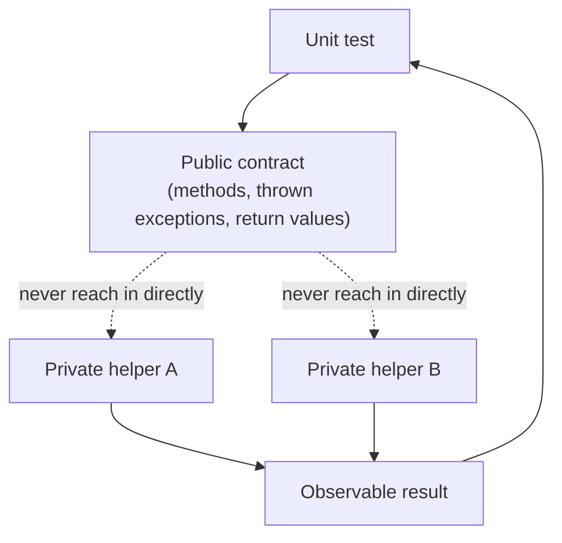
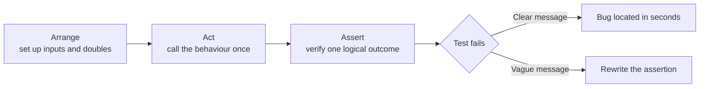

Anyone can write a test that passes today. The interview question underneath "do you write unit tests" is really "do you write unit tests that stay useful in six months, survive a refactor, and fail with a message that tells you exactly what broke".

## What a "unit" actually is

A unit is **a piece of behaviour**, not a class or a method. A single public method can require several tests to describe its behaviour fully, and a single test can legitimately span several private methods reached through one public entry point. The line is drawn at the *public contract* you're willing to keep stable — not at "one class equals one test class" mechanically.

> [!KEY]
> Test the behaviour visible through the public API. If you can rename or restructure private methods without changing what the caller observes, your tests should not need to change either.



## Arrange-Act-Assert



The near-universal structure for a unit test's body. It separates setup, the action under test, and the check, so a reader can scan a test in seconds.

```csharp
[Fact]
public void ApplyDiscount_ReducesTotalByTenPercent_WhenOrderExceedsThreshold()
{
    // Arrange
    var order = new Order(total: 200m);
    var calculator = new DiscountCalculator(threshold: 100m, rate: 0.10m);

    // Act
    var discounted = calculator.Apply(order);

    // Assert
    Assert.Equal(180m, discounted.Total);
}
```

Keep the sections visually separated (blank line or comment) even in a three-line test — it's a habit that pays off the moment the test grows.

## One logical assertion per test

"One assertion" doesn't mean literally one `Assert.*` call — it means one **reason to fail**. Asserting several properties of the *same resulting object* is fine; asserting unrelated behaviours in one test is not.

```csharp
// Fine — all assertions describe one outcome: the created order
[Fact]
public void CreateOrder_SetsExpectedDefaults()
{
    var order = Order.Create(customerId: 42);

    Assert.Equal(42, order.CustomerId);
    Assert.Equal(OrderStatus.Pending, order.Status);
    Assert.Empty(order.Lines);
}

// Not fine — two unrelated behaviours bundled together
[Fact]
public void CreateOrder_And_ApplyDiscount_Work()
{
    var order = Order.Create(customerId: 42);
    Assert.Equal(OrderStatus.Pending, order.Status);

    var discounted = new DiscountCalculator(100m, 0.1m).Apply(order);
    Assert.Equal(0m, discounted.Total); // unrelated concern, buried in the same test
}
```

If the bundled test fails, the name and the failure line don't tell you which behaviour broke without reading the whole body.

## Naming as a specification

A good test name should let someone read a failure report and know what broke **without opening the test file**. A common convention: `MethodOrBehaviour_ExpectedResult_WhenCondition`.

| Weak name | Better name |
|---|---|
| `Test1` | `Withdraw_ThrowsInsufficientFunds_WhenAmountExceedsBalance` |
| `ApplyDiscountTest` | `ApplyDiscount_ReturnsOriginalTotal_WhenBelowThreshold` |
| `TestNullUser` | `Register_ThrowsArgumentNullException_WhenEmailIsNull` |

Read the test name out loud as a sentence. If it reads like a spec ("withdraw throws insufficient funds when amount exceeds balance"), you've named it well. If it reads like an implementation note, rename it.

## Independence and shared state

Tests must be runnable **in any order, in isolation, and in parallel** without affecting each other's outcome. The most common violation is a shared mutable fixture.

```csharp
// Dangerous: static/shared state leaks between tests
public class OrderServiceTests
{
    private static readonly List<Order> _sharedOrders = new(); // shared across tests!

    [Fact]
    public void Test_A() { _sharedOrders.Add(new Order()); Assert.Single(_sharedOrders); }

    [Fact]
    public void Test_B() { Assert.Empty(_sharedOrders); } // fails if Test_A ran first
}
```

xUnit creates a **new instance of the test class per test**, so instance fields are safe by default — shared-state bugs usually come from `static` fields or genuinely shared external resources (a database, a file, a singleton). Use `IClassFixture<T>` for expensive shared setup and reset mutable state in constructor/`Dispose`, not by hoping test order stays stable.

> [!DANGER]
> A test suite that only passes when run in a specific order (or only in isolation, never in parallel) is already broken — it's hiding a shared-state bug that will eventually cause a flaky CI run.

## Determinism: time, randomness, culture, environment

A unit test must produce the same result every time, on every machine. The usual sources of non-determinism all have the same fix: **inject them instead of calling them directly**.

| Source | Problem | Fix |
|---|---|---|
| `DateTime.Now` / `DateTime.UtcNow` | Result depends on when the test runs | Inject `TimeProvider` (or `IClock`/`ISystemClock`) |
| `new Random()` | Different sequence every run | Inject `Random` with a fixed seed, or an `IRandomProvider` |
| `Thread.CurrentThread.CurrentCulture` | `1,000.5` vs `1.000,5` parsing differs by locale | Force `InvariantCulture` in the code, or set it explicitly in the test |
| File system / environment variables | Test behaves differently per machine/CI | Wrap behind an interface (`IFileSystem`), inject a fake |
| Network calls | Slow, flaky, not a unit test anymore | Replace with a test double (see Test Doubles) |

```csharp
public class InvoiceService
{
    private readonly TimeProvider _clock;
    public InvoiceService(TimeProvider clock) => _clock = clock;

    public Invoice Issue(decimal amount) =>
        new Invoice(amount, issuedAt: _clock.GetUtcNow());
}

[Fact]
public void Issue_StampsInvoice_WithProvidedTime()
{
    var fixedTime = new DateTimeOffset(2024, 1, 1, 0, 0, 0, TimeSpan.Zero);
    var clock = new FakeTimeProvider(fixedTime); // test double, not the real clock

    var invoice = new InvoiceService(clock).Issue(100m);

    Assert.Equal(fixedTime, invoice.IssuedAt);
}
```

## Parameterised tests

xUnit's `Theory` avoids near-duplicate tests that differ only by input, and makes edge cases explicit and easy to scan.

```csharp
[Theory]
[InlineData(0, false)]
[InlineData(-1, false)]
[InlineData(1, true)]
[InlineData(int.MaxValue, true)]
public void IsPositive_ReturnsExpected(int value, bool expected)
{
    Assert.Equal(expected, NumberUtils.IsPositive(value));
}

// For complex or non-literal data, use MemberData
public static IEnumerable<object[]> DiscountCases =>
    new List<object[]>
    {
        new object[] { 50m, 0m },
        new object[] { 150m, 15m },
        new object[] { 1000m, 100m },
    };

[Theory]
[MemberData(nameof(DiscountCases))]
public void CalculateDiscount_ReturnsExpected(decimal total, decimal expectedDiscount)
{
    Assert.Equal(expectedDiscount, DiscountCalculator.Calculate(total));
}
```

`InlineData` needs compile-time constants; use `MemberData` or `ClassData` when cases involve objects, or are shared across test classes.

## Testing exceptions and async code

```csharp
[Fact]
public void Withdraw_ThrowsInsufficientFunds_WhenAmountExceedsBalance()
{
    var account = new Account(balance: 50m);

    var ex = Assert.Throws<InsufficientFundsException>(() => account.Withdraw(100m));

    Assert.Equal(50m, ex.AvailableBalance); // assert on exception data, not just the type
}

[Fact]
public async Task GetOrderAsync_ReturnsOrder_WhenItExists()
{
    var repo = new FakeOrderRepository(seed: new Order(id: 1));
    var service = new OrderService(repo);

    var order = await service.GetOrderAsync(1);

    Assert.NotNull(order);
    Assert.Equal(1, order!.Id);
}

[Fact]
public async Task GetOrderAsync_ThrowsNotFound_WhenMissing()
{
    var service = new OrderService(new FakeOrderRepository());

    await Assert.ThrowsAsync<OrderNotFoundException>(() => service.GetOrderAsync(999));
}
```

> [!WARNING]
> Never use `.Result` or `.Wait()` on an async call inside a test to "make it synchronous" — it can deadlock under a synchronization context and hides real async bugs. Make the test method `async Task` and `await` it.

## The FIRST principles

| Letter | Principle | Meaning |
|---|---|---|
| F | Fast | Milliseconds, not seconds — you'll run these hundreds of times a day |
| I | Independent | No test depends on another test's side effects or run order |
| R | Repeatable | Same result on any machine, any environment, any number of times |
| S | Self-validating | Pass/fail is automatic (an assertion), not "read the console output" |
| T | Timely | Written close to the production code, ideally just before or just after |

## Testing behaviour, not implementation

A test coupled to *how* code works instead of *what* it does breaks on every safe refactor — the opposite of what a test suite should give you.

```csharp
// Before: coupled to implementation — breaks if you rename the private helper
// or change from a List to a HashSet internally
[Fact]
public void Bad_ChecksInternalListDirectly()
{
    var cart = new ShoppingCart();
    cart.AddItem("apple");
    Assert.Equal(1, cart.GetInternalItemsForTesting().Count); // exposes internals just for the test
}

// After: coupled to observable behaviour — survives any internal refactor
[Fact]
public void ShoppingCart_ContainsItem_AfterAdding()
{
    var cart = new ShoppingCart();
    cart.AddItem("apple");
    Assert.True(cart.Contains("apple"));
    Assert.Equal(1, cart.ItemCount);
}
```

A strong signal you've drifted into implementation testing: you had to add a method or property *only* so the test could see it, or the test breaks when you rename a private field but the feature still works correctly.

## Test-driven development

Test-driven development (TDD) is a design technique, not a moral test of whether someone is a "real" engineer. The red-green-refactor cycle is: write a failing test for the next small behaviour, write the minimum production code to pass it, then improve the design while the tests stay green.

The **red** step is not optional. It proves the test can fail for the reason you think it can fail. If you write a test after the code already works and it passes immediately, you have not proven that the assertion is meaningful; it might be asserting the wrong thing, not running the code path, or accepting a default value by accident.

```csharp
[Fact]
public void Apply_ReturnsZeroDiscount_WhenTotalIsBelowThreshold()
{
    var calculator = new DiscountCalculator(threshold: 100m, rate: 0.10m);

    var discount = calculator.Apply(total: 80m);

    Assert.Equal(0m, discount); // red first: implementation currently returns 8m
}

public sealed class DiscountCalculator
{
    public DiscountCalculator(decimal threshold, decimal rate) { /* store values */ }
    public decimal Apply(decimal total) => total < _threshold ? 0m : total * _rate;
}
```

TDD buys three practical things. First, it pressures the design toward seams: if a behaviour is painful to test, the production API is probably painful to use. Second, it creates a suite with a stronger trust history because every new test was observed failing at least once. Third, it encourages small safe steps, which is valuable when changing code with branching rules or fragile edge cases. It does not fit every task. Exploratory spikes, UI layout work, generated framework glue, and code whose shape is dictated by a framework often benefit more from quick exploration followed by tests once the shape is known.

> [!TIP]
> The honest interview answer is rarely "yes, always" or "no, never." A strong answer is: "I use TDD when it clarifies design, especially for domain rules and state machines; I do not force it onto exploratory UI or framework glue."

TDD also exposes two schools of unit-testing style:

| School | Also called | What it mocks | What it asserts | Good at | Failure mode |
|---|---|---|---|---|---|
| Chicago | Classicist, inside-out | Only true boundaries such as network, clock, database or email | Final state and observable outputs | Refactor-safe tests and realistic collaboration inside the unit | Can leave design pressure too weak until later integration tests |
| London | Mockist, outside-in | Every collaborator of the class under test | Interactions, messages and call expectations | Driving API design from the outside and isolating behaviour very tightly | Brittle suites that break when internal collaboration changes |

The practical position for most strong teams is in the middle. Use the Chicago / classicist style when state is observable and collaborators are cheap to run; it makes refactors safer. Use the London / mockist style when the interaction itself is the behaviour or when designing from a top-level use case helps discover interfaces. The choice matters because behaviour-verification-heavy tests tend to pin down call sequences, while state-verification-heavy tests tend to survive implementation changes but may catch design problems later.

## Cheat sheet

- A unit is a behaviour reachable through a public contract, not a mechanical one-class-one-test rule.
- Arrange-Act-Assert, always, even for a three-line test.
- One reason to fail per test; bundle assertions only if they describe the same outcome.
- Name tests as specifications: `Method_ExpectedResult_WhenCondition`.
- Inject time, randomness, culture and I/O — never call them directly from code you unit test.
- Use `Theory`/`InlineData`/`MemberData` to cover edge cases without duplicating tests.
- `Assert.Throws`/`ThrowsAsync` for exceptions; `async Task` + `await` for async tests, never `.Result`/`.Wait()`.
- FIRST: Fast, Independent, Repeatable, Self-validating, Timely.
- If a test needs a method that exists only for the test to call, you're testing implementation, not behaviour.
- TDD's red step proves the test can fail; green proves the smallest behaviour works; refactor improves design safely.
- Chicago / classicist tests prefer real collaborators and state assertions; London / mockist tests prefer mocked collaborators and interaction assertions.

## Common mistakes

| Mistake | Fix |
|---|---|
| Test name like `Test1` or `ApplyDiscountTest` | Name it as a spec: method, expected result, condition |
| Static/shared mutable fields across tests | Use instance fields (xUnit default) or `IClassFixture` with reset logic |
| Calling `DateTime.Now` inside code under test | Inject `TimeProvider` and control it from the test |
| `.Result` / `.Wait()` on async calls in tests | Make the test `async Task` and `await` |
| Exposing internals with a `ForTesting` method | Assert on observable outputs/behaviour instead |
| One giant test asserting five unrelated behaviours | Split into focused tests, one reason to fail each |
| Copy-pasted near-identical tests for each input | Use `[Theory]` with `InlineData`/`MemberData` |
| Skipping TDD's red step because the implementation already exists | Temporarily break or withhold the implementation so you know the test fails for the right reason |
| Mocking every collaborator by habit | Choose Chicago or London style deliberately based on whether state or interaction is the real behaviour |

## Summary

Good unit tests describe behaviour through a public contract, follow Arrange-Act-Assert, fail for exactly one reason, and read like a specification when they fail. Determinism is non-negotiable — time, randomness, culture and I/O must be injected so the same test gives the same answer everywhere. TDD adds design pressure through red-green-refactor, but it is a selective technique rather than a universal workflow. The single biggest tell of a maturing test suite is that refactors internal to a class don't break its tests — only changes to its actual behaviour do.

## Top Interview Questions

### Q1. What exactly is a "unit" in unit testing?

A unit is a piece of observable behaviour reachable through a public contract — not necessarily one class or one method. A single public method might need five tests to describe its behaviour under different inputs, and a single test might legitimately exercise several private methods invoked through one public entry point. The boundary is drawn at what you're willing to keep stable: if you can restructure the private implementation without changing what a caller observes, the tests shouldn't need to change. This distinction matters because teams that define "unit" as "one test class per class" end up with brittle, implementation-coupled tests that break on every safe refactor.

### Q2. Why is Arrange-Act-Assert useful, and what goes wrong without it?

AAA separates a test into setup, the action under test, and the verification, making each test scannable in seconds even months later. Without the structure, tests tend to interleave setup and assertions ("assert, arrange some more, act, arrange again, assert"), which makes it hard to tell what's actually being tested versus what's incidental setup. It also encourages one clear "Act" step — if you find yourself needing two distinct Act steps, that's often a sign the test is covering two behaviours and should be split. The convention costs nothing and pays off the first time you have to debug a failing test you didn't write.

### Q3. What does "one assertion per test" really mean, and is it ever okay to have multiple Assert calls in one test?

It doesn't mean literally one `Assert.*` line — it means one **reason to fail**. Multiple assertions that all describe the same outcome (e.g., checking three properties of the object just created) are fine and often clearer than three near-duplicate tests. What's not fine is asserting on two logically unrelated behaviours in the same test, because when it fails, you can't tell from the test name and failure line which behaviour broke without reading the full body. The practical rule: if splitting the test into two would give each half a meaningfully different, specific name, split it.

### Q4. How do you make a unit test involving `DateTime.Now` deterministic?

Never call `DateTime.Now`/`DateTime.UtcNow` directly inside code you want to unit test. Inject a time abstraction — .NET 8+ has `TimeProvider` built in, or you can use a custom `IClock` interface — and pass a fake/fixed implementation in tests. This lets you assert exact timestamps, test boundary conditions (midnight rollover, daylight saving transitions, "exactly 30 days ago") deterministically, and run the test at 11:59pm on New Year's Eve without it flaking. The same pattern — injecting the non-deterministic dependency rather than calling it globally — applies to randomness, culture-sensitive parsing, and file system or environment access.

### Q5. Your test passes locally but fails in CI. What are the likely causes and how do you debug it?

Common causes: (1) culture/locale differences — CI runners often default to a different culture than a developer machine, breaking number/date parsing or formatting if the code doesn't force `InvariantCulture`; (2) timing assumptions — a test using real `Task.Delay` or relying on wall-clock ordering under CI's different CPU contention; (3) shared/static state leaking between tests when CI runs them in a different order or in parallel while local runs were serial; (4) environment differences — missing environment variables, different time zone, different file system case-sensitivity on Linux CI vs Windows dev machine. Debugging approach: reproduce with the same culture/timezone/parallelism settings locally, check for any direct calls to `DateTime.Now`, `Random`, `Thread.CurrentCulture`, or static fields, and grep for `.Result`/`.Wait()` on async code which can behave differently under CI's synchronization context.

### Q6. What's wrong with a test that calls a method named `GetInternalStateForTesting()`?

It's a sign the test is coupled to implementation rather than behaviour. Any method that exists purely so a test can peek at internal state means the test will break the moment you refactor that internal representation — even if the externally observable behaviour hasn't changed at all. This defeats the purpose of having tests, which is to give you confidence to refactor safely. The fix is to assert only on what's reachable through the class's real public contract: return values, thrown exceptions, or effects visible through other public methods. If the behaviour genuinely isn't observable any other way, that's often a sign the class's public API is incomplete, not that you need a testing-only escape hatch.

### Q7. How do `InlineData` and `MemberData` differ in xUnit, and when do you use each?

`[InlineData]` supplies test case values as compile-time constants directly in the attribute — ints, strings, bools, enums — and is the simplest option for a handful of small cases. `[MemberData]` (or `[ClassData]`) points to a static property/method that returns `IEnumerable<object[]>`, which is required when test data involves non-constant types (objects, collections, computed values) or when the same data set needs to be reused across multiple test classes. A good rule: start with `InlineData` for simple primitive cases; move to `MemberData` once the case list grows long, needs comments explaining each case, or needs non-primitive data.

### Q8. Why shouldn't you use `.Result` or `.Wait()` to test async methods?

Both block the calling thread waiting for the async operation to complete, which can deadlock if the async method needs to resume on a captured synchronization context that's blocked by that same wait (a classic ASP.NET classic/UI-thread deadlock, though less common with `ConfigureAwait(false)` and modern ASP.NET Core's lack of a synchronization context). Even where it doesn't deadlock, it silently swallows and wraps exceptions inside an `AggregateException`, making failures harder to diagnose. The correct approach is to declare the test method itself as `async Task` and `await` the call under test — xUnit, NUnit and MSTest all support async test methods natively, so there's no reason to fall back to blocking calls.

### Q9. What does FIRST stand for and why does "Fast" matter enough to be first?

Fast, Independent, Repeatable, Self-validating, Timely. Fast is listed first because speed is what determines whether tests actually get run — a suite that takes 45 minutes will get skipped locally and only checked in CI, at which point feedback arrives long after the relevant code was fresh in your mind, which defeats much of the value of having unit tests at all. A unit suite should run in seconds; anything doing real I/O (database, network, file system, sleeps) has drifted out of "unit" territory and either needs a test double or belongs in the integration layer instead.

### Q10. Describe a case where two tests interfered with each other because of shared state, and how you'd fix it.

A common real example: a test class holds a `static readonly List<T>` used as an in-memory "repository" fake, and one test adds an item to it while another test asserts the list is empty — the outcome then depends entirely on execution order, which is invisible until CI parallelises test execution or reorders tests and the suite starts failing intermittently. The fix is to never use `static` mutable fields for per-test state; xUnit already creates a fresh instance of the test class per test, so instance fields are naturally isolated. For genuinely expensive shared setup (e.g., a Testcontainers database), use `IClassFixture<T>`/`ICollectionFixture<T>` but explicitly reset mutable state between tests rather than relying on order.

### Q11. What is red-green-refactor, and why is the red step important?

Red-green-refactor is the TDD loop: first write a test for the next small behaviour and see it fail, then write the minimum production code that makes it pass, then refactor the implementation while the test stays green. The red step matters because it proves the test is capable of detecting the missing or broken behaviour. Without it, a passing test might be exercising the wrong path, asserting a weak condition, or passing because the setup accidentally matches a default. In interviews, frame TDD as design pressure and feedback discipline, not as ceremony. It works best for domain rules, state machines and edge cases where small safe steps help; it is less useful for throwaway spikes or framework-driven glue.

### Q12. Compare Chicago and London schools of TDD.

Chicago, also called classicist or inside-out TDD, prefers real collaborators inside the unit and mocks only true boundaries such as network, time, email or databases. It asserts on final state and observable outputs, so tests tend to survive refactors well. London, also called mockist or outside-in TDD, mocks each collaborator and asserts interactions, letting design emerge from top-level behavior and expected messages between objects. It can produce clean interfaces quickly, but it can also create brittle tests that fail when internal call sequences change even though user-visible behavior is unchanged. Most strong teams blend them: state verification by default, interaction verification when the interaction itself is the requirement.
