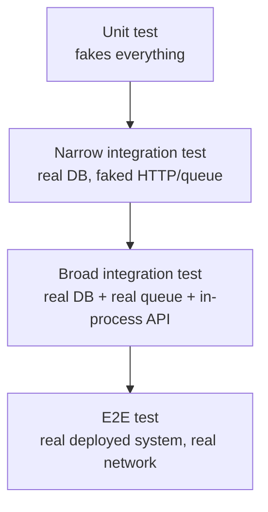

Integration tests prove that components which work in isolation actually cooperate — the wiring, the SQL, the serialization, the middleware pipeline. They sit deliberately between the speed of unit tests and the realism of end-to-end tests, and getting that boundary right is most of what makes them worth their cost.

## What counts as an integration test

An integration test exercises **two or more real components together**, crossing at least one boundary a unit test would fake — a database, an in-process HTTP pipeline, a message broker, the file system. The key distinction interviewers probe for is narrow versus broad.

| Scope | Narrow integration test | Broad integration test |
|---|---|---|
| What it touches | One service + one real dependency (e.g., repository + real database) | Multiple services, or a service through its full external boundary (API in, DB + queue + cache all real) |
| Speed | Fast (100ms–1s) | Slower (seconds) |
| Failure signal | Precise — points at the one boundary | Vague — could be any of several components |
| Where it runs | Every CI build | CI, maybe a dedicated stage |



> [!KEY]
> Prefer narrow integration tests. Test one boundary at a time — repository against a real database, message handler against a real broker — rather than wiring everything together, which pushes you toward e2e cost without e2e-level confidence.

## In-process API testing with WebApplicationFactory

`WebApplicationFactory<TEntryPoint>` boots your ASP.NET Core app in-memory, including the full middleware pipeline, routing, model binding and filters, without a real network socket or a deployed process.

```csharp
public class OrdersApiTests : IClassFixture<WebApplicationFactory<Program>>
{
    private readonly HttpClient _client;

    public OrdersApiTests(WebApplicationFactory<Program> factory)
    {
        _client = factory.WithWebHostBuilder(builder =>
        {
            builder.ConfigureServices(services =>
            {
                // Replace the real DB registration with a test one
                services.RemoveAll<DbContextOptions<AppDbContext>>();
                services.AddDbContext<AppDbContext>(o =>
                    o.UseNpgsql(TestDatabaseFixture.ConnectionString));

                // Replace an external dependency with a stub
                services.RemoveAll<IPaymentGatewayClient>();
                services.AddSingleton<IPaymentGatewayClient, StubPaymentGatewayClient>();
            });
        }).CreateClient();
    }

    [Fact]
    public async Task PostOrder_ReturnsCreated_AndPersistsOrder()
    {
        var response = await _client.PostAsJsonAsync("/api/orders", new { customerId = 1, total = 49.99m });

        response.StatusCode.Should().Be(HttpStatusCode.Created);
        var body = await response.Content.ReadFromJsonAsync<OrderResponse>();
        body!.Status.Should().Be("Pending");
    }
}
```

This exercises real routing, real model binding, real EF Core queries against a real database — everything except the process boundary and the network. It's an order of magnitude faster than spinning up the app and hitting it over HTTP from outside.

## Replacing dependencies in the test host

Two common patterns: `ConfigureTestServices` (or `ConfigureServices` + `RemoveAll`) to swap real registrations, and a custom `WebApplicationFactory` subclass to centralise the setup for reuse across test classes.

```csharp
public class ApiFactory : WebApplicationFactory<Program>
{
    protected override void ConfigureWebHost(IWebHostBuilder builder)
    {
        builder.ConfigureServices(services =>
        {
            services.RemoveAll<IEmailSender>();
            services.AddSingleton<IEmailSender, NoOpEmailSender>(); // never send real email in tests
        });
    }
}
```

> [!TIP]
> Only replace what's genuinely external to the system boundary you're testing (payment gateways, email providers, third-party APIs). Keep the database real wherever practical — it's usually the highest-value thing to test honestly, and Testcontainers makes that cheap.

## Real database versus in-memory provider

| Aspect | Testcontainers (real engine in Docker) | EF Core `InMemoryDatabase` |
|---|---|---|
| Fidelity | High — real SQL, real constraints, real query translation | Low — no real SQL, permissive constraint handling |
| Speed | Container starts once per run (~1–3s), then queries are normal DB speed | Fastest — pure in-memory objects |
| Setup complexity | Needs Docker available in CI | Zero — just a NuGet package |
| Catches | Migration errors, constraint violations, provider-specific SQL, real transaction behaviour | Only gross logic errors reachable via LINQ that happens to translate similarly |
| Verdict | Use for real integration tests | Acceptable only for quick unit-level scaffolding, never as a stand-in for "tested against the database" |

```csharp
public class TestDatabaseFixture : IAsyncLifetime
{
    private readonly PostgreSqlContainer _container = new PostgreSqlBuilder()
        .WithImage("postgres:16-alpine")
        .Build();

    public string ConnectionString => _container.GetConnectionString();

    public async Task InitializeAsync()
    {
        await _container.StartAsync();
        await using var context = new AppDbContext(BuildOptions());
        await context.Database.MigrateAsync(); // run real EF migrations, same as production
    }

    public Task DisposeAsync() => _container.DisposeAsync().AsTask();
}
```

> [!WARNING]
> An in-memory provider can pass a test for a query with an unsupported `GroupBy` translation, a case-sensitivity assumption, or a missing unique index — and then fail against the real engine in production. Treat it as a red flag when you see it used for anything beyond a placeholder.

## Managing database state between tests

Tests that share a database need a strategy to avoid one test's leftover data breaking another.

| Strategy | How it works | Trade-off |
|---|---|---|
| Transaction rollback | Wrap each test in a transaction, roll back after | Fast, but breaks if code under test explicitly commits/opens its own transaction |
| Respawn (delete + reseed) | A library resets all tables to a known seed state between tests | Slower than rollback, but works regardless of how the code manages transactions |
| Per-test schema/database | Each test (or class) gets its own schema or database, created fresh | Fully isolated, enables parallelism, higher setup cost |
| Container per test class | Spin up a fresh Testcontainer per class (not per test) | Balances isolation and speed — good default with Testcontainers |

```csharp
public async Task DisposeAsync()
{
    // Respawner resets all tables to empty (or seeded) state after each test class
    await _respawner.ResetAsync(_connection);
}
```

## Testing message handlers and queues

For asynchronous messaging, spin up a real broker in a container (RabbitMQ, Kafka via Testcontainers) rather than mocking the client library, since message serialization, routing keys and consumer acknowledgement semantics are exactly what you want to verify.

```csharp
[Fact]
public async Task OrderPlaced_Consumer_MarksInventoryReserved()
{
    await _bus.Publish(new OrderPlacedEvent(OrderId: 1, ProductId: 42));

    await _harness.WaitForConsumerAsync(TimeSpan.FromSeconds(5)); // poll, don't sleep a fixed time

    var reservation = await _repository.GetReservation(orderId: 1);
    reservation.Should().NotBeNull();
}
```

Frameworks like MassTransit ship an in-memory test harness (`ITestHarness`) that is itself a well-designed fake for the *broker client*, while still exercising your real consumer and serialization logic — a good middle ground when a full broker container is overkill for a given test.

## Test data builders

Constructing valid entities by hand in every test is verbose and fragile to schema changes. A builder centralises sensible defaults and lets each test override only what matters.

```csharp
public class OrderBuilder
{
    private int _customerId = 1;
    private decimal _total = 100m;
    private OrderStatus _status = OrderStatus.Pending;

    public OrderBuilder WithTotal(decimal total) { _total = total; return this; }
    public OrderBuilder WithStatus(OrderStatus status) { _status = status; return this; }
    public Order Build() => new(_customerId, _total) { Status = _status };
}

// In a test:
var order = new OrderBuilder().WithTotal(250m).WithStatus(OrderStatus.Shipped).Build();
```

## Determinism and parallelism

Integration tests introduce new sources of flakiness beyond unit tests: shared containers, port conflicts, ordering assumptions, and race conditions from parallel test runs hitting the same database.

- Give each test class its own database/schema, or use transaction rollback, so tests can run in parallel safely.
- Never assume a fixed auto-increment ID — assert on returned/queried values, not hard-coded IDs from a previous run.
- Poll for eventual state (message consumed, background job finished) instead of `Thread.Sleep`.
- Pin container image tags (`postgres:16-alpine`, not `postgres:latest`) so a test run today matches one in six months.

> [!DANGER]
> `Thread.Sleep(2000)` to "wait for the consumer to process the message" is the single most common source of integration test flakiness — it's too short on a loaded CI runner and wastefully long otherwise. Poll with a timeout, or use a test harness that exposes a proper wait primitive.

## Speed budgets

| Layer | Reasonable target for a full suite |
|---|---|
| Unit tests | Seconds, run on every save |
| Narrow integration tests | Under 2–3 minutes total, run on every commit/PR |
| Broad integration tests | Under 10 minutes, run on every PR or pre-merge |
| Full e2e suite | Minutes to tens of minutes, run pre-release or nightly |

If narrow integration tests creep past a few minutes, look for containers being recreated per test instead of per class, or missing parallelisation across test collections.

## Cheat sheet

- Narrow integration test = one real boundary; broad = several. Prefer narrow by default.
- `WebApplicationFactory<Program>` gives you the real middleware pipeline in-process — no network, no deployed process.
- Replace only genuinely external dependencies (payment, email, third-party APIs) in the test host; keep the database real.
- Testcontainers > EF Core InMemory for anything you actually want tested — InMemory hides real SQL bugs.
- Manage database state with transaction rollback, Respawn, or per-class containers — pick based on whether the code manages its own transactions.
- Test message handlers against a real (or well-designed in-memory harness) broker, not a mocked client.
- Poll for async completion; never sleep a fixed duration.
- Pin container image versions for reproducibility.

## Common mistakes

| Mistake | Fix |
|---|---|
| Using EF Core `InMemoryDatabase` and calling it "integration tested" | Use Testcontainers with the real engine |
| `Thread.Sleep(n)` to wait for async processing | Poll with a timeout, or use the framework's test harness wait helper |
| Sharing one database across parallel test classes with no isolation | Respawn, transaction rollback, or per-class container/schema |
| Testing through the full HTTP stack when a narrower test would do | Prefer narrow integration tests; reserve broad ones for real cross-component risk |
| Hard-coding IDs assumed from insert order | Capture and reuse the ID returned/queried, don't assume `1` |
| `postgres:latest` in CI config | Pin a specific version tag |

## Summary

Integration tests validate the parts unit tests intentionally fake — real databases, real HTTP pipelines, real message brokers — and `WebApplicationFactory` plus Testcontainers is the standard .NET combination for doing that fast and in-process. The narrow-versus-broad distinction is the main lever for cost control: test one boundary at a time by default, and reserve broader multi-component tests for risks that genuinely live in the interaction between components. State management (rollback, Respawn, per-class containers) and polling instead of sleeping are what keep a database-backed suite both fast and deterministic under parallel execution.

## Top Interview Questions

### Q1. What distinguishes an integration test from a unit test and from an end-to-end test?

A unit test isolates one component and fakes every collaborator, so it never crosses a process, network or I/O boundary. An integration test deliberately keeps at least one real boundary — a real database, a real in-process HTTP pipeline, a real message broker — to verify that two or more components genuinely cooperate: the SQL is correct, the serialization round-trips, the middleware pipeline behaves as configured. An end-to-end test goes further, exercising the fully deployed (or near-deployed) system over a real network, often across multiple services, to validate a complete user journey. The practical difference that matters for a test suite's health is speed and failure precision: integration tests are slower and vaguer than unit tests, but faster and more precise than e2e tests.

### Q2. What's the difference between a narrow and a broad integration test, and why does the distinction matter?

A narrow integration test exercises one component against one real dependency — for example, a repository class against a real (containerised) database, with everything else faked. A broad integration test wires together multiple real components at once — a real database, a real message queue, and the in-process API host together. The distinction matters because narrow tests are almost as fast to run and as precise on failure as unit tests while still catching real boundary bugs, whereas broad tests cost much more (slower, more setup, vaguer failures) for often-marginal extra confidence. The senior default is to prefer narrow integration tests and reserve broad ones specifically for risks that live in the interaction between multiple real components, not as a default habit.

### Q3. How does `WebApplicationFactory<Program>` work, and what does it actually exercise versus what does it skip?

It boots your ASP.NET Core application in an in-process test server, wiring up the real `Startup`/`Program` configuration — routing, middleware pipeline, dependency injection container, model binding, filters, authentication/authorization handlers — and gives you an `HttpClient` that talks to it via an in-memory transport rather than a real TCP socket. This means requests genuinely flow through your actual pipeline exactly as configured, including any custom middleware or conventions, so bugs in routing or model binding are caught. What it skips is the actual network stack, process boundaries (if your real deployment involves multiple processes or containers talking to each other), and anything that depends on being a truly separate OS process (like certain hosting lifecycle behaviours). You typically override specific service registrations (e.g., swap a real payment client for a stub) via `ConfigureWebHost`/`ConfigureTestServices`.

### Q4. Why would you use Testcontainers instead of EF Core's `InMemoryDatabase` provider for testing a repository?

`InMemoryDatabase` isn't a real relational engine — it doesn't enforce foreign keys or unique constraints the way SQL Server or PostgreSQL do, and it translates LINQ queries differently, sometimes silently evaluating parts of a query client-side that the real provider would need to translate to SQL (and might fail to, or behave differently for). This means a repository test can pass against `InMemoryDatabase` and then break in production against the real engine — for example, using a database function unsupported by the in-memory provider, or relying on a uniqueness constraint that's only enforced by the real database. Testcontainers spins up the actual database engine in a Docker container for the test run, so migrations run for real, constraints are enforced for real, and the SQL that executes is the same SQL that will run in production — at the cost of a few seconds to start the container once per test run or class.

### Q5. How do you keep a database-backed integration test suite fast and free of test-order dependencies?

Isolate state between tests using one of a few strategies: wrap each test in a database transaction and roll it back afterward (fast, but breaks if the code under test manages its own transactions or does explicit commits); use a tool like Respawn to reset tables to a known seed state between tests (works regardless of the code's transaction handling, a bit slower); or give each test class its own schema or database entirely, which enables safe parallel execution at the cost of more setup. In practice, a good default is one Testcontainers instance shared per test class (not per test, which would be too slow to start repeatedly) combined with transaction rollback or Respawn between individual tests within that class, plus never hard-coding assumed IDs — always capture and reuse whatever ID the system actually returned.

### Q6. Your integration test for a message consumer is flaky — it fails about one time in twenty. What's the likely cause and fix?

The most common cause is a fixed `Thread.Sleep()` used to "wait for the consumer to finish processing" — on a fast or idle CI runner it happens to be enough time, but under load (other tests, resource contention, a cold container) processing genuinely takes longer than the sleep, so the assertion runs before the message has actually been handled. The fix is to replace the sleep with an active poll-with-timeout — check the expected state (e.g., the record now exists, the status changed) in a loop with a short delay and an overall timeout, or better, use the messaging framework's built-in test harness wait primitive (e.g., MassTransit's `ITestHarness.Consumed.Any()` or `WaitForConsumerAsync`), which is designed specifically to avoid this race without over-waiting.

### Q7. When should you replace a real dependency with a fake or stub in a `WebApplicationFactory`-based test, versus keeping it real?

Replace dependencies that are genuinely external to what you're trying to verify and expensive, non-deterministic, or unsafe to call for real in a test — a payment gateway, a third-party email provider, an external partner API. Keep dependencies real when the whole point of the test is to verify they work correctly together with your code — most notably the database, since ORM mapping and query correctness are exactly the kind of bug integration tests exist to catch, and Testcontainers makes using a real database cheap enough that faking it usually isn't worth the lost fidelity. The rule of thumb: fake or stub things outside your system's boundary that you don't own and can't safely exercise repeatedly in CI; keep real the things inside your boundary that you're actually responsible for getting right.

### Q8. How would you test a message-based (event-driven) interaction between two services without deploying both services?

Test each side's boundary narrowly and independently rather than trying to run both full services together. For the publishing side, verify that the correct event is published with the correct shape when a given action occurs, using an in-memory test harness for the bus client (or asserting on what was serialized to a real broker in a container). For the consuming side, publish a known event directly to a real (or test-harnessed) broker and verify the consumer produces the correct observable effect — a database write, a follow-up event, an API call. This gives you confidence in each service's contract-honoring behaviour without needing a full multi-service environment; contract testing (a separate technique) is what then verifies the two sides actually agree on the event shape without deploying either.

### Q9. What would you consider "too slow" for an integration test suite, and how would you speed one up?

As a rough budget, narrow integration tests as a whole should complete in a couple of minutes so they can run on every pull request without becoming a bottleneck; broader integration tests can be allowed up to around ten minutes, often gated to run on merge rather than every push. If a suite creeps well past that, the usual causes are: spinning up a fresh container per test instead of per test class (fixable by sharing one container across a class or collection and resetting state between tests instead of restarting the container), lack of test parallelisation across independent test collections, or tests that unnecessarily go through a broad path (full HTTP + DB + queue) when a narrower test against just the database would answer the same question faster.

### Q10. How do you test authorization and authentication behaviour with `WebApplicationFactory`?

Replace the real authentication handler with a test authentication scheme registered via `AddAuthentication` in the test host's `ConfigureWebHost`, which lets you construct a `ClaimsPrincipal` with whatever roles or claims a given test scenario needs, without needing a real identity provider or token issuance flow. Then write tests asserting the actual authorization behaviour: a request without the required claim gets a `403`, one with it gets through to the real handler logic, and route-level `[Authorize]` attributes are genuinely exercised because the pipeline is real. This is a good example of "replace what's external, keep the internal pipeline real" — you don't want to depend on a real identity provider in every test run, but you do want to prove your actual authorization policies work.

### Q11. What is a test data builder, and why prefer it over constructing entities inline in every test?

A test data builder is a small helper class with fluent methods (`WithTotal(...)`, `WithStatus(...)`) that constructs a valid instance of a domain entity with sensible defaults, letting each test override only the fields that matter to that specific scenario. Constructing entities inline in every test means every required constructor parameter has to be supplied everywhere, so a schema change (a new required field) forces edits across the entire test suite, and it's hard to tell at a glance which fields are actually relevant to a given test's assertion versus just boilerplate needed to satisfy the constructor. A builder centralises that boilerplate in one place, keeps each test's setup focused on what's actually being varied, and tends to reduce the blast radius of entity shape changes to a single file.

### Q12. How would you decide whether a failing integration test is a real bug versus test infrastructure flakiness?

First check whether the failure is reproducible in isolation and on repeated runs — genuine flakiness usually only appears intermittently or under parallel execution, while a real bug reproduces consistently given the same inputs. Look for the common flakiness fingerprints: fixed sleeps instead of polling, shared mutable state or database rows touched by another test running in parallel, assumptions about auto-increment IDs or insertion order, or an unpinned container image version that changed behaviour between runs. If none of those apply and the failure is consistent, treat it as a real regression and trace it the same way you would a unit test failure — narrow down which real dependency (database, queue, downstream service) produced the unexpected result. Quarantining a test without understanding which of these it is just hides the signal, so the investigation step should come before deciding to skip or fix.
