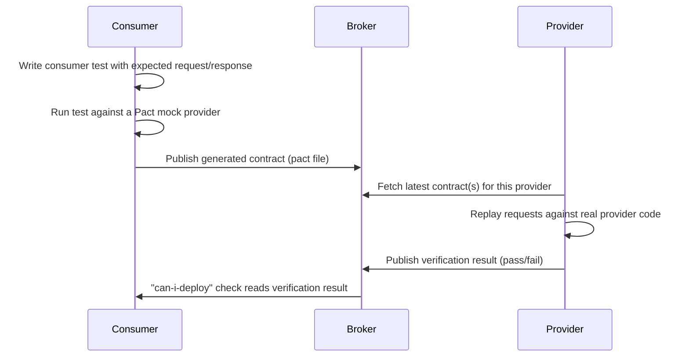
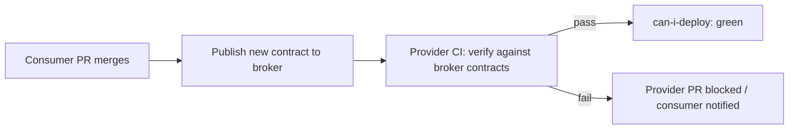

Once a system has more than a couple of services, proving they still work together becomes the hardest testing problem you have. Full end-to-end tests across every service answer that question honestly but slowly and flakily; contract testing answers a narrower version of it — "do we still agree on the shape of our interaction" — cheaply and on every commit.

## The problem with cross-service end-to-end tests

To e2e-test service A calling service B, you need both deployed, both configured, both seeded with compatible data, and the network path between them working — for every commit, on every branch. As the number of services grows, the number of pairwise interactions grows faster, and a flaky test in *any* dependency blocks *everyone's* pipeline.

> [!KEY]
> Contract testing decomposes "does the whole system work together" into "does each consumer's expectation match each provider's actual behaviour" — checked independently, without either side needing the other running.

## Consumer-driven contracts and the Pact workflow

In consumer-driven contract testing, the **consumer** (the service making the call) writes a test describing exactly what it expects from the **provider** (the service being called) — specific requests and the responses it needs. Running that test produces a **contract** (a Pact file: JSON describing the interactions). The provider then replays those exact requests against its real implementation and verifies its real responses match what the consumer expects.



```csharp
// Consumer test (xUnit + PactNet) — defines the expectation, generates the contract
[Fact]
public async Task GetCustomer_ReturnsCustomer_WhenCustomerExists()
{
    _pact.UponReceiving("a request for an existing customer")
        .Given("customer 42 exists")
        .WithRequest(HttpMethod.Get, "/customers/42")
        .WillRespond()
        .WithStatus(HttpStatusCode.OK)
        .WithJsonBody(new { id = 42, name = Match.Type("Alice") });

    await _pact.VerifyAsync(async ctx =>
    {
        var client = new CustomerApiClient(ctx.MockServerUri);
        var customer = await client.GetCustomerAsync(42);
        Assert.Equal("Alice", customer.Name);
    });
}
```

```csharp
// Provider verification test (runs in the provider's own CI pipeline)
[Fact]
public void EnsureProviderApiHonoursContract()
{
    var verifier = new PactVerifier();
    verifier
        .ServiceProvider("CustomerService", new Uri("http://localhost:5000"))
        .WithPactBrokerSource(new Uri(brokerUrl), options => options.PublishResults("1.4.0"))
        .WithProviderStateUrl(new Uri("http://localhost:5000/provider-states"))
        .Verify();
}
```

## Provider verification in CI, and the broker

The **Pact broker** is the shared store: consumers publish contracts to it, providers pull the latest (or all currently-deployed-version) contracts to verify against, and verification results are published back. This is what makes the crucial **can-i-deploy** check possible — before deploying either side, you ask the broker "has this exact consumer version been verified against this exact provider version (or vice versa)?" and block the deploy if not.

| Question the broker answers | Why it matters |
|---|---|
| Which consumers depend on this provider, and which versions? | Lets a provider know who it would break before changing an endpoint |
| Has version X of the consumer been verified against version Y of the provider? | Gates deployment — `can-i-deploy` |
| Which contract versions are actually in each environment? | Avoids verifying against a contract nobody is running |

> [!TIP]
> The "can-i-deploy" gate is the single most senior thing you can say about contract testing in an interview — it's what turns a contract test from "a nice extra check" into an actual deployment safety mechanism.

## Contract testing versus schema validation versus full integration tests

| Approach | Verifies | Needs both services running? | Catches |
|---|---|---|---|
| Schema validation (OpenAPI/JSON Schema) | Structural shape — field names, types, required fields | No | Structural drift, missing/renamed fields |
| Contract testing (Pact) | Specific expected interactions — this request produces this response, for real, on both sides | No (independently, via the broker) | Behavioural drift the consumer actually depends on, not just any schema change |
| Full integration/e2e test | The entire real interaction end-to-end, over the network | Yes | Everything, but slowly, flakily, and expensively |

Schema validation is cheap but blind to behaviour — a field can be structurally valid but semantically wrong (an amount in cents instead of dollars, a status enum with a new value the consumer doesn't handle). Contract tests catch exactly the behavioural expectations the consumer actually cares about, encoded as concrete examples, without needing either side deployed. Full integration tests are the ground truth but too slow and flaky to run on every commit for every service pair.

## Contracts for asynchronous, message-based interactions

Contract testing isn't limited to synchronous HTTP. For event-driven systems, the "consumer" is the service that **reacts to** a message, and the contract describes the message shape it expects to receive — even though causally the producer sends it.

```csharp
// Message consumer contract (Pact Message support)
[Fact]
public void OrderPlacedEvent_ContainsRequiredFields()
{
    messagePact
        .ExpectsToReceive("an order placed event")
        .Given("an order was placed")
        .WithContent(new
        {
            orderId = Match.Type(1),
            customerEmail = Match.Regex("a@b.com", @".+@.+\..+"),
            total = Match.Decimal(99.99m)
        })
        .Verify<OrderPlacedEvent>(evt => HandleOrderPlaced(evt)); // runs your real handler
}
```

The producer side then verifies it actually emits messages matching each registered consumer's contract before it's allowed to deploy — the same broker/can-i-deploy mechanism as the HTTP case.

## Evolving a contract safely

| Change | Safe for existing consumers? | Notes |
|---|---|---|
| Add a new optional field to a response | Usually safe | Consumers ignoring unknown fields are unaffected |
| Add a new required field | Breaking | Every consumer's contract must be updated and reverified first |
| Remove or rename a field a consumer asserts on | Breaking | Caught immediately by contract verification failing |
| Change a field's type or semantics (string → enum, dollars → cents) | Breaking | Structural schema check might miss this; contract test catches it if the consumer asserts a value |
| Add a new endpoint | Safe | No existing contract references it |

> [!WARNING]
> A schema-only check can happily approve a field changing from dollars to cents, because the type (`number`) didn't change. A contract test with a concrete example value (`Match.Decimal(99.99m)`) plus provider state ("given a $99.99 order exists") is what actually catches semantic drift like this.

## Who owns the contract

The **consumer** owns the content of the contract, because they know what they actually need — this is the "consumer-driven" part of the name. But the **provider** owns whether it can be honoured, and both sides share responsibility for keeping verification passing: the provider must run verification in its own CI on every change, and the consumer must republish an updated contract when its expectations change, rather than the provider guessing at what consumers need.

## When contract testing is overkill

- **A monolith**, or services that always deploy together — there's no independent deployability risk to protect against.
- **A single consumer and single provider under the same team**, where a shared PR or a quick chat achieves the same coordination more cheaply.
- **Public APIs with unknown/uncountable consumers** (e.g., a public REST API) — you can't get every consumer to write a Pact contract; use versioned schemas and a strong deprecation policy instead.
- **Early-stage systems where the interface changes weekly** — the overhead of maintaining contracts may exceed the value until the interface stabilises.

> [!DANGER]
> Introducing contract testing between two services owned by the same three-person team that deploys them together in lockstep is a classic case of process cargo-culting — it adds broker infrastructure and CI complexity for a coordination problem that doesn't actually exist yet.

## Combining OpenAPI schema checks with contract tests

A pragmatic layered approach: validate every response against the OpenAPI/JSON Schema spec automatically (cheap, catches structural drift, can run as middleware or in existing integration tests) and use Pact contracts specifically for the handful of interactions where a consumer's actual behaviour depends on specific values or edge cases, not just shape. This avoids writing a full Pact interaction for every single field while still catching semantic breaking changes on the interactions that matter most.

## Breaking-change detection in the pipeline



Wiring `can-i-deploy` into the deployment pipeline (not just CI) means a provider genuinely cannot ship a breaking change until every known consumer's contract has been re-verified — turning contract testing from documentation into an enforced gate.

## Cheat sheet

- Contract testing decomposes cross-service correctness into independent consumer/provider checks via a shared broker — neither side needs the other running.
- Consumer-driven: the consumer writes the expectation; the provider verifies it can honour it.
- The Pact broker + `can-i-deploy` is what turns contracts into an enforced deployment gate, not just documentation.
- Schema validation catches structural drift; contract tests catch semantic/behavioural drift with concrete examples.
- Works for async/message-based interactions too — the message consumer defines the expected shape.
- Skip contract testing for monoliths, same-team lockstep services, or public APIs with uncountable consumers.
- Combine cheap OpenAPI schema checks broadly with Pact contracts on the interactions that actually carry behavioural risk.

## Common mistakes

| Mistake | Fix |
|---|---|
| Treating contract tests as a replacement for all integration tests | Keep a small number of true integration/e2e tests too; contracts verify agreement, not full system correctness |
| Provider never runs verification in its own CI | Wire verification into the provider's pipeline on every change, not as a manual/occasional check |
| Using schema validation alone for semantic changes (units, meaning) | Add concrete-value contract tests for fields where the actual value/semantics matter |
| Introducing Pact for two services owned by one team deployed together | Skip it; use it where deployability is genuinely independent |
| Consumer never republishes contract after changing what it needs | Republish and reverify on every consumer-side expectation change |
| Not using `can-i-deploy` | Wire it into the deploy pipeline so a failing verification actually blocks a release |

## Summary

Contract testing solves the specific, expensive problem of proving two independently deployable services still agree on their interaction, without needing both running together for every commit. Consumer-driven contracts via Pact and a shared broker let each side verify independently, and the `can-i-deploy` gate is what makes that verification enforceable rather than advisory. It complements, rather than replaces, lightweight schema validation for structural drift and a thin layer of real integration/e2e tests for the handful of journeys that need full-system confidence — and it's genuinely overkill for monoliths or tightly coupled same-team services with no independent deployment risk to protect against.

## Top Interview Questions

### Q1. What problem does contract testing solve that end-to-end tests don't solve well?

End-to-end tests across services require both (or all) services deployed, configured, and seeded with compatible data simultaneously, which makes them slow, expensive to maintain, and prone to flaking for reasons unrelated to the actual interaction being tested (network blips, unrelated service instability, data setup races). Contract testing decomposes the cross-service correctness question into two independent, fast checks: does the consumer's expectation match what it actually needs, and does the provider's real behaviour match that expectation — verified separately, on each side's own CI, without either service needing the other running. This gives fast, reliable feedback on the specific risk that matters most between independently deployable services: "did we just break someone who depends on us," without the cost and flakiness of running the whole system together.

### Q2. Explain the consumer-driven contract workflow with Pact end to end.

The consumer team writes a test expressing exactly what it needs from the provider — specific requests and the responses required for its own code to work correctly. Running that test against Pact's mock provider produces a contract file (a Pact) describing those interactions, which gets published to a shared Pact broker. The provider team's CI pipeline then fetches the relevant contracts from the broker and replays each recorded request against the real provider implementation, checking that the real response matches what was expected; the pass/fail result is published back to the broker. Before deploying either side, a "can-i-deploy" check queries the broker to confirm the specific versions in play have a passing verification between them, blocking the deploy if not. This whole loop runs without the consumer and provider ever needing to be deployed and running against each other simultaneously.

### Q3. Why is it called "consumer-driven," and why does that matter?

It's consumer-driven because the contract's content originates from the consumer's actual needs — the consumer decides and writes down exactly what request/response shape it depends on — rather than the provider unilaterally publishing a spec and hoping it covers what every consumer actually uses. This matters because a provider often exposes far more fields and behaviour than any single consumer actually relies on; a provider-driven schema would force verification against everything, including fields no one uses, while a consumer-driven contract narrows verification to what would actually break someone if changed. It also creates a natural forcing function: if a consumer needs new behaviour, it must first express that need as a contract, making cross-team dependencies explicit and reviewable rather than implicit.

### Q4. How does contract testing catch breaking changes that OpenAPI/JSON Schema validation would miss?

Schema validation checks structural shape — field names, types, whether a field is present — which is blind to semantic or behavioural drift where the structure stays the same but the meaning changes: a monetary field switching from dollars to cents, a status field's set of possible values changing, or a previously-always-populated field becoming sometimes null under a new business rule. A contract test encodes concrete example values and expected behaviour ("given a customer with $99.99 owed, the response's `total` field is `99.99`"), so the provider's verification step replays that exact scenario against real code and fails if the actual value or behaviour has changed — even though the schema (a decimal number) looks identical. Combining both gives cheap, broad structural coverage plus targeted, deep behavioural coverage on the interactions that matter.

### Q5. What role does the Pact broker play, and what is the "can-i-deploy" check?

The broker is the shared, queryable store of contracts and verification results: consumers publish the contracts they've generated, providers publish the results of verifying those contracts against their real implementation, and the broker tracks which versions of each service are running in which environments. "Can-i-deploy" is a query against the broker, run as a pipeline gate before a deployment, that asks whether the specific version about to be deployed has a passing, up-to-date verification against every other currently-deployed version it interacts with. If any relevant verification is missing or failing, the deploy is blocked. This is what elevates contract testing from a documentation artifact to an actual automated safety mechanism enforced at deploy time, not just at commit time.

### Q6. How would you contract-test an asynchronous, event-driven interaction rather than a synchronous HTTP call?

The same consumer-driven model applies, but the roles map differently: the "consumer" of the contract is the service that reacts to and processes the message, even though causally the other service produces it first. The message-consuming service's test defines the expected shape and semantics of the message it needs to receive (using Pact's message support, or an equivalent), which is published as a contract. The producing service then verifies, in its own CI, that the messages it actually emits (by invoking its real message-construction code, not a hand-written example) match every registered consumer's contract, before it's allowed to deploy a change to that message shape. This catches the same class of breaking changes — a renamed field, a changed enum value, a removed property — before they reach a real queue in production.

### Q7. Your provider team wants to remove a field from an API response. How would contract testing change how you approach that?

Before removing the field, query the broker to see which consumer contracts currently reference it — this tells you exactly who would break, without needing to ask every team or grep their codebases. If any active contract asserts on that field, the provider's own verification will fail as soon as the field is removed and that failure is run in CI, so the change would be caught before merge, not after a production incident. The safe rollout is: coordinate with each affected consumer to stop relying on the field (they update and republish their contract once they no longer need it), wait until no active contract references it, and only then remove it — at which point provider verification passes cleanly and `can-i-deploy` is unblocked.

### Q8. When would you decide contract testing is not worth the investment for a given service pair?

When the two services are effectively deployed together (a monolith, or services with a shared release train and no independent deployability), contract testing protects against a risk — one side changing without the other's knowledge — that doesn't actually exist, since any breaking change would be caught by the fact that they ship as one unit or are reviewed/tested together anyway. It's also often not worth it early in a service's life when the interface is still churning weekly, since the overhead of maintaining contracts can exceed value until the interface stabilises, and for public APIs with a large, uncountable set of external consumers, where you can't realistically get every consumer to author a Pact contract — versioned schemas and a deprecation policy are the better tool there.

### Q9. How does contract testing fit alongside integration and end-to-end tests rather than replacing them?

Contract tests answer a narrow, specific question extremely well and cheaply — "do the two sides still agree on this interaction's shape and behaviour" — but they don't prove the whole system actually works when wired together with real infrastructure, real data volumes, and real timing. A small number of true integration or end-to-end tests still earn their keep by validating the handful of critical, high-value user journeys end-to-end, catching classes of bugs contract tests can't (infrastructure misconfiguration, real network behaviour, multi-step workflows spanning more than two services). The practical layering is: unit tests for logic, narrow integration tests for each service's own boundaries (its database, its queue), contract tests for cross-service agreement, and a small, curated e2e suite for the journeys where full-system confidence is worth the cost.

### Q10. A provider team says running contract verification adds too much time to their CI pipeline — how would you address that?

First check whether verification is running against every historical contract version ever published rather than only the versions currently deployed somewhere real — the broker can (and should) be configured to only verify against contracts that are actually in use in an environment, which is usually the biggest unnecessary cost. Second, check whether provider states (the fixtures each interaction needs, like "given customer 42 exists") are being set up inefficiently, e.g., spinning up a full database per interaction instead of reusing a shared, fast setup. If verification is still meaningfully slow after that, it's likely proportional to genuinely wide consumer usage, which is itself useful information — it means the provider has many dependents and should treat verification time as a worthwhile investment relative to the cost of a production break, rather than something to cut.

### Q11. What's a concrete example of a contract test catching a bug that a full integration test would also catch, but far more slowly?

Suppose the order service adds a new required field, `taxRegion`, to the payload it sends when it calls the billing service, but the billing service's real endpoint hasn't been updated to require or even read it yet — a compatibility issue that's really about the consumer sending something the provider doesn't expect versus vice versa. Running the provider's verification against the consumer's contract would replay the exact new request shape the order service now sends and immediately show whether the billing service handles it correctly, in a test that takes seconds because it's just an HTTP call against one locally-running service with fixtures. A full e2e test covering "place an order and confirm billing" would eventually catch the same defect, but only after deploying both services to a shared environment, running a much slower and more failure-prone journey, and with a far less precise failure message pointing at "checkout failed" rather than the exact field mismatch.

### Q12. How do you keep contracts from becoming stale — passing in the broker but no longer reflecting what's actually deployed?

Version every contract and verification result against the actual deployable version (commit SHA or semantic version) of each service, and configure the broker to only consider the contract versions currently associated with real environments (via "deployment" or "release" tagging in the broker) when answering `can-i-deploy` — this prevents a years-old contract from silently keeping a gate green. Require provider verification to run on every change to the provider, not just occasionally, so drift is caught immediately rather than accumulating. And treat a contract that a consumer no longer uses as something to actively retire (delete the interaction, republish), rather than leaving it around passing by coincidence — an unused, stale contract gives false confidence and clutters what verification failures actually mean.
