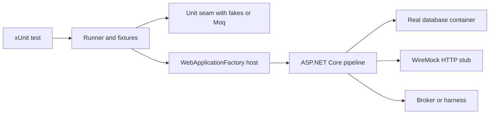

A senior .NET testing answer should move from tool names to concrete test shapes quickly. The goal is not to re-explain why unit and integration tests exist, but to show how xUnit, Moq, FluentAssertions, WebApplicationFactory, Testcontainers and CI fit together without hiding real production risks.

## The practical .NET stack

The common modern stack is xUnit for the runner, FluentAssertions for readable assertions, a mocking library for narrow seams, and real infrastructure through Testcontainers for persistence and brokers. NUnit and MSTest are still valid, but xUnit's lifecycle makes isolation the default rather than an afterthought.

| Framework | Best default when | Lifecycle detail to mention |
|---|---|---|
| xUnit | ASP.NET Core, OSS projects, new backend services | Creates a new test class instance per test and runs classes in parallel by default |
| NUnit | Existing enterprise suites or teams that depend on its rich attributes | Reuses fixture instances unless configured carefully, so shared state needs attention |
| MSTest | Visual Studio and Azure DevOps centric organizations | Familiar Microsoft tooling with a more traditional initialize and cleanup model |

| Tool | Role in a real suite | Interview signal |
|---|---|---|
| FluentAssertions | Expressive assertions and failure messages | Use it for complex objects and collections, not just syntax sugar |
| Moq or NSubstitute | Interaction seams for outbound dependencies | Verify only interactions that are the behavior being tested |
| AutoFixture | Generate irrelevant object data | Useful when constructors are noisy but assertions stay focused |
| WebApplicationFactory | In-process ASP.NET Core host | Catches routing, DI, middleware, auth and serialization problems |
| Testcontainers | Real SQL, Redis, RabbitMQ or Azurite in Docker | Avoids EF Core in-memory false confidence for query and migration tests |
| Respawn | Reset relational database state | Keeps shared container tests isolated without restarting the container |
| WireMock.Net | Local HTTP stub server | Tests real HTTP serialization, headers and retry behavior without a real provider |



> [!KEY]
> xUnit's per-test class instance is a practical safety feature. Instance fields are rebuilt for every test, so most accidental state sharing disappears unless you introduce static fields or shared external resources.

## xUnit structure and parameterized data

Use `[Fact]` when the scenario has one meaningful input shape. Use `[Theory]` when the assertion is identical across an input matrix. `InlineData` is for compile-time constants, `MemberData` for computed or reusable cases, and `ClassData` when the data deserves a named class.

```csharp
public sealed class DiscountCalculatorTests
{
    public static IEnumerable<object[]> PremiumCases => new[]
    {
        new object[] { true, 100m, 90m },
        new object[] { false, 100m, 100m }
    };

    [Theory]
    [InlineData(true, 200, 180)]
    [InlineData(false, 200, 200)]
    [MemberData(nameof(PremiumCases))]
    public void Apply_ReturnsExpectedTotal(bool premium, decimal total, decimal expected)
    {
        var actual = new DiscountCalculator().Apply(premium, total);

        actual.Should().Be(expected);
    }
}
```

Expensive setup belongs in fixtures. `IClassFixture<T>` shares one fixture instance inside a test class. `ICollectionFixture<T>` shares across multiple classes and also serializes those classes together, which is useful when they share a database or container. For async startup and teardown, prefer `IAsyncLifetime`; blocking inside `IDisposable` is a common source of deadlocks and slow shutdowns.

```csharp
[CollectionDefinition("postgres")]
public sealed class PostgresCollection : ICollectionFixture<PostgresFixture> { }

public sealed class PostgresFixture : IAsyncLifetime
{
    private readonly PostgreSqlContainer _db = new PostgreSqlBuilder()
        .WithImage("postgres:16-alpine")
        .Build();

    public string ConnectionString => _db.GetConnectionString();
    public Task InitializeAsync() => _db.StartAsync();
    public Task DisposeAsync() => _db.DisposeAsync().AsTask();
}
```

## Assertions, doubles and Moq discipline

Moq is useful, but mature .NET tests do not mock everything. Prefer a fake when the collaborator has stateful behavior used by many tests, such as an in-memory repository or clock. Prefer Moq when the behavior is an outbound interaction whose only observable result is the call itself, such as sending an email or charging a gateway.

```csharp
[Fact]
public async Task PlaceOrder_SendsReceipt_WhenPaymentSucceeds()
{
    var email = new Mock<IEmailSender>();
    var orders = new InMemoryOrderRepository();
    var service = new OrderService(orders, email.Object);

    await service.PlaceAsync(new OrderRequest("alice@example.com", 49.99m));

    orders.All.Should().ContainSingle(o => o.Total == 49.99m);
    email.Verify(e => e.SendAsync("alice@example.com", It.Is<string>(s => s.Contains("49.99"))), Times.Once);
}
```

The state assertion on `orders` is more refactor-safe than verifying every repository call. The email verification is legitimate because the interaction is the externally visible behavior.

| Situation | Better seam | Why |
|---|---|---|
| Domain service needs saved orders for later assertions | Fake repository | Maintains real state and reduces repeated mock setup |
| Outbound payment must be charged once | Mock gateway | The call is the behavior and must be verified |
| Third party HTTP service | Wrapper interface plus WireMock.Net integration test | Unit tests stay simple while integration tests check real HTTP mechanics |
| Current time | `TimeProvider` or `IClock` fake | Makes expiry and scheduling tests deterministic |
| Static or sealed legacy dependency | Wrapper or adapter | Moq cannot intercept non-virtual static behavior safely |

> [!WARNING]
> `MockBehavior.Strict` everywhere sounds rigorous but often pins tests to incidental calls. Use it for narrow collaboration contracts, not as a default substitute for meaningful assertions.

## ASP.NET Core integration harness

`WebApplicationFactory<Program>` boots the real ASP.NET Core app in-process. It is the concrete .NET answer for tests that must exercise middleware order, model binding, JSON options, filters, dependency injection and authorization policies without deploying a service.

```csharp
public sealed class OrdersApiTests : IClassFixture<ApiFactory>
{
    private readonly HttpClient _client;

    public OrdersApiTests(ApiFactory factory) => _client = factory.CreateClient();

    [Fact]
    public async Task PostOrder_PersistsOrder_AndReturnsCreated()
    {
        var response = await _client.PostAsJsonAsync("/orders", new { sku = "BK-101", quantity = 2 });

        response.StatusCode.Should().Be(HttpStatusCode.Created);
        var body = await response.Content.ReadFromJsonAsync<OrderResponse>();
        body!.Status.Should().Be("Pending");
    }
}

public sealed class ApiFactory : WebApplicationFactory<Program>
{
    protected override void ConfigureWebHost(IWebHostBuilder builder) =>
        builder.ConfigureTestServices(services =>
        {
            services.RemoveAll<TimeProvider>();
            services.AddSingleton<TimeProvider>(new FakeTimeProvider(DateTimeOffset.Parse("2026-01-01T00:00:00Z")));
            services.AddAuthentication("Test").AddScheme<AuthenticationSchemeOptions, TestAuthHandler>("Test", _ => { });
        });
}
```

Keep the boundary honest: swap external providers such as email, payment and identity; keep the database real when query behavior matters. EF Core's in-memory provider skips relational constraints and SQL translation. SQLite in-memory is a better middle ground but still not SQL Server or PostgreSQL.

## Async code, time and background work

Async tests should return `Task` and use `await`. Avoid `.Result`, `.Wait()` and `async void`; they can deadlock, hide exceptions inside `AggregateException`, or pass before work finishes. Cancellation is a first-class behavior, not just plumbing.

```csharp
[Fact]
public async Task RunAsync_WhenCancelled_ThrowsOperationCanceled()
{
    using var cts = new CancellationTokenSource();
    cts.Cancel();

    await Assert.ThrowsAsync<OperationCanceledException>(() => _worker.RunAsync(cts.Token));
}
```

For time, .NET 8's `TimeProvider` is the built-in abstraction. Register `TimeProvider.System` in production and use `FakeTimeProvider` in tests to advance timers without sleeping.

```csharp
[Fact]
public void IsExpired_UsesInjectedClock()
{
    var clock = new FakeTimeProvider(new DateTimeOffset(2026, 1, 1, 10, 0, 0, TimeSpan.Zero));
    var token = new AccessToken(expiresAt: clock.GetUtcNow().AddMinutes(30));

    clock.Advance(TimeSpan.FromMinutes(31));

    new TokenService(clock).IsExpired(token).Should().BeTrue();
}
```

Background services should expose a testable unit beneath `ExecuteAsync`, or signal progress with a `TaskCompletionSource` in tests. Do not sleep for a worker to maybe finish.

```csharp
[Fact]
public async Task Worker_ProcessesOneQueuedJob()
{
    var processed = new TaskCompletionSource(TaskCreationOptions.RunContinuationsAsynchronously);
    var queue = new InMemoryJobQueue(new Job("email"));
    var worker = new EmailWorker(queue, processed);

    await worker.StartAsync(CancellationToken.None);
    await processed.Task.WaitAsync(TimeSpan.FromSeconds(2));
    await worker.StopAsync(CancellationToken.None);

    queue.ProcessedCount.Should().Be(1);
}
```

## Messages, data and CI gates

Message consumer tests need more than a happy path. Deliver the same message twice and assert one side effect, deliver a malformed payload and assert dead-letter behavior, and deliver out-of-order messages if the domain has ordering constraints. MassTransit's in-memory harness is often enough for component tests; Testcontainers with RabbitMQ or Kafka gives real broker semantics when routing, serialization or acknowledgements are the risk.

```csharp
[Fact]
public async Task OrderPlaced_WhenRedelivered_IsIdempotent()
{
    var repo = new InMemoryReservationRepository();
    var consumer = new OrderPlacedConsumer(repo);
    var message = new OrderPlaced("order-42", "sku-1");

    await consumer.HandleAsync(message);
    await consumer.HandleAsync(message);

    repo.Reservations.Should().ContainSingle(r => r.OrderId == "order-42");
}
```

In CI, categorize tests with traits and gate cheap layers first. A practical .NET pipeline runs unit tests on every PR, targeted integration tests after units pass, broader container-backed tests on merge, and slow e2e or performance suites nightly.

```bash
dotnet test --filter "Category!=Integration"
dotnet test --filter "Category=Integration" --logger trx
```

> [!TIP]
> If a PR gate grows past ten minutes, profile the test durations before deleting coverage. One container per fixture, parallel assemblies, and test impact selection usually recover more time than rewriting tests.

When a .NET estate grows, the suite also needs naming and reporting conventions. Use `[Trait("Category", "Unit")]`, `[Trait("Category", "Integration")]` and `[Trait("Category", "Contract")]` consistently, publish TRX results from CI, and trend duration plus flakiness by test name. That makes decisions concrete: a team can see which fixtures are slow, which tests fail intermittently on the same commit, and which category is blocking the PR gate. Senior teams treat the test project like production code, with shared builders, shared container fixtures and common authentication handlers instead of one-off setup copied into every service.

## Cheat sheet

- xUnit's fresh test class instance per test makes instance fields safe, but static fields and shared infrastructure still need isolation.
- `[Fact]` is one scenario; `[Theory]` is the same assertion over multiple inputs.
- `InlineData` is for constants; `MemberData` and `ClassData` are for richer or reusable cases.
- Use `IAsyncLifetime` for async setup and teardown, especially containers.
- Prefer fakes for stateful collaborators and Moq for true outbound interactions.
- Use FluentAssertions when object graphs, collections or failure messages need clarity.
- `WebApplicationFactory` validates the real ASP.NET Core pipeline in-process.
- Use Testcontainers for query, migration and broker fidelity; do not trust EF Core in-memory for relational behavior.
- Test async code with `async Task` and `await`, never `.Result` or `.Wait()`.
- Use `TimeProvider` and `FakeTimeProvider` for expiry, timers and scheduled work.
- Message consumers need idempotency, poison message and ordering tests.
- CI should run cheap categories first and keep flaky tests out of the blocking gate with ownership.

## Common mistakes

| Mistake | Fix |
|---|---|
| Treating xUnit constructor setup as shared fixture setup | Remember the constructor runs per test and use fixtures for expensive shared resources |
| Using EF Core in-memory for repository confidence | Use Testcontainers with the production database engine for query and migration tests |
| Blocking async code with `.Result` or `.Wait()` | Make the test `async Task` and await the operation |
| Mocking every repository call | Use a fake repository and assert final state when possible |
| Recreating a container per test | Share per class or collection and reset data with transactions or Respawn |
| Testing background services with `Task.Delay` | Signal completion with `TaskCompletionSource` or poll an observable condition with a timeout |
| Running one giant `dotnet test` gate for every push | Split by trait and cost, then run the slow layers after cheap layers pass |

## Summary

Concrete .NET testing is about choosing the right tool for the seam. xUnit gives isolated test instances and flexible fixtures, FluentAssertions improves the failure signal, Moq is useful when an interaction is the behavior, and fakes are often better for stateful seams. `WebApplicationFactory` and Testcontainers provide high-fidelity integration checks without a deployed environment, while `TimeProvider`, async-first tests and disciplined CI categorization keep the suite deterministic and useful.

## Top Interview Questions

### Q1. Why do many modern .NET teams choose xUnit over NUnit or MSTest?

xUnit is popular because its defaults push teams toward isolated tests. It creates a new instance of the test class for every test, so instance fields are rebuilt and accidental state sharing is less likely. It also supports constructor setup, `IDisposable`, async lifetime through `IAsyncLifetime`, and fixture patterns that are explicit about what is shared. NUnit and MSTest are both capable frameworks, especially in existing enterprise estates, but xUnit is common in ASP.NET Core and OSS projects because its model fits parallel CI well. The trade-off to say out loud is that xUnit has fewer traditional lifecycle attributes, so teams coming from NUnit need to learn fixtures rather than relying on `[SetUp]` and `[TearDown]` everywhere.

### Q2. When would you use `[Fact]`, `[Theory]`, `InlineData`, `MemberData` and `ClassData`?

Use `[Fact]` for one behavior with one meaningful input shape. Use `[Theory]` when the same assertion should hold for a matrix of inputs. `InlineData` is the simplest form and works when values are compile-time constants such as numbers, strings, booleans and enums. `MemberData` points to a static property or method returning `IEnumerable<object[]>`, which is better for longer lists, computed data or cases needing comments. `ClassData` moves the data into a dedicated class, which helps when the same data is shared or when building it is noisy. The important design point is that parameterization should clarify equivalent cases, not hide many unrelated behaviors behind one generic test name.

### Q3. What is the difference between `IClassFixture` and `ICollectionFixture`?

`IClassFixture<T>` creates one fixture instance and shares it across all tests in a single test class. It is a good fit for an expensive object that only that class needs, such as a container, an API factory or a seeded data builder. `ICollectionFixture<T>` shares one fixture across several test classes that are marked with the same `[Collection]` name. In xUnit, test classes in the same collection are not run in parallel with each other, which is useful when they share a database, port or other mutable resource. The warning is that fixtures should hold expensive setup, not mutable per-test state. If test A can leave data that changes test B, add reset logic or isolate the data.

### Q4. How should you use Moq without making tests brittle?

Use Moq for seams where the interaction is the observable behavior, such as sending an email, publishing an event or calling a payment gateway exactly once. Avoid verifying every internal collaborator call just because the tool makes it easy. If the result can be observed as state, prefer a fake and assert the state instead; that makes the test survive refactors that change how the result is produced. Use argument matchers carefully: `It.IsAny<T>()` is fine for irrelevant arguments, but key business values should be matched or captured. `MockBehavior.Strict` is useful for narrow collaboration contracts, but strict mocks everywhere turn harmless implementation changes into test failures.

### Q5. Why is FluentAssertions commonly used with xUnit?

xUnit's built-in assertions are perfectly usable, but FluentAssertions often gives more readable test intent and better failure messages for complex objects, collections and exceptions. `actual.Should().BeEquivalentTo(expected)` can compare object graphs with clear diffs, and collection assertions like `ContainSingle` or `OnlyContain` read close to the requirement. That matters in large suites because the failure message is what a developer sees in CI before opening the test file. The trade-off is to avoid using it as decorative syntax only. For simple equality, either style is fine; FluentAssertions earns its keep when the assertion would otherwise be verbose, hard to read or produce a vague failure.

### Q6. What does `WebApplicationFactory<Program>` test that a unit test does not?

It boots the real ASP.NET Core application in an in-process test server and lets an `HttpClient` send requests through the real middleware pipeline. That means routing, model binding, JSON serialization, filters, dependency injection, authentication and authorization policies are all exercised. A unit test of a controller or service would miss many of those wiring failures. It still skips the real network boundary, reverse proxies, TLS and container startup, so it is not a full deployed end-to-end test. In practice, `WebApplicationFactory` is the right tool for fast API integration tests, especially when you replace only external dependencies such as email or payment clients while keeping the database real if persistence is part of the risk.

### Q7. Why should repository and migration tests use Testcontainers instead of EF Core in-memory?

EF Core's in-memory provider is not a relational database. It does not enforce foreign keys, unique constraints, computed columns, transaction isolation or provider-specific SQL translation the way SQL Server or PostgreSQL do. A LINQ query can pass against in-memory and fail in production because the real provider cannot translate it or because collation and null semantics differ. Testcontainers starts the real database engine in Docker, so migrations, constraints, transactions and query behavior are tested with production-like semantics. The cost is Docker availability and slower startup, so share containers per fixture and reset state between tests. For pure domain logic above the repository boundary, a fake repository is still cheaper and appropriate.

### Q8. How do you test async and cancellation behavior correctly in .NET?

Make the test method `async Task` and `await` the method under test. Do not use `.Result` or `.Wait()` because they block the calling thread, can deadlock under a synchronization context, and often wrap exceptions in `AggregateException`. For cancellation, pass a real `CancellationToken` and assert the expected behavior, usually `OperationCanceledException` or a clean partial result depending on the contract. For operations that should keep waiting until canceled, use a `CancellationTokenSource` with a short timeout rather than a fixed sleep. The senior point is that asynchronous behavior is part of the contract: missing awaits, swallowed exceptions and ignored tokens all deserve tests when the code coordinates background work or I/O.

### Q9. How do you test code that depends on the current time or timers?

Do not call `DateTime.UtcNow` or create timers directly inside code you need to test. Inject `TimeProvider` in .NET 8 or a small `IClock` abstraction in older code. Production registers `TimeProvider.System`; tests use `FakeTimeProvider` to set an initial time and advance it by a `TimeSpan` without waiting. This makes token expiry, cache TTL, scheduled jobs and timeout windows deterministic. It also lets tests cover edge cases such as exactly at expiry, daylight saving boundaries and clock skew. For timer callbacks, advancing the fake clock can trigger work synchronously, which is much more reliable than sleeping and hoping the scheduler runs in time.

### Q10. How would you structure a .NET CI test pipeline for a growing service estate?

Start with categories and cost. Unit tests should run on every PR and finish in a couple of minutes. Targeted integration tests, including `WebApplicationFactory` and important Testcontainers checks, run after units pass and should keep the PR gate under roughly ten minutes. Broader integration, contract, e2e and performance suites can run on merge, nightly or before release depending on cost. Use xUnit collections for shared resources, one container per fixture rather than per test, and duration reports to find the slowest tests before pruning. Flaky tests should be quarantined out of the blocking gate with an owner and deadline; leaving them red teaches the team to ignore CI.
