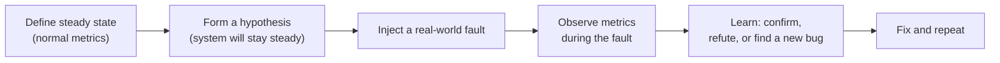

Chaos engineering has a reputation for "randomly breaking production," which is precisely backwards — done properly it is one of the most rigorous, scientific testing disciplines in this whole list. The interview signal is whether you can describe it as a controlled experiment with a hypothesis, not a stunt.

## The hypothesis-driven method

Chaos engineering follows a fixed method, deliberately borrowed from the scientific method, so that an experiment produces a clear answer rather than just noise.



1. **Steady state** — define measurable normal behaviour first (error rate, latency, throughput), not vague "the system feels fine."
2. **Hypothesis** — state what you believe will happen: "if the payments service loses connectivity to its database for 30 seconds, checkout latency will rise but error rate will stay under 1% because of the retry-with-fallback logic."
3. **Inject** — introduce the fault, ideally the smallest version that would still test the hypothesis.
4. **Observe** — watch the same steady-state metrics during and after the fault.
5. **Learn** — the hypothesis was right (confidence gained), or wrong (a real gap found before a customer found it) — either is a good outcome.

> [!KEY]
> The point of chaos engineering isn't to break things — it's to find out whether your *belief* about how the system handles failure matches reality, under conditions you control, before reality tests it for you at 3 a.m.

## Starting small and in non-production

Chaos engineering is a maturity ladder, not a single leap to "kill random production servers."

| Stage | Where | Example |
|---|---|---|
| 1 | Local/dev | Kill a dependency container, see if the app handles it |
| 2 | Staging/test environment | Inject latency into a database call under a realistic load test |
| 3 | Production, single instance, off-peak | Terminate one instance behind a load balancer, confirm traffic reroutes cleanly |
| 4 | Production, small % of traffic, business hours | Inject latency for 1% of requests to one dependency |
| 5 | Production, game day, cross-team | Simulate a full region failure with all responders participating |

> [!WARNING]
> Jumping straight to production experiments without first validating in staging is how chaos engineering gets a bad reputation — you should already have a strong hypothesis about the outcome before you touch anything customers depend on.

## Common experiments

| Experiment | What it simulates | What it typically reveals |
|---|---|---|
| Instance/pod termination | A server crashes or is rescheduled | Whether load balancing and health checks reroute traffic without dropped requests |
| Latency injection | A dependency slows down (not fails outright) | Whether timeouts are set sensibly, or a slow dependency cascades into thread/connection pool exhaustion upstream |
| Dependency failure | A downstream service or database becomes unreachable | Whether retries, circuit breakers and fallbacks actually engage as designed |
| Resource exhaustion | CPU, memory, disk, or file handles maxed out | Whether the system degrades gracefully (sheds load) or falls over entirely |
| Network partition | Two parts of the system can't talk to each other | Whether the system assumes consistency it doesn't actually have (split-brain risk) |
| Clock skew | Nodes disagree on the current time | Whether time-based logic (token expiry, distributed locks, log ordering) breaks under drift |
| Region/zone failover | An entire cloud region or availability zone goes down | Whether failover is actually automatic, and how long it truly takes end to end |

## Blast radius control and the abort switch

Every chaos experiment needs an explicit, pre-agreed **blast radius** — the maximum scope of impact — and a way to stop instantly if reality diverges from the hypothesis.

- Scope the experiment to the smallest population that can still test the hypothesis (one instance, 1% of traffic, a single non-critical region).
- Set an automatic abort condition tied to a real metric (error rate exceeds X%, latency exceeds Y ms) — don't rely on a human noticing in time.
- Have a manual kill switch that immediately reverts the injected fault, tested *before* the real experiment.
- Run during a time window with the right people watching (not Friday at 5pm, not during an unrelated incident).

> [!DANGER]
> An experiment with no automatic abort condition is not a controlled experiment — it's a bet that someone will notice and react fast enough. Build the abort trigger into the tooling itself (most chaos platforms — Gremlin, Azure Chaos Studio, Chaos Mesh — support automatic halt-on-metric-breach).

## Game days and incident rehearsal

A **game day** is a scheduled, deliberately-run exercise where a team responds to a simulated incident — often a chaos experiment, sometimes a tabletop scenario — as if it were real, to rehearse both the technical failover and the human incident response (who gets paged, who declares an incident, how status pages get updated, how the fix gets communicated). It surfaces gaps that a purely technical chaos experiment wouldn't: an outdated runbook, an alert that never fires, a dashboard that doesn't show the metric you actually need during the incident, or an on-call engineer who doesn't know the escalation path.

## What you actually learn (usually)

Most chaos experiments, run honestly, surface the same handful of categories of gap:

- **Timeouts set too long or not set at all** — a client waits far longer than it should for a slow dependency, tying up its own thread pool or connection pool while it waits.
- **Retries without backoff or jitter** — a fleet of clients all retry a failing dependency at the same instant, turning a partial outage into a full one (a "retry storm").
- **Missing or misconfigured circuit breakers** — a dependency failure isn't detected and isolated, so failure cascades upstream.
- **Health checks that don't reflect real health** — a load balancer keeps sending traffic to an instance whose health check passes but whose actual dependency (database, cache) is unreachable.
- **Assumed synchronous consistency that isn't guaranteed** — code that silently assumes a network partition can't happen.

> [!TIP]
> A strong interview answer names this pattern explicitly: *"In my experience, chaos experiments rarely uncover exotic bugs — they overwhelmingly reveal that a timeout was missing, a retry had no backoff, or a circuit breaker wasn't actually wired up. The value is finding that before an incident does."*

## Prerequisites before doing chaos engineering

Chaos engineering assumes you can already **observe** the system well enough to tell steady state from degraded state, and that you already have targets to protect.

| Prerequisite | Why it must come first |
|---|---|
| Observability (metrics, logs, traces) | You cannot detect a deviation from steady state you can't measure |
| SLOs / error budgets | You need a defined "acceptable" to know if the experiment's impact is tolerable |
| Alerting that actually fires | An abort condition is useless if nothing pages when it's breached |
| Basic resilience patterns already in place | Chaos engineering finds gaps in retries/timeouts/circuit breakers — it doesn't make sense to test resilience patterns you haven't attempted to implement at all |

> [!WARNING]
> Running chaos experiments against a system with no dashboards and no alerting isn't chaos engineering — it's just an outage with extra steps, because nobody can tell whether the injected fault is being handled or is actively taking the system down.

## Fault injection in .NET with resilience pipelines

Polly's `ResiliencePipeline` (v8+) is the standard .NET library for both implementing resilience patterns and, in tests, deliberately injecting faults to verify those patterns behave as intended.

```csharp
// Production code: a resilience pipeline combining retry, circuit breaker and timeout
var pipeline = new ResiliencePipelineBuilder()
    .AddRetry(new RetryStrategyOptions
    {
        MaxRetryAttempts = 3,
        BackoffType = DelayBackoffType.Exponential,
        UseJitter = true // avoids retry storms across many clients
    })
    .AddCircuitBreaker(new CircuitBreakerStrategyOptions
    {
        FailureRatio = 0.5,
        SamplingDuration = TimeSpan.FromSeconds(30),
        BreakDuration = TimeSpan.FromSeconds(15)
    })
    .AddTimeout(TimeSpan.FromSeconds(2))
    .Build();

await pipeline.ExecuteAsync(async ct => await paymentClient.ChargeAsync(order, ct));
```

```csharp
// Test code: Polly's chaos extensions deliberately inject faults to verify the pipeline works
var chaosPipeline = new ResiliencePipelineBuilder()
    .AddChaosLatency(new ChaosLatencyStrategyOptions { InjectionRate = 0.3, Latency = TimeSpan.FromSeconds(5) })
    .AddChaosFault(new ChaosFaultStrategyOptions
    {
        InjectionRate = 0.1,
        FaultGenerator = static _ => new ValueTask<Exception?>(new TimeoutException())
    })
    .Build();

// Wrap the real pipeline in the chaos pipeline during a resilience test run
// to confirm retries/circuit breaker actually engage under injected failure
```

This lets a team validate resilience configuration in an automated integration test — "does the circuit breaker actually open after the configured failure ratio" — without needing a live chaos platform for every check.

## How to describe this in an interview

A strong answer walks through the method explicitly rather than naming tools: define steady state with real metrics, form a falsifiable hypothesis, start small and non-production, scope the blast radius with an automatic abort, run the experiment, and report the learning regardless of outcome. Naming that chaos engineering has *prerequisites* (observability, SLOs, basic resilience patterns already attempted) shows maturity — it signals you wouldn't recommend it as the first testing investment for a team that doesn't have dashboards yet.

## Cheat sheet

- Method: steady state → hypothesis → inject → observe → learn. Always in that order.
- Start local/staging, then single production instance off-peak, then small % of production traffic, then full game day — a ladder, not a leap.
- Common experiments: instance termination, latency injection, dependency failure, resource exhaustion, network partition, clock skew, region failover.
- Every experiment needs a scoped blast radius and an automatic, metric-based abort condition — not a human hoping to notice in time.
- Game days rehearse the human incident response, not just the technical failover.
- The recurring findings are almost always: missing/too-long timeouts, retries without backoff/jitter, broken circuit breakers, misleading health checks.
- Prerequisites: observability, SLOs, working alerts, and basic resilience patterns already attempted — chaos finds gaps in those, it doesn't replace building them.
- Polly's `ResiliencePipeline` + chaos extensions let you fault-inject in automated .NET tests, not just live experiments.

## Common mistakes

| Mistake | Fix |
|---|---|
| Running chaos experiments in production with no prior staging validation | Climb the maturity ladder: local → staging → single instance → % of traffic → game day |
| No automatic abort condition tied to a real metric | Build a metric-based auto-halt into the experiment before running it |
| Treating chaos engineering as "randomly break things" | Always start from an explicit, falsifiable hypothesis and a defined steady state |
| Running chaos experiments with no observability in place | Build metrics/alerting first — you can't detect what you can't measure |
| Only testing the technical failover, never the human response | Run game days that include paging, incident declaration, and communication |
| Retrying failed requests with no backoff or jitter | Add exponential backoff with jitter to avoid retry storms |

## Summary

Chaos and resilience testing is a controlled, hypothesis-driven method — steady state, hypothesis, inject, observe, learn — not an excuse to randomly break production. It climbs a maturity ladder from local experiments to full production game days, with blast radius control and an automatic abort condition at every stage, and it has real prerequisites: you need observability and SLOs before an experiment's impact can even be judged. The recurring lesson across most real experiments is mundane and valuable — timeouts, retries, circuit breakers and health checks are usually where the actual gaps are — and tools like Polly's resilience pipelines let teams verify those specific behaviours in ordinary automated tests, not only in live chaos runs.

## Top Interview Questions

### Q1. Walk through the hypothesis-driven method of chaos engineering.

It follows five steps modeled on the scientific method. First, define the steady state using real, measurable metrics — error rate, latency, throughput — not a subjective sense that things are fine. Second, form a specific, falsifiable hypothesis about what will happen under a fault, such as "if the recommendations service becomes unreachable, checkout will fall back to a default list and error rate will stay flat." Third, inject the smallest real-world fault that would test that hypothesis. Fourth, observe the same steady-state metrics during and after the fault to see whether reality matched the prediction. Fifth, learn — either the hypothesis was confirmed (increasing confidence) or it was refuted, surfacing a real gap before a customer or an on-call engineer discovers it during a real incident. Both outcomes are considered a success because the goal is calibrating belief against reality, not proving the system is perfect.

### Q2. Why shouldn't a team start chaos engineering by running experiments directly in production?

Because chaos engineering only produces useful signal when you already have a strong, well-reasoned hypothesis about the outcome — jumping straight to production without first validating in a lower environment means you're gambling with real user impact to learn something you could have learned more cheaply and safely elsewhere. The recommended progression is a maturity ladder: start locally (kill a dependency container and see how the app reacts), move to a staging environment under realistic load, then to a single production instance during off-peak hours, then a small percentage of production traffic during business hours, and only then to full cross-team game days simulating larger failures. Each stage builds confidence and refines the hypothesis before the blast radius increases, which is what keeps chaos engineering a controlled experiment rather than a reckless one.

### Q3. What does "blast radius" mean in chaos engineering, and how do you control it?

Blast radius is the maximum scope of impact an experiment could have if things go worse than expected — how many users, how much traffic, or which systems could be affected. You control it by deliberately scoping the experiment to the smallest population that can still meaningfully test the hypothesis (a single instance rather than the whole fleet, 1% of traffic rather than all of it, a non-critical region first), and by building in an automatic abort condition tied to a real metric threshold (e.g., halt immediately if error rate exceeds 2%) rather than relying on a human noticing and reacting in time. A manual kill switch should also exist and be tested before the real experiment runs, so that if the automatic condition somehow doesn't trigger, a person can immediately revert the injected fault.

### Q4. What kinds of bugs does latency injection typically reveal that outright dependency failure doesn't?

Outright failure (a connection refused, an immediate error) is often already handled reasonably well because it's the obvious failure mode people design for — retries and fallbacks tend to exist for "the call failed." Latency injection simulates something subtler and more common in practice: a dependency that's still responding, just slowly, which can be far more damaging because callers keep threads, connections, or memory tied up waiting rather than failing fast. This frequently exposes missing or overly generous timeouts, and can cascade into exhausting an upstream service's own thread pool or connection pool, causing a slow dependency to take down services that don't even depend on the specific failing call directly, purely through resource contention. It's a classic case where "does it eventually return an error" is the wrong question — "how long does it take to give up, and what does waiting cost us" is the right one.

### Q5. What's the difference between a chaos experiment and a game day?

A chaos experiment is typically a narrow, technical test of a specific hypothesis about system behaviour under a specific fault, often automated and run frequently as confidence-building regression testing. A game day is a broader, scheduled exercise — sometimes built around a chaos experiment, sometimes a tabletop scenario with no real fault injected — where a team rehearses the full incident response as if it were real: who gets paged, who declares an incident, how the status page gets updated, how the fix is communicated to stakeholders. Game days surface gaps a pure technical experiment wouldn't, like an outdated runbook, an alert that's supposed to fire but doesn't, or an on-call engineer who's unsure of the escalation path — the human and process side of resilience, not just the code's behaviour under fault.

### Q6. A chaos experiment reveals that a retry storm made an outage worse rather than the system recovering. What's the fix, and how would you verify it?

The fix is to add exponential backoff with jitter to the retry policy, so that when many clients experience the same failure simultaneously, they don't all retry at the exact same moment (which is what turns a brief blip into a sustained overload as retries stack on top of the recovering service) — jitter randomizes the retry delay slightly so retries spread out over time instead of synchronizing. In .NET, this is a configuration change to a Polly `ResiliencePipeline`'s retry strategy (`BackoffType = DelayBackoffType.Exponential` with `UseJitter = true`). To verify it, re-run the same chaos experiment (the same fault injection, same conditions) and confirm via the same steady-state metrics that the dependency's request rate during recovery no longer spikes above its normal baseline, and that the calling service's error rate and latency recover faster than in the first run — comparing the same experiment before and after the fix is what proves the fix actually worked, rather than just assuming it did.

### Q7. Why are observability and SLOs described as prerequisites for chaos engineering rather than optional extras?

Chaos engineering's entire method depends on being able to detect a deviation from a defined steady state — without metrics, logs and traces, you have no way to tell whether an injected fault is being handled gracefully or is actively degrading the system, which means you can't observe step four of the method (observe) at all, and the experiment produces no usable signal. SLOs (and error budgets) matter because they define what "acceptable impact" even means for the abort condition and for judging whether the hypothesis was confirmed or refuted — without them, "is this bad enough to abort" is a subjective judgment call made under pressure, which is exactly the kind of ambiguity that leads to experiments running too long or halting inconsistently. Recommending chaos engineering to a team with no dashboards or alerting is effectively recommending an uncontrolled outage, since nobody can observe what's actually happening during the experiment.

### Q8. How would you fault-inject in an automated .NET test without needing a live chaos engineering platform?

Use Polly's chaos extensions alongside its `ResiliencePipeline`, which let you compose fault-injecting strategies — `AddChaosLatency`, `AddChaosFault`, `AddChaosOutcome` — with a configurable injection rate, and wrap them around the real resilience pipeline (retry, circuit breaker, timeout) under test in an integration test. This lets you assert, in an ordinary automated test run in CI, that a circuit breaker actually opens after its configured failure ratio is exceeded, or that a retry policy actually retries the expected number of times with the expected backoff, without needing a live chaos platform like Gremlin or Azure Chaos Studio, which are more suited to experiments against a running, deployed system. This is a good middle ground — it validates the resilience configuration itself as part of normal CI, catching a misconfigured circuit breaker or a retry policy with no jitter before it ever reaches a live chaos experiment or, worse, a real incident.

### Q9. What is the most common category of finding from real chaos experiments, and why is that useful to know as an interview answer?

Overwhelmingly, real experiments reveal mundane configuration gaps rather than exotic distributed-systems bugs: timeouts that are missing or set far too long, retries with no backoff or jitter causing retry storms, circuit breakers that are either missing or misconfigured so failures cascade instead of being isolated, and health checks that report "healthy" even though a critical dependency is actually unreachable. Knowing this is a strong interview answer because it demonstrates you understand the actual value proposition of chaos engineering — it's not about hunting for rare, exotic failure modes, it's a systematic, evidence-based way to find the boring-but-critical gaps in resilience configuration that would otherwise only surface during a real, unplanned incident, at a much higher cost.

### Q10. How would you justify introducing chaos engineering to a team that says "we already have plenty of tests"?

Point out that unit, integration and e2e tests almost universally validate the happy path and expected error paths of code the team already thought to write tests for — they very rarely validate what happens when a dependency the code assumes is reliable actually becomes slow or unavailable, because that failure mode usually isn't something anyone writes an explicit test case for. Chaos engineering specifically targets that blind spot: it validates the resilience mechanisms (timeouts, retries, circuit breakers, failover) that are supposed to handle real infrastructure failures, which is a different risk category from correctness bugs that existing tests are designed to catch. Frame it as complementary, not a replacement, and propose starting with the smallest possible experiment (a single non-critical instance termination in staging) so the cost of adopting it is low and the first result — likely a real, previously-unknown gap — makes the case for itself.

### Q11. How do you decide when chaos engineering is not yet the right investment for a team?

If the team doesn't yet have solid observability (metrics, logs, traces) or defined SLOs, chaos engineering isn't actionable — you can't reliably tell steady state from degraded state, so experiments won't produce trustworthy signal, and the team's time is better spent building that foundation first. Similarly, if the system doesn't yet have basic resilience patterns in place at all (no retries, no timeouts configured anywhere), running chaos experiments to "find gaps" in patterns that were never attempted is redundant — the gap is already known and doesn't need an experiment to discover it; the effort should go into implementing baseline resilience patterns first, then use chaos engineering to verify and refine them. Chaos engineering is best positioned as a validation and continuous-improvement practice for a system that already has a resilience strategy, not a substitute for building one.

### Q12. What would an automatic abort condition look like in practice for a latency-injection experiment on a payment service?

It would be a real-time monitor, wired into the chaos tooling itself, watching the payment service's actual error rate and p99 latency (the same steady-state metrics defined before the experiment) against pre-agreed thresholds — for example, "abort immediately if error rate exceeds 2% for more than 30 seconds, or if p99 latency exceeds 5 seconds." The moment either threshold is breached, the tooling automatically removes the injected latency and, ideally, the on-call/experiment owner is paged so a human can confirm the system has actually recovered rather than just assuming it based on the fault being removed. This is deliberately not left to a human watching a dashboard and deciding manually, because during a genuinely fast-moving degradation, a metric-based automatic trigger reacts faster and more reliably than a person noticing, especially if the experiment is running outside of the most heavily-staffed hours.
