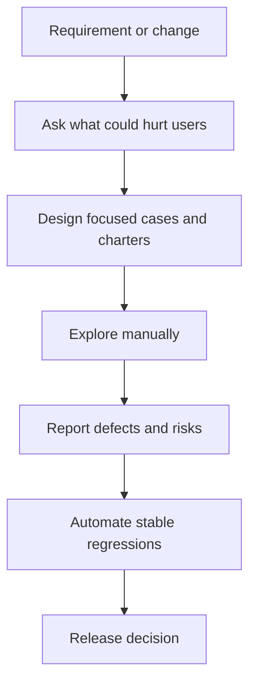
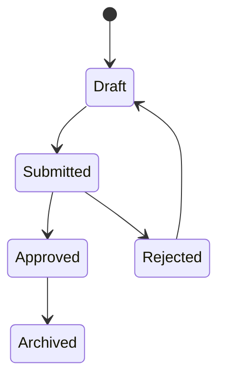

Manual testing is not the absence of automation. It is disciplined human investigation of risk, ambiguity, usability and business meaning in places where scripted checks are too early, too expensive or too blind to be useful.

## What manual testing is for

Automation is excellent at repeating known checks. Manual and exploratory testing are strongest when the team is still learning what the product should do, when the user experience is subjective, or when a new change creates uncertain risk.

| Manual testing is best for | Automation is best for |
|---|---|
| Ambiguous or changing requirements | Stable flows that must be checked every release |
| Exploratory discovery around new features | Regression checks with deterministic expected results |
| Usability, wording, accessibility feel and workflow friction | API, calculation and data validation with many repeated cases |
| One-off release risk assessment | Long-lived smoke and regression suites |
| UAT support and stakeholder signoff | Fast feedback in CI after every change |



> [!KEY]
> A strong QA contribution is not a large number of test cases. It is a clear explanation of what risk was covered, what was not covered, and what evidence supports release confidence.

Modern QA starts during refinement, not after coding. A tester reviews acceptance criteria, asks what happens on negative and boundary paths, identifies dependencies, and helps the team define what evidence will be enough to ship.

## Designing high value test cases

Good manual cases reduce the input space without guessing blindly. The goal is representative coverage: enough examples to expose likely defects without brute-forcing every combination.

| Technique | Use it when | Example |
|---|---|---|
| Equivalence partitioning | Many values should behave the same | For age 18 to 60, test one valid age and one invalid age below and above the range |
| Boundary value analysis | A numeric, date, size or count limit exists | Test 17, 18, 19 and 59, 60, 61 for an 18 to 60 rule |
| Decision tables | Output depends on combinations of conditions | Premium user, coupon, cart threshold and regional restriction determine discount |
| State transition testing | The system moves through states | Draft, submitted, approved, rejected and resubmitted expense reports |
| Pairwise testing | Many independent configuration options combine | Browser, role, payment method and shipping region without testing every product |

A decision table makes business rules reviewable before execution.

| Premium | Coupon | Cart above threshold | Expected discount |
|---|---|---|---|
| Yes | Yes | Yes | Highest eligible discount only |
| Yes | No | Yes | Premium discount |
| No | Yes | Yes | Coupon discount |
| No | Yes | No | Coupon rejected with clear message |
| No | No | No | No discount |

For stateful features, draw the allowed transitions and test both valid and invalid moves.



> [!TIP]
> When time is short, boundary values and state transitions usually find more defects than another happy path. Bugs cluster around edges and illegal moves.

## Exploratory testing with charters

Exploratory testing is simultaneous learning, test design and execution. It is not random clicking. A good exploratory session has a time box, a charter and notes that separate observations from confirmed defects.

| Charter | Risk being explored | Useful evidence |
|---|---|---|
| Explore checkout recovery after a failed payment | Users may pay twice or lose cart state | Steps, screenshots, order IDs, payment attempt IDs |
| Explore admin to standard user role switching | Authorization leakage | Accounts used, pages visited, data visible and hidden |
| Explore file upload with unsupported and oversized files | Validation and storage risk | File names, sizes, MIME types, error text |
| Explore draft save across refresh, logout and session expiry | Data loss | Timestamps, draft IDs, network condition |

A concise session note is enough:

```text
Charter: Explore draft-save reliability during refresh and logout
Build: 2026.09.28.3 on staging
Coverage: Chrome desktop, editor page, standard user role
Findings: Draft survives refresh but is lost after logout if autosave is pending
Evidence: draft id D-1842, console error, video attached to defect
Open risk: Mobile browser not covered in this session
```

Exploratory testing often feeds automation. Once a defect is understood and fixed, the stable regression check can become an API, unit or UI automated test at the cheapest level that would catch it.

## Bug reports that get fixed

A bug report competes for engineering attention. It should let a developer reproduce the issue, understand impact, and decide priority without a meeting.

| Field | What good looks like |
|---|---|
| Summary | Specific symptom and affected area, not vague words like broken |
| Environment | Build, browser, device, account type, data set and flags |
| Preconditions | Setup that must exist before step one |
| Steps | Numbered, minimal and repeatable |
| Expected result | Product rule or user expectation |
| Actual result | Observable failure, error text, data state or logs |
| Impact | Who is affected and what business process is blocked |
| Evidence | Screenshot, video, request id, console log or server correlation id |
| Reproducibility | Always, intermittent with pattern, or unable to reproduce again |

Severity and priority are related but different.

| Scenario | Severity | Priority | Why |
|---|---|---|---|
| Payment fails for all users | Critical | High | Core revenue path is blocked |
| Typo on an internal archived report | Low | Low | Small impact and low urgency |
| Logo wrong on public demo page | Low | High | Business deadline makes it urgent |
| Data export drops rows for one regulated customer | Critical | High | Compliance and data integrity risk |

> [!WARNING]
> A defect with no expected result is often a requirement question, not a ready engineering bug. Clarify the product rule before asking someone to fix it.

## Smoke, regression, UAT and signoff

Manual QA still shapes release confidence through risk-based suites. Smoke testing asks whether the build is testable. Sanity testing checks a narrow fix. Regression testing checks that important existing behavior still works. User acceptance testing, or UAT, confirms the product is ready for real business use.

| Suite | Purpose | Typical owner | Scope |
|---|---|---|---|
| Smoke | Prove the build and environment are usable | QA or CI | Broad and shallow critical paths |
| Sanity | Prove a specific fix or change behaves as expected | QA and developer | Narrow changed area |
| Regression | Protect high-value existing behavior | QA with automation support | Risk-based impacted journeys |
| UAT | Confirm business readiness | Business users with QA facilitation | Real workflows and signoff criteria |

Release signoff is not a promise that no bugs exist. It is an evidence-based decision that remaining risk is known and accepted.

Good exit criteria include: blocker and critical defects closed or explicitly accepted, smoke and planned regression complete, open high defects reviewed by product and engineering, test environment issues separated from product issues, rollback plan known, and stakeholder signoff captured for UAT-sensitive changes.

## QA on a modern team

The QA role is quality coach, risk analyst and feedback accelerator. In refinement, QA challenges vague acceptance criteria. During development, QA pairs with engineers on edge cases and testability. Near release, QA summarizes risk instead of acting as the final safety net for every defect.

Risk-based testing orders work by impact and likelihood: revenue, security, privacy, high-traffic flows, recent churn, third-party integrations, historically defect-prone areas and hard-to-recover failures. It also means deciding what not to test first.

> [!NOTE]
> Manual testing beats automation when judgment matters, when the feature is changing daily, when the expected result is subjective, or when the team is discovering unknown risks. Automation wins after the behavior is stable and worth repeating.

A lightweight test plan keeps this work visible without becoming ceremony. For a feature or release, record scope, out-of-scope items, entry criteria, exit criteria, environments, data needs, major risks, owners and deliverables. The plan should be short enough to update during the sprint and specific enough that a stakeholder can see what evidence will exist before signoff.

| Test plan area | Senior question to answer |
|---|---|
| Scope | Which workflows and platforms are intentionally covered or skipped |
| Entry criteria | What build, data, accounts and requirements must exist before testing starts |
| Exit criteria | Which defect levels block release and who can accept exceptions |
| Risk register | Which open unknowns could change the release decision |
| Deliverables | Which reports, charters, defect summaries and UAT notes will be produced |

This also prevents the common blame pattern where QA is asked for a release answer after receiving an unstable build, missing test data or unclear acceptance criteria. Good QA practice makes those dependencies explicit early.

Metrics should support judgment, not replace it. Useful QA metrics include escaped defects by area, reopen rate, defect aging, blocked test time and flaky automation count. Avoid rewarding raw test case volume or raw bug count; those incentives push people toward shallow cases and low-value defects. The best reports connect evidence to risk: what was tested, what failed, what remains unknown, and which decision the team can now make.

## Cheat sheet

- Manual testing is disciplined risk investigation, not unskilled clicking.
- Testing starts in requirement analysis by clarifying acceptance criteria and edge cases.
- Equivalence partitions reduce large input spaces to representative values.
- Boundary value analysis targets limits where defects cluster.
- Decision tables make multi-condition business rules reviewable.
- State transition tests cover valid and invalid moves in workflows.
- Exploratory testing needs a charter, time box and evidence.
- A good bug report includes impact, environment, repro steps and evidence.
- Severity means impact; priority means urgency.
- Smoke checks build testability, sanity checks a targeted change, regression protects existing behavior, and UAT confirms business readiness.
- QA in Agile is a continuous collaborator, not a final gate after development.
- Manual findings should become automated checks only after the behavior is stable and valuable to repeat.

## Common mistakes

| Mistake | Fix |
|---|---|
| Treating manual testing as a backup for missing automation | Use manual work for discovery, ambiguity and judgment |
| Writing hundreds of step-by-step cases with no risk priority | Use risk, boundaries, states and decision tables to focus effort |
| Logging bugs without expected behavior or impact | Clarify the requirement and state business impact in the report |
| Confusing smoke and regression coverage | Keep smoke broad and shallow, regression risk-based and deeper |
| Automating a feature while the UI changes every sprint | Explore manually first, automate after the workflow stabilizes |
| Letting UAT be the first time business users see the feature | Involve stakeholders earlier with examples and acceptance criteria |
| Calling every defect critical | Separate severity from priority and calibrate with product and engineering |

## Summary

Manual QA remains valuable because not every important product risk is repeatable, objective or known in advance. Strong testers use design techniques such as boundaries, decision tables, state transitions and pairwise selection to find defects efficiently. They report bugs with enough evidence to be fixed, guide smoke and regression scope by risk, support UAT with clear signoff criteria, and turn stable discoveries into automation at the right level.

## Top Interview Questions

### Q1. Why does manual testing still matter when a team has strong automation?

Automation is excellent at repeating known checks, but it does not discover unknown risks by itself. Manual testing is valuable when requirements are ambiguous, a workflow is new, the user experience is subjective, or the product risk depends on domain judgment rather than a simple assertion. Exploratory testing can reveal missing acceptance criteria, confusing copy, broken mental models, accessibility friction and business-rule gaps that scripted tests were never written to check. The mature answer is not manual versus automation. It is manual discovery followed by selective automation: once a behavior is understood, stable and worth repeating, automate the regression at the cheapest level that would catch it.

### Q2. What is exploratory testing, and how do you keep it disciplined?

Exploratory testing is simultaneous learning, test design and execution. It is disciplined by using a charter, a time box and evidence. A charter names the feature, the risk and the focus, such as exploring checkout recovery after payment failure. During the session, the tester follows observations, varies data and workflows, and records what was covered, what was found and what remains uncertain. It is not random clicking because the goal is bounded risk discovery. Good notes include build, environment, accounts, data, steps for confirmed defects and open risks. Afterward, important findings either become bugs, clarified requirements or candidates for future automated regression checks.

### Q3. How do equivalence partitioning and boundary value analysis differ?

Equivalence partitioning divides inputs into groups expected to behave the same, then tests a representative from each group. If an age field accepts 18 to 60, below 18, 18 to 60 and above 60 are partitions. Boundary value analysis focuses on the edges of those partitions because defects often occur at off-by-one limits. For the same field, test 17, 18, 19 and 59, 60, 61. Partitioning reduces the number of cases; boundary analysis chooses the highest-value examples around limits. In interviews, use both together: first identify valid and invalid partitions, then select representatives at and around boundaries rather than picking arbitrary values.

### Q4. When would you use a decision table?

Use a decision table when the outcome depends on combinations of conditions rather than one input at a time. Examples include discount eligibility, loan approval, shipping rules and authorization decisions. The table lists conditions as columns and expected outcomes as rows, making gaps and contradictions visible before testing begins. It also helps product, QA and engineering agree on rules without reading long prose. A senior tester does not necessarily execute every possible row if risk is low; they use the table to choose meaningful cases, automate stable combinations and ask about impossible or conflicting combinations. The main benefit is turning hidden business logic into a reviewable artifact.

### Q5. What should a good bug report include?

A good bug report gives engineering enough information to reproduce, understand and prioritize the issue. It needs a clear summary, environment and build, preconditions, minimal numbered steps, expected result, actual result, severity or impact, evidence and reproducibility notes. For backend or API defects, include request ids, payloads, account ids and timestamps when safe. For UI defects, screenshots or short videos can remove ambiguity. The strongest reports also name suspected scope: whether it affects all users, one role, one browser, one tenant or one data shape. A report that only says something is broken wastes time; a report with impact and evidence gets fixed faster.

### Q6. How do severity and priority differ?

Severity describes impact: how bad the defect is if it occurs. Priority describes urgency: how soon the team should fix it. A payment failure for all users is high severity and high priority. A typo in an internal legacy screen is low severity and usually low priority. A small branding issue on a public demo page may be low severity but high priority because of a business deadline. QA often proposes severity based on observed impact, while product and engineering help set priority based on release plans, customer commitments and cost. Keeping the concepts separate prevents every visible issue from being labeled critical and helps the team make rational trade-offs.

### Q7. What is the difference between smoke, sanity and regression testing?

Smoke testing is broad and shallow. It asks whether the new build is stable enough for deeper testing, usually by checking login, core navigation and one or two critical flows. Sanity testing is narrow and focused. It validates that a specific fix or small change behaves as expected before spending more time elsewhere. Regression testing is broader and risk-based. It checks that important existing behavior still works after changes, especially impacted areas and historically defect-prone flows. A common mistake is calling a quick smoke run a regression suite. In a release discussion, be precise about scope so stakeholders understand what confidence the result actually provides.

### Q8. How do you decide what to test first when time is limited?

Use risk, not convenience. Start with flows whose failure would cause revenue loss, security or privacy exposure, data loss, compliance issues or major customer disruption. Then look at likelihood: recent code churn, complex integrations, historically buggy areas, unclear requirements and dependencies on third parties. Choose high-impact, high-likelihood areas first and be explicit about what will not be covered. This is where QA judgment matters most. A senior answer sounds like, I would test payment, authorization and data integrity before low-impact cosmetic paths, and I would communicate remaining risk rather than pretending coverage is complete.

### Q9. What is UAT, and how should QA support it?

User acceptance testing is business-facing validation that the system is ready for real use. It is not a substitute for QA finding functional defects earlier. QA supports UAT by helping define business scenarios, preparing realistic data, explaining known limitations, triaging feedback, distinguishing defects from change requests, and capturing signoff criteria. The business users bring domain judgment that engineering and QA may not have, such as whether a workflow matches operational practice or a report supports a regulatory task. A good UAT process is scoped and evidence-based: pass criteria, blockers, accepted risks and signoff are explicit before release.

### Q10. Where does QA fit on an Agile team?

QA should be involved from refinement through release. During refinement, QA clarifies acceptance criteria, identifies edge cases and helps split stories into testable increments. During development, QA collaborates with engineers on test data, automation opportunities and early validation instead of waiting for a finished build. During review and release, QA summarizes evidence, open defects and risk. This does not mean QA owns quality alone. Developers own unit and integration quality, product owns business rules, and QA helps the team see blind spots. The mature Agile QA role is a quality coach and risk communicator, not a final inspection department.
