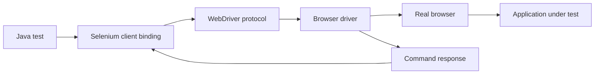

Selenium is still a common interview topic because many organizations run large browser suites on it. A strong answer explains the WebDriver architecture, synchronization discipline, locator maintainability and the scaling limits honestly.

## WebDriver architecture

Selenium WebDriver does not execute test code inside the browser directly. Your Java test calls the Selenium client library, which sends standard WebDriver commands to a browser-specific driver such as ChromeDriver or GeckoDriver, and that driver controls the real browser.



| Layer | Responsibility | Common interview detail |
|---|---|---|
| Test runner | JUnit or TestNG lifecycle, assertions and reporting | Selenium itself is not a complete test framework |
| Selenium client | Language binding used by test code | Java remains common in enterprise Selenium suites |
| WebDriver protocol | Standard command contract | Commands are remote style requests and responses |
| Browser driver | Browser-specific adapter | Driver and browser versions must be compatible |
| Browser | Executes real clicks, navigation and DOM interaction | This gives realism but also timing and UI cost |

> [!KEY]
> The WebDriver layer is Selenium's strength and cost. It gives real browser fidelity and broad language support, but every action crosses a driver boundary and must synchronize with a live, changing page.

Selenium Grid adds a routing layer so tests can request capabilities and run on remote nodes. Grid helps with browser coverage and parallel throughput, but it does not fix brittle selectors, shared data or poor waits.

## Locator strategy and fragility

Good locators are stable, readable and tied to user intent or test-specific attributes rather than layout. Fragility usually comes from selecting by position or by styling classes that designers freely change.

| Rank | Locator style | Stability | Notes |
|---|---|---|---|
| 1 | Stable id or test id | High | Best when the application deliberately exposes testable hooks |
| 2 | Name or accessible label | High to medium | Good for forms and accessible applications |
| 3 | CSS by stable attribute | Medium | Concise and fast, but avoid style-only classes |
| 4 | Relative XPath by text or relationship | Medium | Useful for table rows and parent-child relationships |
| 5 | Absolute XPath or nth-child chain | Low | Breaks on minor layout changes and should be avoided |

```java
WebElement email = driver.findElement(By.id("email"));
WebElement search = driver.findElement(By.name("q"));
WebElement save = driver.findElement(By.cssSelector("[data-testid='save-profile']"));
WebElement userRow = driver.findElement(By.xpath("//tr[td[normalize-space()='alice@example.com']]"));
```

Avoid absolute XPath such as `/html/body/div[2]/div[3]/button`. It encodes page layout rather than product behavior. If the application lacks stable hooks, ask the team to add `data-testid` or accessible names instead of writing heroic selectors.

## Waits and synchronization

Synchronization is where Selenium suites most often become flaky. An element can exist in the DOM but still be hidden, disabled, covered by an animation, or replaced by a reactive render between lookup and click.

| Wait type | Scope | Best use | Risk |
|---|---|---|---|
| Implicit wait | Applies globally to element lookup | Very small legacy safety net | Masks slow selectors and combines unpredictably with explicit waits |
| Explicit wait | Waits for a specific condition | Default production choice | Requires choosing the right condition |
| Fluent wait | Explicit wait with polling and ignored exceptions | Dynamic DOM and transient stale elements | Can hide real instability if timeout is too broad |

```java
WebDriverWait wait = new WebDriverWait(driver, Duration.ofSeconds(10));
WebElement submit = wait.until(
    ExpectedConditions.elementToBeClickable(By.id("submit-order"))
);
submit.click();

WebElement banner = wait.until(
    ExpectedConditions.visibilityOfElementLocated(By.cssSelector("[data-testid='success-banner']"))
);
assertEquals("Order placed", banner.getText());
```

Fluent waits are useful when the page re-renders elements and `StaleElementReferenceException` is expected briefly.

```java
Wait<WebDriver> wait = new FluentWait<>(driver)
    .withTimeout(Duration.ofSeconds(15))
    .pollingEvery(Duration.ofMillis(250))
    .ignoring(NoSuchElementException.class)
    .ignoring(StaleElementReferenceException.class);

WebElement toast = wait.until(d -> d.findElement(By.cssSelector(".toast-success")));
```

> [!WARNING]
> Avoid mixing implicit and explicit waits. Selenium's behaviour becomes unpredictable because the global lookup delay can be paid inside each explicit poll, making failures slow and confusing. Prefer explicit waits and keep implicit wait at zero or very small.

`Thread.sleep` is not synchronization. It waits for time, not readiness. It is too short on busy CI and wastefully long when the application is fast.

## Page Object Model

The Page Object Model separates test intent from page structure. Tests should read like user behavior, while page objects hold selectors and low-level interactions.

```java
public final class LoginPage {
    private final WebDriver driver;
    private final WebDriverWait wait;
    private final By email = By.id("email");
    private final By password = By.id("password");
    private final By submit = By.cssSelector("[data-testid='login-submit']");

    public LoginPage(WebDriver driver) {
        this.driver = driver;
        this.wait = new WebDriverWait(driver, Duration.ofSeconds(10));
    }

    public LoginPage open(String baseUrl) {
        driver.get(baseUrl + "/login");
        return this;
    }

    public DashboardPage loginAs(String userEmail, String userPassword) {
        driver.findElement(email).sendKeys(userEmail);
        driver.findElement(password).sendKeys(userPassword);
        wait.until(ExpectedConditions.elementToBeClickable(submit)).click();
        return new DashboardPage(driver);
    }
}
```

```java
@Test
void userCanLogIn() {
    WebDriver driver = new ChromeDriver();
    try {
        DashboardPage dashboard = new LoginPage(driver)
            .open(baseUrl)
            .loginAs("alice@example.com", "correct-password");

        assertTrue(dashboard.isLoaded());
    } finally {
        driver.quit();
    }
}
```

Keep page objects focused. They should expose user actions and stable page state, not become a giant application service that hides assertions and control flow from every test.

## Browser cases that need explicit handling

Some browser features require switching context or using Selenium-specific APIs. These are common interview follow-ups because they expose whether you have used WebDriver beyond simple clicks.

| Scenario | Selenium shape | Pitfall |
|---|---|---|
| Frame or iframe | `driver.switchTo().frame(...)` then return to default content | Looking for elements in the wrong browsing context |
| Alert | `driver.switchTo().alert()` then accept or dismiss | Waiting for alert before switching |
| File upload | Send a local path to an `<input type="file">` | Trying to automate the OS file picker |
| Multiple tabs | Store handles and switch explicitly | Closing a child tab and forgetting to switch back |
| Shadow DOM | Use JavaScript or Selenium shadow root support | Normal CSS lookup may not cross the shadow boundary |

```java
driver.switchTo().frame("payment-frame");
driver.findElement(By.id("cvv")).sendKeys("123");
driver.switchTo().defaultContent();

Alert alert = new WebDriverWait(driver, Duration.ofSeconds(5))
    .until(ExpectedConditions.alertIsPresent());
assertEquals("Delete record?", alert.getText());
alert.accept();

WebElement upload = driver.findElement(By.cssSelector("input[type='file']"));
upload.sendKeys("C:\\tests\\receipts\\invoice.pdf");
```

For shadow DOM, prefer exposing stable test hooks at the component boundary when possible. Deep JavaScript traversal across implementation details can become just as brittle as absolute XPath.

## Grid, parallelism and honest limits

Selenium Grid routes sessions to remote browsers based on requested capabilities. It is useful when a suite needs cross-browser coverage, multiple OS/browser combinations or faster feedback by distributing tests.

```java
ChromeOptions options = new ChromeOptions();
options.setCapability("browserName", "chrome");

WebDriver driver = new RemoteWebDriver(URI.create(gridUrl).toURL(), options);
```

Parallel Selenium requires strict isolation: one WebDriver instance per test thread, unique test data, no shared mutable accounts, and clean browser state. Sharing one static driver across parallel tests is a classic cause of random failures.

| Scaling concern | Good practice |
|---|---|
| Driver lifecycle | Create and quit one driver per test or per isolated fixture |
| Test data | Generate unique users, orders and emails per test run |
| Cross-browser matrix | Keep full matrix for smoke paths, not every edge case |
| Grid capacity | Monitor node utilization and queue time |
| Reporting | Capture screenshots, page source and logs on failure |

> [!TIP]
> A senior Selenium answer is honest: Grid solves distribution and browser coverage. Stability still comes from locators, waits, isolation and data discipline.

Driver management and diagnostics matter as much as test code once the suite is in CI. Pin browser images or use a managed grid so driver upgrades are deliberate, capture screenshots and page source on failure, and attach console or network logs when they help explain the defect. A red browser test without artifacts is expensive because the developer must reproduce a timing-sensitive failure locally before learning anything.

| Failure artifact | What it helps diagnose |
|---|---|
| Screenshot | Wrong page, missing element, validation text or modal overlay |
| Page source | Element absent, duplicated, disabled or rendered with unexpected attributes |
| Browser console log | JavaScript errors and failed client-side initialization |
| Network log | Failed API calls, redirects, authorization failures and slow requests |
| Grid session video | Click target, scrolling, focus and animation problems |

Use these artifacts to classify failures before changing timeouts. If the screenshot shows the correct element hidden behind a spinner, fix synchronization. If the page source has no element, fix setup or application behavior. If another test changed the same account, fix isolation.

Cross-browser coverage should be risk based. It is reasonable to run one deep suite in the team's primary browser and a smaller smoke matrix across Chrome, Firefox, Edge or Safari equivalents. Browser-specific bugs usually appear in rendering, file handling, downloads, focus, keyboard behavior and security prompts, not in every data-validation edge case. Put those high-risk UI behaviors in the matrix and keep pure business combinations at the API or service layer.

This is also where accessibility-aware locators help twice: they make tests more stable and they expose missing labels before a separate accessibility review catches them.

## Cheat sheet

- WebDriver uses client bindings, a protocol, a browser driver and a real browser.
- Selenium needs a runner such as JUnit or TestNG for lifecycle, assertions and reporting.
- Prefer stable ids, accessible labels or test ids; avoid layout-based XPath.
- Explicit waits are the default synchronization tool; fluent waits are for custom polling.
- Keep implicit waits zero or tiny, especially when explicit waits are used.
- Never use `Thread.sleep` as readiness logic.
- Page objects centralize selectors and expose user actions, not raw DOM details everywhere.
- Switch explicitly for frames, alerts, windows and shadow DOM boundaries.
- File upload uses `sendKeys` on the file input, not OS dialog automation.
- Grid improves browser coverage and throughput but does not fix poor test design.
- Parallel tests need one driver and isolated data per test thread.
- Selenium is mature and portable, but modern async web apps require careful synchronization discipline.

## Common mistakes

| Mistake | Fix |
|---|---|
| Absolute XPath tied to page layout | Add stable attributes or use relative selectors tied to behavior |
| Large implicit wait plus explicit waits | Prefer explicit waits and keep implicit wait minimal |
| `Thread.sleep` after every action | Wait for a specific condition such as clickable, visible or text present |
| Static shared WebDriver in parallel tests | Create isolated driver instances per test thread |
| Page objects containing all assertions and business logic | Keep assertions in tests unless they describe page-loaded state |
| Running every browser for every test | Run full matrix for smoke journeys and narrower browsers for deeper suites |
| Automating OS file dialogs | Send the file path to the file input element |

## Summary

Selenium remains relevant because WebDriver provides mature, language-agnostic browser automation against real browsers. The practical skill is designing tests that survive UI change: stable locators, explicit waits, lean page objects, isolated data and careful driver lifecycle. Grid can scale execution across browsers and machines, but it only amplifies the quality of the suite design already in place; it cannot rescue brittle selectors or nondeterministic data.

## Top Interview Questions

### Q1. Explain Selenium WebDriver architecture.

A Selenium test calls a language binding, such as Java's Selenium client, rather than manipulating the browser directly. The client sends WebDriver protocol commands to a browser-specific driver like ChromeDriver, GeckoDriver or EdgeDriver. That driver controls the real browser, performs actions such as click or navigation, and returns responses to the client. A test runner such as JUnit or TestNG provides lifecycle, assertions and reporting around those commands. This architecture gives Selenium broad language and browser support and real browser fidelity. The cost is synchronization and driver management: actions cross process boundaries, browser and driver versions must be compatible, and tests must wait for the page to be ready.

### Q2. How do you choose locator strategies in Selenium?

Choose locators by stability and meaning. A stable unique id or test id is usually best because it is fast, readable and resilient to layout changes. Names and accessible labels are also good for forms and user-facing controls. CSS selectors are concise for stable attributes but should not depend on styling classes that designers can change. XPath is useful for relationships, such as finding a table row containing specific text, but absolute XPath from the root is brittle and should be avoided. If all available selectors are fragile, the right engineering response is to add testable attributes or accessibility names to the application rather than building complicated selectors.

### Q3. What is the difference between implicit, explicit and fluent waits?

An implicit wait is a driver-wide timeout applied when locating elements. It is simple but blunt and can make failures slow or confusing, especially when combined with explicit waits. An explicit wait targets a specific condition, such as an element becoming clickable or text appearing, and is the normal production choice. A fluent wait is an explicit wait with custom polling interval and ignored exceptions, useful for dynamic DOM updates where stale elements are transient. The key interview point is to wait on readiness, not time. Prefer explicit waits, use fluent waits for special polling cases, and keep implicit waits zero or very small.

### Q4. Why can implicit waits cause flaky or slow Selenium tests?

Implicit waits are global and apply to every element lookup. When a test also uses explicit waits, each poll inside the explicit wait may pay the implicit lookup timeout, causing unexpectedly long failures. They can also hide slow or incorrect selectors because the driver quietly waits rather than making the root cause obvious. In complex pages, a global delay does not express the condition that actually matters: visible, clickable, stable, or containing expected text. This leads to tests that still race against disabled buttons or animations. A better approach is explicit condition-based waits with short, meaningful timeouts and selectors that represent the intended element clearly.

### Q5. What is the Page Object Model, and what problem does it solve?

The Page Object Model wraps a page or component behind a class that owns its selectors and exposes meaningful user actions such as `loginAs` or `submitPayment`. It solves the maintenance problem of duplicated selectors and low-level DOM operations scattered across many tests. When a button's selector changes, one page object changes instead of dozens of tests. It also improves readability because the test describes the journey rather than implementation details. The limitation is that page objects can become too large and hide test intent if they contain complex business logic or many assertions. Keep them lean: locators, actions and page-state checks.

### Q6. How do you handle frames, alerts and file uploads in Selenium?

Frames require switching the driver's context with `driver.switchTo().frame(...)`; after interacting inside the frame, return with `defaultContent()`. Alerts require waiting for an alert and then using `driver.switchTo().alert()` to read, accept or dismiss it. File uploads should not automate the operating system file picker. Selenium can set the file path by sending keys to the underlying `<input type="file">` element. These examples matter because they show WebDriver controls browser contexts, not just elements. Many failures in real suites are simply caused by looking for an element in the wrong frame or active window.

### Q7. What is Selenium Grid, and when would you use it?

Selenium Grid distributes WebDriver sessions across remote machines or containers. A test requests capabilities such as browser name and version, the Grid router finds an available node, and the test runs there through `RemoteWebDriver`. Use Grid when a suite needs cross-browser coverage, OS/browser combinations, or enough parallelism to reduce feedback time. It is especially useful in CI for large regression suites. The honest caveat is that Grid does not make tests stable. If locators are brittle, data is shared, or waits are poor, Grid will fail faster and in more places. Design discipline comes first; Grid is a scaling tool.

### Q8. How do you make Selenium tests safe for parallel execution?

Every parallel test needs isolated browser state and test data. Create a separate WebDriver instance per test thread or fixture, and always quit it. Do not store the driver in a shared static field unless a thread-local wrapper is used correctly. Generate unique users, emails, orders and other records so tests do not collide. Avoid test order dependencies and shared accounts that mutate state. Use the runner's parallel features deliberately and group tests that truly share an environment if serialization is unavoidable. When a suite fails only in parallel, assume shared state first, then investigate timing and grid capacity.

### Q9. What are the limitations of Selenium compared with newer tools?

Selenium is mature, portable and supports many languages and browsers, which is why it remains widely used. Its limitations are mostly defaults and ergonomics: synchronization is manual, browser isolation is more session-centric, debugging usually requires additional reporting tools, and network interception is less integrated than in newer frameworks. Modern reactive applications can expose stale element and timing problems if tests are not designed carefully. Newer tools such as Playwright reduce some of this friction with auto-waiting, contexts and trace tooling. A fair answer is not that Selenium is obsolete, but that Selenium requires more framework discipline to reach similar reliability.

### Q10. Why are Selenium suites often flaky, and how would you fix one?

The usual causes are poor synchronization, brittle selectors, shared data, shared driver state, dynamic DOM re-renders, environment instability and real third-party dependencies. Fixing the suite starts with measurement: identify which tests fail on the same commit and classify failures by cause. Replace sleeps with explicit waits, replace absolute XPath with stable attributes, create unique data per test, isolate drivers, and capture screenshots, logs and page source on failure. Quarantine genuinely flaky tests out of the blocking pipeline with an owner and deadline. Do not simply rerun failures. Re-running hides the signal and trains the team to distrust red builds.
