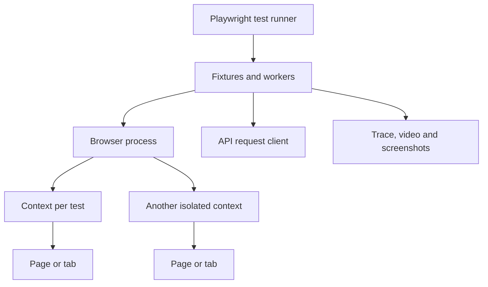

Playwright changed browser automation by making isolation, waiting and diagnostics first-class defaults. A strong interview answer explains what those defaults buy, where Playwright still needs discipline, and how it compares honestly with Selenium and Cypress.

## What changed versus older UI automation

Playwright controls Chromium, Firefox and WebKit through a single API and ships with its own test runner, fixtures, reporters, trace viewer, API request client and parallel worker model. The biggest practical difference is that actions and assertions are retry-aware by default.



| Dimension | Playwright | Selenium | Cypress |
|---|---|---|---|
| Primary strength | Modern cross-browser automation with strong isolation and diagnostics | Mature WebDriver ecosystem and many language bindings | Developer-friendly component and app testing with rich time travel UI |
| Waiting model | Auto-waits for actionability and retryable assertions | Mostly manual explicit wait discipline | Retryable commands inside its own execution model |
| Isolation | Cheap browser contexts per test | Driver sessions are heavier and often custom-managed | Test isolation exists but browser control model is different |
| Browser reach | Chromium, Firefox and WebKit | Broad real browser support through drivers | Strong Chromium family support, Firefox support, WebKit more limited |
| Network control | Built-in route interception and request fixture | Possible but often indirect or tool-specific | Strong stubbing inside Cypress workflow |
| Best fit | Modern async apps, CI diagnostics, cross-browser TypeScript suites | Existing enterprise suites and multi-language teams | Frontend teams wanting fast local feedback in the app stack |

> [!KEY]
> Playwright is not simply faster Selenium. Its biggest advantage is better defaults: auto-waiting, isolated browser contexts, integrated tracing and a runner that understands parallelism.

## Auto-waiting and web-first assertions

A Playwright locator is lazy. It re-resolves the element when used, which helps with reactive UIs that replace DOM nodes during rendering. Actions such as `click` wait until the element is attached, visible, stable, enabled and not covered; assertions through `expect` retry until the condition passes or times out.

```typescript
import { test, expect } from '@playwright/test';

test('user can place an order', async ({ page }) => {
  await page.goto('/products/BK-101');
  await page.getByRole('button', { name: 'Add to cart' }).click();
  await page.getByRole('link', { name: 'Cart' }).click();
  await page.getByRole('button', { name: 'Checkout' }).click();

  await expect(page.getByRole('heading', { name: 'Order confirmed' })).toBeVisible();
  await expect(page.getByTestId('order-status')).toHaveText('Confirmed');
});
```

Prefer user-facing locators in this order: role, label, placeholder, text, test id, then CSS only when semantic options do not exist. This makes tests read like user behavior and improves accessibility pressure on the application.

> [!WARNING]
> Auto-waiting does not fix bad test data, shared environments or hidden backend races. It removes many element timing problems, but suite reliability still depends on isolation and deterministic setup.

Use explicit waits for non-UI signals such as downloads, backend responses or custom polling.

```typescript
const responsePromise = page.waitForResponse(resp =>
  resp.url().includes('/api/orders') && resp.status() === 201
);

await page.getByRole('button', { name: 'Place order' }).click();
const response = await responsePromise;
expect((await response.json()).status).toBe('Pending');
```

## Contexts, fixtures and parallel workers

A browser context is an isolated session with its own cookies, local storage, session storage, permissions and cache. Playwright can create contexts much more cheaply than launching a new browser process, so the default test model is one clean context per test.

| Playwright concept | What it means | Why it matters |
|---|---|---|
| Browser | The underlying Chromium, Firefox or WebKit process | Expensive enough to reuse across tests |
| BrowserContext | Isolated session inside the browser | Prevents cookies and storage leaking between tests |
| Page | A tab inside a context | Most UI actions happen here |
| Worker | Separate process running test files | Enables parallelism with process isolation |
| Project | Browser, device or environment configuration | Defines cross-browser or mobile matrices |
| Fixture | Managed setup and teardown dependency | Centralizes page objects, auth state and API clients |

Custom fixtures keep setup reusable without hiding test intent.

```typescript
import { test as base, expect, Page } from '@playwright/test';

class LoginPage {
  constructor(private readonly page: Page) {}
  async open() { await this.page.goto('/login'); }
  async login(email: string, password: string) {
    await this.page.getByLabel('Email').fill(email);
    await this.page.getByLabel('Password').fill(password);
    await this.page.getByRole('button', { name: 'Login' }).click();
  }
}

type Fixtures = { loginPage: LoginPage };
export const test = base.extend<Fixtures>({
  loginPage: async ({ page }, use) => {
    await use(new LoginPage(page));
  }
});

test('login succeeds', async ({ loginPage, page }) => {
  await loginPage.open();
  await loginPage.login('alice@example.com', 'correct-password');
  await expect(page).toHaveURL(/dashboard/);
});
```

Parallel execution is safe only when tests own their data. Use generated users, per-test tenants or API cleanup. Reusing a shared admin account across workers is a common way to reintroduce flakiness that contexts would otherwise prevent.

## Traces, debugging and code generation

Playwright's trace viewer records snapshots, actions, network calls, console logs, screenshots and timing. It is much easier to debug a CI-only failure when the trace shows what the page looked like at each step.

```typescript
import { defineConfig } from '@playwright/test';

export default defineConfig({
  workers: 4,
  retries: 1,
  use: {
    baseURL: process.env.BASE_URL,
    trace: 'on-first-retry',
    screenshot: 'only-on-failure',
    video: 'retain-on-failure'
  }
});
```

```bash
npx playwright test --project=chromium
npx playwright show-trace test-results/checkout-retry1/trace.zip
npx playwright codegen "$BASE_URL/login"
```

Codegen is useful for discovering selectors and learning the API, not for committing raw generated flows wholesale. Review generated locators, replace brittle choices with role or test-id locators, and extract only reusable page actions.

> [!TIP]
> In interviews, mention trace viewer before retries. Retrying without diagnostics hides failure causes; tracing on retry captures the information needed to fix them.

## Network interception, mocking and API tests

Playwright can intercept browser network traffic. This is useful for isolating third-party dependencies, forcing rare errors, or testing UI behavior for slow or failed responses.

```typescript
test('shows retry message when inventory API fails', async ({ page }) => {
  await page.route('**/api/inventory/**', route =>
    route.fulfill({ status: 503, contentType: 'application/json', body: '{"error":"unavailable"}' })
  );

  await page.goto('/products/BK-101');

  await expect(page.getByText('Inventory temporarily unavailable')).toBeVisible();
});
```

The `request` fixture lets the same runner create data, clean up data, or test APIs without opening a browser.

```typescript
test('creates order through API', async ({ request }) => {
  const create = await request.post('/api/orders', {
    data: { sku: 'BK-101', quantity: 2 }
  });

  expect(create.status()).toBe(201);
  const body = await create.json();

  const read = await request.get(`/api/orders/${body.id}`);
  await expect(read).toBeOK();
});
```

This does not replace dedicated API integration or contract suites, but it is excellent for setting up UI preconditions and verifying browser-visible network behavior in one framework.

## Visual comparison and limits

Playwright supports screenshot assertions for visual regression checks. Use them sparingly for stable components or pages where visual change is a real requirement, and control fonts, viewport, animations, data and operating system differences.

```typescript
test('invoice summary visual layout is stable', async ({ page }) => {
  await page.goto('/invoices/preview?fixture=standard');
  await expect(page.getByTestId('invoice-summary')).toHaveScreenshot('invoice-summary.png');
});
```

| Feature | Good use | Caution |
|---|---|---|
| Visual snapshots | Stable UI components, layout regressions and generated documents | Noisy if data, fonts or animations vary |
| API fixture | Test data setup, cleanup and small service checks | Do not turn every browser suite into a full API framework |
| Network mocking | Third-party isolation and rare error states | Over-mocking can hide real integration failures |
| Retries | Capture diagnostics for suspected flakes | Not a substitute for fixing nondeterminism |
| Projects | Browser and device coverage | Avoid multiplying every test across every browser without risk justification |

> [!NOTE]
> Playwright still produces expensive end-to-end tests. Keep browser coverage focused on user journeys and UI-specific risks; push pure business rules down to API or unit tests.

Project configuration is the other place senior candidates can show judgment. Define a small browser matrix for critical journeys, shard large suites across CI jobs, and use tags or projects to keep smoke, regression and visual checks separate. A common setup runs the full suite in Chromium on every merge, a smoke subset in Firefox and WebKit, and deeper cross-browser coverage nightly or before release.

```typescript
export default defineConfig({
  projects: [
    { name: 'chromium', use: { browserName: 'chromium' } },
    { name: 'firefox-smoke', use: { browserName: 'firefox' }, grep: /@smoke/ },
    { name: 'webkit-smoke', use: { browserName: 'webkit' }, grep: /@smoke/ }
  ],
  fullyParallel: true
});
```

That structure keeps feedback fast while still catching browser-specific regressions on the flows that matter most. It is better than multiplying every low-value edge case across three browsers and then ignoring the slow pipeline.

Use tags deliberately. A checkout test might be both `@smoke` and `@critical`, while a screenshot-heavy layout check might be `@visual` and excluded from the PR gate. Clear tags let CI choose the right confidence level without editing code, and they make it obvious when a supposedly fast suite has quietly accumulated slow visual or end-to-end coverage.

## Cheat sheet

- Playwright's differentiators are auto-waiting, browser contexts, bundled runner and trace diagnostics.
- Use role, label, placeholder, text and test-id locators before CSS.
- `expect` assertions are retry-aware and should replace manual polling for UI state.
- Browser contexts isolate cookies, storage, permissions and cache cheaply.
- Fixtures centralize setup, page objects, auth and API clients while preserving test readability.
- Workers run in parallel processes; unique data is still required.
- Trace viewer is the first debugging tool to mention for CI failures.
- Codegen helps discover selectors, but raw generated tests need review and refactoring.
- Use `page.route` for network interception and the `request` fixture for API setup or cleanup.
- Visual comparison is valuable for stable UI surfaces but noisy without controlled data and rendering.
- Compare tools honestly: Selenium is mature and broad, Cypress is frontend-friendly, Playwright has stronger modern defaults.
- Browser tests remain expensive, so do not use Playwright for every business rule.

## Common mistakes

| Mistake | Fix |
|---|---|
| Using `waitForTimeout` for app readiness | Use web-first assertions or wait for a response, event or locator state |
| Committing raw codegen output | Review locators, extract page actions and remove incidental steps |
| Sharing one account across parallel workers | Generate per-test users or isolate tenants and clean up via API |
| Treating retries as the flakiness solution | Use traces to diagnose and fix the root cause |
| Mocking every backend route in UI tests | Mock third parties and rare errors, but keep owned critical paths real when that is the risk |
| Running all tests across all browsers | Use project matrices based on risk and keep deep edge coverage in one primary browser |
| Overbuilding page objects | Keep them small and expose user actions, not every locator on the page |

## Summary

Playwright improves UI automation by making waits, isolation and diagnostics part of the default workflow. Locators and web-first assertions reduce timing flakiness, browser contexts isolate sessions cheaply, and traces make CI failures debuggable. Network interception, fixtures, parallel workers, visual checks and API requests make it a complete modern runner, but the suite still needs disciplined data, limited browser scope and honest placement of non-UI checks at cheaper layers.

## Top Interview Questions

### Q1. What makes Playwright different from Selenium in practice?

The practical differences are defaults and tooling. Playwright actions and assertions auto-wait for elements to become actionable, while Selenium suites usually need explicit wait discipline. Playwright creates cheap browser contexts for test isolation, while Selenium often manages heavier driver sessions. Playwright also bundles a runner, fixtures, projects, tracing, screenshots, video, network interception and an API request client. Selenium's advantages are maturity, language breadth and existing enterprise adoption through the WebDriver standard. A strong answer is not that Playwright is always better. It is that Playwright reduces common UI automation failure modes, especially timing, isolation and debugging overhead, for modern TypeScript-friendly teams.

### Q2. How does Playwright auto-waiting reduce flakiness?

Before actions such as click or fill, Playwright waits until the locator resolves to an element that is attached, visible, stable, enabled and ready to receive the action. Its `expect` assertions also retry until the condition is true or the timeout expires. This removes many races where a test clicks before a button is enabled or asserts before text has rendered. It is stronger than a fixed sleep because it waits for the condition that matters and proceeds immediately when ready. The caveat is that auto-waiting only handles browser actionability. It cannot fix shared test data, nondeterministic backends or wrong assumptions about business state.

### Q3. What is a BrowserContext, and why is it important?

A BrowserContext is an isolated browser session inside a browser process. It has its own cookies, local storage, session storage, permissions and cache. Playwright can create contexts cheaply, so the usual model is a clean context per test rather than a new browser process every time. This prevents one test's login, feature flag, cart or local storage value from leaking into another test. It also makes parallel execution more reliable because browser state is isolated by default. It does not isolate backend data, so tests still need unique users, orders or tenants when they mutate server-side state.

### Q4. What locator strategy do you prefer in Playwright?

Prefer locators that describe the page as a user understands it: `getByRole`, `getByLabel`, `getByPlaceholder`, `getByText`, and then `getByTestId` for stable application-specific hooks. Use CSS selectors only when semantic locators are not practical. Role and label locators improve test readability and encourage accessible UI because buttons, inputs and headings need meaningful names. Test ids are appropriate for controls with ambiguous text or highly dynamic content. Avoid brittle CSS chains such as nested `div` selectors because they depend on layout. A senior answer ties locator strategy to maintainability and accessibility, not only to whether the selector works today.

### Q5. How do Playwright fixtures help large suites?

Fixtures are managed setup and teardown dependencies provided to tests by the runner. Built-in fixtures include `page`, `context`, `browser`, `request` and `browserName`; teams can extend them with page objects, authenticated users, seeded data or API clients. Fixtures reduce duplication and centralize cleanup while preserving test readability because dependencies are explicit in the test signature. They also compose well with projects and workers. The caution is not to hide too much behavior inside a fixture. A fixture should prepare reusable state or dependencies, not turn tests into mysterious one-line calls whose real setup is impossible to see.

### Q6. How do you debug a Playwright test that only fails in CI?

First enable trace, screenshot and video capture on failure or on first retry. The trace viewer shows actions, snapshots, network requests, console logs and timing, which is usually enough to identify whether the issue is a selector, timing, data or environment problem. Reproduce with the same project, viewport, browser and environment variables used in CI. Check whether the test fails only when run in parallel; if so, suspect shared data or account state. Avoid simply increasing timeouts or adding retries. Retries are useful for capturing diagnostics, but the goal is to remove the nondeterminism that made the test fail on the same code.

### Q7. When would you use network interception in Playwright?

Use network interception to isolate third-party services, simulate rare or expensive backend states, force error responses, or assert that the UI reacts correctly to slow and failed dependencies. For example, a product page can route inventory calls to return 503 and assert the retry banner appears. It is also useful to block analytics or ads that should not affect tests. The caution is over-mocking: if you intercept every backend route, the UI test no longer proves the real app integrates with its own services. Mock external or hard-to-create conditions, and keep owned critical paths real when integration confidence is the point.

### Q8. How can Playwright be used for API testing, and where are the limits?

The `request` fixture provides an HTTP client inside the Playwright runner. It is useful for creating preconditions before UI tests, cleaning up data afterward, and writing small API checks that benefit from the same configuration and reports. For example, create an order through the API, then open the UI to verify how it renders. The limit is suite ownership and depth. Serious API integration, schema validation, contract testing and service-level regression suites often deserve their own dedicated structure. Playwright API tests are best when they support browser tests or cover a small service check, not when they turn the UI suite into the only API quality gate.

### Q9. How do visual comparisons work, and what makes them flaky?

Playwright can compare a locator or page screenshot against a stored baseline image. This is useful for stable components, invoice previews, layout-sensitive pages and visual regressions that normal DOM assertions would miss. Flakiness comes from uncontrolled inputs: dynamic dates, random data, animations, fonts, operating system rendering differences, viewport changes and network-loaded images. To make visual checks trustworthy, use fixed test data, disable or wait out animations, pin viewport and browser project, mask dynamic regions, and limit snapshots to surfaces where visual stability is a real requirement. Do not snapshot every page casually; image diffs are expensive to review.

### Q10. How would you decide between Playwright, Selenium and Cypress?

For a new TypeScript-friendly web app needing cross-browser CI, trace diagnostics, network control and strong isolation, Playwright is often the best default. For an organization with a large existing Java Selenium framework, many browser versions and established Grid infrastructure, staying on Selenium can be reasonable while improving waits and locators. For frontend teams focused on component or app testing inside a JavaScript workflow, Cypress can be very productive, especially with its interactive debugging model. The decision should consider team language, existing investment, browser matrix, debugging needs, network mocking needs and CI constraints. Tool choice matters, but data isolation and test design matter more.
