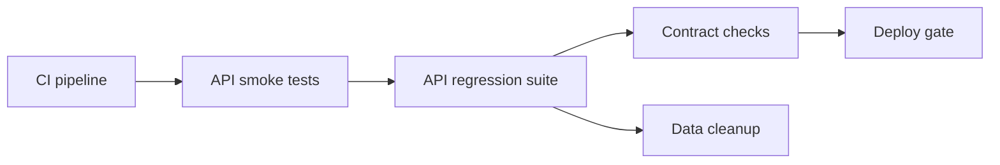

API automation sits between fast code-level tests and slower browser journeys. It is valuable because it checks service behavior, contracts, authentication and data side effects without paying the full cost of driving a UI.

## Where API tests fit

API tests are not one single category. Some are narrow integration tests against one service and a real database. Some are contract checks that protect consumers. Some are end-to-end at the API layer because they call several services through public endpoints.



| API test type | What it proves | What it does not prove |
|---|---|---|
| Service integration test | Endpoint, serialization, validation, auth and persistence work for one service | Browser behavior or multi-service user journey |
| Contract test | Provider and consumer agree on expected request and response shape | Full business workflow across real infrastructure |
| API end-to-end test | Public API workflow works across services | UI rendering, accessibility or browser-specific behavior |
| Schema validation | Response fields and types stay compatible | Business semantics unless paired with value assertions |
| Smoke check | Environment is alive and core endpoints respond | Deep edge-case correctness |

> [!KEY]
> API tests are usually the best automation return on investment for service behavior: faster and less flaky than UI checks, but closer to production wiring than pure unit tests.

A mature pipeline runs a small API smoke suite after deploy or environment creation, targeted API regression on pull requests when service contracts change, and broader API suites before release or nightly when they depend on shared environments.

## REST Assured given when then

REST Assured is a Java DSL for HTTP tests. Its shape maps cleanly to arrange, act and assert: `given()` configures the request, `when()` sends it, and `then()` verifies the response.

```java
import static io.restassured.RestAssured.given;
import static org.hamcrest.Matchers.equalTo;
import static org.hamcrest.Matchers.notNullValue;

@Test
void getUserReturnsExpectedFields() {
    given()
        .baseUri("http://localhost:8080")
        .basePath("/users/{id}")
        .pathParam("id", 42)
        .header("Accept", "application/json")
    .when()
        .get()
    .then()
        .statusCode(200)
        .body("id", equalTo(42))
        .body("email", notNullValue());
}
```

Request and response specifications remove duplication and make environment switching explicit.

```java
RequestSpecification requestSpec = new RequestSpecBuilder()
    .setBaseUri(System.getProperty("api.baseUri", "http://localhost:8080"))
    .setContentType("application/json")
    .addHeader("Accept", "application/json")
    .build();

ResponseSpecification createdSpec = new ResponseSpecBuilder()
    .expectStatusCode(201)
    .expectHeader("Content-Type", containsString("application/json"))
    .build();

given()
    .spec(requestSpec)
    .body(Map.of("sku", "BK-101", "quantity", 2))
.when()
    .post("/orders")
.then()
    .spec(createdSpec)
    .body("id", notNullValue());
```

> [!TIP]
> In an interview, say that shared specs should standardize base URI, headers and common expectations, but the important business assertions should stay visible in each test.

## Response validation beyond status codes

A `200 OK` only proves the server returned a successful HTTP status. Good API tests also verify headers, critical fields, schema, side effects, error bodies and sometimes latency thresholds for smoke checks.

| Assertion | Why it matters | Example |
|---|---|---|
| Status code | Confirms protocol-level result | `201` for creation, `409` for duplicate |
| Headers | Protects content type, cache, correlation and location behavior | `Content-Type`, `Location`, `X-Request-Id` |
| JSON path fields | Verifies business-critical values | `status`, `total`, `currency`, `roles` |
| Schema | Catches removed or renamed fields | JSON Schema in classpath |
| Side effect | Confirms state changed, not just response text | Read the created resource or inspect downstream state |
| Error body | Makes failures usable by clients | Code, message and field-level validation details |

```java
import static io.restassured.module.jsv.JsonSchemaValidator.matchesJsonSchemaInClasspath;

given()
    .spec(requestSpec)
.when()
    .get("/orders/{id}", orderId)
.then()
    .statusCode(200)
    .header("X-Request-Id", notNullValue())
    .body(matchesJsonSchemaInClasspath("schemas/order-response.json"))
    .body("status", equalTo("Pending"))
    .body("items.size()", greaterThan(0));
```

Schema validation is strongest when paired with semantic assertions. A schema can say `total` is a number; a business assertion says the number is in the expected currency and includes tax.

## Authentication and authorization flows

API suites should cover successful authentication and negative authorization paths. Many real production incidents are not caused by missing endpoints; they are caused by the wrong user seeing or changing the wrong resource.

```java
String token = given()
    .spec(requestSpec)
    .body(Map.of("username", "alice", "password", "correct-password"))
.when()
    .post("/auth/token")
.then()
    .statusCode(200)
    .extract()
    .path("access_token");

given()
    .spec(requestSpec)
    .auth().oauth2(token)
.when()
    .get("/orders")
.then()
    .statusCode(200);
```

| Scenario | Expected result | Why to test |
|---|---|---|
| Missing token | `401 Unauthorized` | Endpoint requires authentication |
| Expired token | `401 Unauthorized` | Token lifetime is enforced |
| Wrong role | `403 Forbidden` | Authorization is not confused with authentication |
| Wrong tenant | `403` or `404` by policy | Prevents cross-tenant data exposure |
| Malformed token | `401` with safe error body | Avoids leaking validation internals |
| Valid token and permission | Success | Confirms happy path still works |

> [!WARNING]
> Testing only a valid admin token is weak API automation. Senior suites include negative role and tenant checks because access-control bugs are high impact and easy to miss through the UI.

## Data driven tests and cleanup

Data management decides whether API tests stay reliable under parallel CI. Avoid hard-coded ids that may disappear or be modified by another test. Prefer creating data through APIs or fixtures, extracting identifiers, and cleaning up with an API call or a reset strategy.

```java
@DataProvider(name = "invalidOrders")
public Object[][] invalidOrders() {
    return new Object[][] {
        { Map.of("sku", "", "quantity", 1), "sku" },
        { Map.of("sku", "BK-101", "quantity", 0), "quantity" },
        { Map.of("sku", "BK-101", "quantity", -1), "quantity" }
    };
}

@Test(dataProvider = "invalidOrders")
void invalidOrdersReturnValidationErrors(Map<String, Object> payload, String field) {
    given()
        .spec(requestSpec)
        .body(payload)
    .when()
        .post("/orders")
    .then()
        .statusCode(400)
        .body("errors.field", hasItem(field));
}
```

For created data, extract ids and clean up even on failure when possible.

```java
String id = given().spec(requestSpec)
    .body(uniqueOrderPayload())
.when()
    .post("/orders")
.then()
    .statusCode(201)
    .extract()
    .path("id");

try {
    given().spec(requestSpec).get("/orders/{id}", id).then().statusCode(200);
} finally {
    given().spec(requestSpec).delete("/orders/{id}", id).then().statusCode(anyOf(is(200), is(204), is(404)));
}
```

Unique payloads, run-specific prefixes and per-test tenants are often more reliable than global cleanup, especially when suites run in parallel.

## Contract, integration and pipeline placement

At the API layer, naming matters. An API integration test calls the real service endpoint and usually exercises real validation, serialization and persistence. A contract test checks that provider and consumer expectations match, often using examples and a broker. An API end-to-end test chains multiple public endpoints to prove a business workflow.

| Pipeline stage | API checks to run | Budget |
|---|---|---|
| Pull request | Service-level tests affected by the change, schema checks and auth edge cases | Seconds to a few minutes |
| Merge to main | Broader regression against real dependencies | A few minutes |
| Environment deploy | Smoke checks for health and critical write-read flows | Under five minutes |
| Nightly or release | Cross-service API workflows and larger data combinations | Longer, with richer reporting |

A brief C# equivalent shape uses `HttpClient` and xUnit. The ideas are the same even when the Java tool changes.

```csharp
[Fact]
public async Task CreateOrder_ReturnsCreated_AndCanBeRead()
{
    var create = await _client.PostAsJsonAsync("/orders", new { sku = "BK-101", quantity = 2 });
    create.StatusCode.Should().Be(HttpStatusCode.Created);

    var body = await create.Content.ReadFromJsonAsync<OrderResponse>();
    var read = await _client.GetAsync($"/orders/{body!.Id}");

    read.StatusCode.Should().Be(HttpStatusCode.OK);
}
```

> [!NOTE]
> API automation should protect consumers from silent service changes. That means validating status, shape, key semantics, auth behavior and data side effects, not only that an endpoint responds.

Good API suites are also observable. Log enough request and response detail on failure to diagnose the problem, but avoid dumping tokens, passwords or personal data into CI output. Capture correlation ids from response headers so a failing test can be matched with server logs and traces. For unstable environments, record latency and dependency errors separately from assertion failures; otherwise real product regressions and test-environment outages look identical.

| Diagnostic item | Safe practice |
|---|---|
| Request body | Redact secrets and personally identifying fields before logging |
| Response body | Log on failure only, with size limits for large payloads |
| Correlation id | Always capture and print so backend logs can be queried |
| Timing | Track slow endpoints separately from incorrect responses |
| Environment metadata | Include build, base URI, tenant and feature flags |

This discipline makes API automation useful to backend engineers. A failure report should say which request failed, which assertion failed, what data was used, and how to find the corresponding server trace without exposing sensitive data.

Finally, keep environments explicit. A local suite can own its database and reset freely; a shared staging suite may need tenant isolation and read-only checks for dangerous endpoints; a production smoke suite should avoid destructive writes unless the product has a dedicated synthetic tenant. The same test code can run in several places, but its data strategy and allowed assertions must match the environment.

That clarity also helps incident response. When a deployment smoke test fails, the team should know whether it indicates a bad release, a broken dependency, missing seed data or an unsafe environment assumption.

## Cheat sheet

- API tests are faster and less flaky than UI tests for service behavior, but more realistic than unit tests.
- REST Assured uses `given`, `when`, `then` for request setup, action and assertions.
- Centralize base URI, content type and shared headers in request specifications.
- Keep business assertions visible in the test, not buried in a generic helper.
- Status code alone is not enough; assert headers, critical fields, schema and side effects.
- Schema validation catches structural drift but needs semantic assertions for business meaning.
- Authentication tests need valid, missing, expired, malformed, wrong role and wrong tenant cases.
- Data-driven tests are good for validation matrices and negative cases.
- Generate unique data and clean up created records to support parallel execution.
- Contract tests, API integration tests and API end-to-end tests answer different questions.
- API smoke checks belong in deployment validation; broader suites can run on merge or nightly.
- Use API setup for UI tests when the setup is not the behavior being tested.

## Common mistakes

| Mistake | Fix |
|---|---|
| Asserting only `statusCode(200)` | Assert headers, body fields, schema and side effects |
| Depending on hard-coded shared ids | Create data per test and extract ids from responses |
| Running destructive tests against shared business data | Use isolated tenants, seeded environments or disposable data |
| Testing only admin happy paths | Add negative role, tenant and expired-token cases |
| Duplicating base URI and headers in every test | Use request and response specifications |
| Treating schema validation as full contract coverage | Add semantic examples or consumer-driven contract tests where consumers depend on behavior |
| Leaving created test data behind | Cleanup through API or reset the environment predictably |
| Putting every API test in the PR gate | Gate targeted high-value checks first, run broad suites later |

## Summary

API automation gives strong service confidence without browser cost. REST Assured's fluent model makes Java API tests readable, but the value comes from disciplined assertions, authentication coverage, data isolation and clear pipeline placement. Use schema validation for structural compatibility, semantic assertions for business behavior, contract tests for provider-consumer agreement, and cleanup strategies that let tests run repeatedly and in parallel.

## Top Interview Questions

### Q1. Why are API tests often a better automation layer than UI tests?

API tests exercise service behavior without paying for browser rendering, selectors, animations and full UI timing. They are usually faster, more stable and easier to debug because failures point at a request, response or data side effect rather than a long user journey. They are also closer to service contracts, so they are good for validation rules, authorization, schema shape, error handling and idempotency. UI tests are still needed for browser-specific behavior and critical user journeys, but pure business rules and API contracts are cheaper to cover at the API layer. A mature suite uses API tests to reduce the number of fragile browser checks.

### Q2. What do `given`, `when` and `then` mean in REST Assured?

`given()` configures request preconditions: base URI, path parameters, query parameters, headers, content type, authentication and request body. `when()` sends the HTTP method such as GET, POST, PUT or DELETE. `then()` verifies the response through status code, headers, body fields, schema and extraction. The pattern reads like behavior-driven syntax, but it is simply a clear arrange-act-assert structure for HTTP. Good tests keep the important assertions in the `then()` block so a reader can see what behavior is being protected. Shared details such as base URI and common headers belong in request specifications.

### Q3. Why are request and response specifications useful?

Specifications remove duplication and make common assumptions explicit. A request specification can centralize base URI, content type, common headers, authentication setup and logging configuration. A response specification can define expectations shared by many endpoints, such as content type or a standard success status. This improves maintainability when environments or headers change. The caution is not to hide business behavior in a generic spec. If every test just calls `.spec(successSpec)`, readers may not know what matters. Use specs for infrastructure-level repetition and keep endpoint-specific assertions, such as order status or validation fields, visible in each test.

### Q4. Is status code validation enough in an API test?

No. A successful status code only tells you the server considered the request successful at the protocol level. The body may have missing fields, wrong values, wrong currency, wrong tenant data or an empty list where data was expected. Strong API tests verify critical JSON fields, headers, schema shape, error body format and side effects. For a create endpoint, that might mean asserting `201`, checking the `Location` header, reading the created resource, and verifying important fields. For an error case, assert both the status and the field-level validation message. Status code is the first assertion, not the complete test.

### Q5. How do you validate JSON schema, and what are its limits?

In REST Assured, schema validation commonly uses `matchesJsonSchemaInClasspath` with a JSON Schema file stored in test resources. It catches structural changes such as removed fields, renamed properties, wrong types or missing required values. This is useful when clients depend on response shape. The limit is semantic meaning. A schema can say `total` is a number, but it cannot by itself prove the value includes tax, uses the right currency or follows a discount rule. Pair schema validation with targeted JSON path assertions for critical business values. For independently deployed consumers, add contract tests when examples and compatibility gates are needed.

### Q6. What authentication and authorization cases should API automation cover?

Cover the valid happy path, then the negative paths that protect data. Missing token should return `401`. Expired or malformed token should return `401` with a safe error. A valid token with insufficient role should return `403`, proving authorization is separate from authentication. A token from the wrong tenant should not access another tenant's data; teams choose `403` or `404` depending on policy. Also test token scopes when APIs use OAuth-style permissions. Testing only an admin token gives false confidence because admin often bypasses the rules most likely to fail for real users.

### Q7. How do you keep API tests reliable in parallel CI?

Avoid shared mutable data. Generate unique payloads using a run id or GUID, create resources through the API or a fixture, extract ids from responses, and delete or reset data after the test. Do not assume a hard-coded user, order or auto-increment id is available unless the environment explicitly seeds it for every run. If cleanup can fail, design data to be isolated by tenant or prefix so leftovers do not break later runs. Keep tests independent and make them safe to run in any order. When a parallel API suite flakes, look first for shared records, shared rate limits or cleanup races.

### Q8. What is the difference between API integration, contract and API end-to-end tests?

An API integration test calls a real endpoint of one service and usually exercises its validation, serialization, auth and persistence. A contract test verifies that a provider and consumer agree on expected interactions, often through concrete examples and a broker, without needing a shared deployed environment. An API end-to-end test chains multiple public endpoints or services to prove a business workflow, such as create order, pay, confirm and refund. The difference matters because they have different costs and failure signals. Do not call every HTTP test a contract test; a contract test protects compatibility between parties, while an integration test proves one service boundary works.

### Q9. How do you test negative validation scenarios efficiently?

Use data-driven tests. In TestNG, a `@DataProvider` can supply invalid payloads and the expected error field or code. Each row should vary one meaningful condition when possible: missing required field, invalid range, malformed enum, duplicate value, wrong content type or malformed JSON. The test sends the payload and asserts a `400` or appropriate status plus a stable error body. This approach keeps the assertion logic consistent while making the case matrix easy to review. Avoid building a giant random invalid payload where several fields fail at once, because the failure will not tell you which rule broke.

### Q10. Where should API tests sit in the pipeline?

Run a small targeted set on pull requests: changed endpoint behavior, validation, schema and critical auth checks. On merge to main, run a broader API regression suite with real dependencies. After deploying an environment, run smoke checks that prove health and one or two critical write-read flows. Nightly or release pipelines can run slower cross-service API workflows and larger data combinations. The goal is fast feedback first and broader confidence later. If every API test blocks every push, the suite eventually becomes a bottleneck; if none run before release, contract and auth regressions are found too late.
